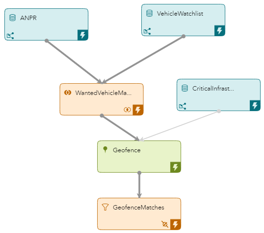

# Using a Geofence to Find Wanted Vehicles
## Overview
This example uses Join, Geofence, and Filter windows to match wanted vehicles that are in close proximity to critical infrastructure sites. This example also demonstrates the use of connector orchestration.

---
**NOTE:**
Use this example with SAS Event Stream Processing 2024.01 and later. This example contains a Python-based Filter window. Earlier releases of SAS Event Stream Processing do not support Python-based Filter windows. 

---

For more information about how to install and use example projects, see [Using the Examples](https://github.com/sassoftware/esp-studio-examples#using-the-examples).

## Use Case

The [model.xml](model.xml) project performs the following actions:

- Streams a list of vehicles, including vehicle locations.
- Streams a list of vehicles that are included on a vehicle watch list.
- Streams a list of critical infrastructure sites, including site locations.
- Processes the list of vehicles and attempts to match any wanted vehicles that are in close proximity to critical infrastructure sites.
- Produces a list of wanted vehicles found in close proximity to critical infrastructure sites.

## Source Data

- The [anpr.csv](anpr.csv) file contains a list of all vehicles within close proximity of critical infrastructure sites.
- The [wantedvehicle.csv](wantedvehicle.csv) file contains a list of all vehicles on the vehicle watch list.
- The [infrastructure.csv](infrastructure.csv) file contains a list of sites that contain critical infrastructure.

## Workflow
The following figure shows the diagram of the project:



- The ANPR, VehicleWatchList, and CriticalInfrastructure windows are Source windows that read data from the CSV files that are discussed in [Source Data](#source-data).
- The WantedVehicleMatch window is a Join window. This is where a list of all vehicles found within close proximity of critical infrastructure sites and a list of all wanted vehicles are merged into one list.
- The Geofence window is a Geofence window. This is where geofencing information that relates to the matched vehicles enters the model.
- The GeofenceMatches window is a Filter window. This is where matches with null values are filtered out.

### ANPR

The ANPR window streams information about all vehicles within close proximity of critical infrastructure sites from the `anpr.csv file` to the WantedVehicleMatch window.

Explore the settings for the ANPR window:
1. Open the project in SAS Event Stream Processing Studio and select the ANPR window. 
2. In the right pane, expand **State and Event Type**. Observe that the model accepts only Insert events and the key field is generated automatically.
3. To examine the window's output schema, on the right toolbar, click . Observe the following fields: 
   - `vrm`: This is the vehicle registration mark.
   - `lat`: This is the latitude where the vehicle was found.
   - `long`: This is the longitude where the vehicle was found.
   - `date`: This is date and time when the vehicle was found.
   - `pkey`: This is the identifier for each event. It is also selected as the Key.

### VehicleWatchList

The VehicleWatchList window streams information about wanted vehicles from the `wantedvehicle.csv` file to the WantedVehicleMatch window.

Explore the settings for the VehicleWatchList window:
1. Select the VehicleWatchList window.
2. Examine the window's output schema in the right pane. Observe that the `vrm` field is present. This is the vehicle registration mark. This field is also selected as the Key.
3. Click . 

### WantedVehicleMatch

The WantedVehicleMatch window merges vehicles found within close proximity of critical infrastructure sites with wanted vehicles.

Explore the settings for the WantedVehicleMatch window:
1. Select the WantedVehicleMatch window.
2. In the right pane, expand **Settings**. 
3. Observe the **Left window** and **Right window** fields. Notice that the ANPR window is regarded as the left window and the VehicleWatchList window is regarded as the right window. <br/>When you use SAS Event Stream Processing Studio to create a project from scratch, the left window and the right window for a Join window are determined by the order in which you add edges from the input windows to the Join window. The first window that you connect to the Join window becomes the right window.
4. Observe that the **Output field calculation method** field is set to **Select fields**. As a result, as new input events arrive, join non-key fields are calculated by using a join selection string. This selection string is a one-to-one mapping of input fields to join fields.
5. Expand **Join Conditions**. Observe that the `vrm` field is specified for both the left and the right join.
6. To examine the window's output schema, on the right toolbar, click . Observe that the fields that are defined in the output schema of the ANPR window are present here too.

### CriticalInfrastructure

The CriticalInfrastructure window streams information about sites that contain critical infrastructure.

Explore the settings for the CriticalInfrastructure window:
1. Select the CriticalInfrastructure window. 
2. Examine the window's output schema in the right pane. The fields relate to the location and characteristics of infrastructure sites.
3. Click . 
   
### Geofence

The Geofence window performs geofencing on the matched vehicles.

Explore the settings for the Geofence window:
1. Select the Geofence window.
2. In the right pane, expand **Settings**. Observe the **Position window** and **Geometry window** fields. Notice that the WantedVehicleMatch window is regarded as the position window and the CriticalInfrastructure window is regarded as the geometry window. <br/>Geofence windows require two input windows: one to inject streaming events and another to inject geofence areas and locations. When you use SAS Event Stream Processing Studio to create a project from scratch, the position window and the geometry window for a Geofence window are determined by the order in which you add edges from the input windows to the Geofence window. The first window that you connect to the Geofence window becomes the position window.
3. Expand **Positions**. Observe that the `long` field is specified as the field that contains the longitude coordinate and the `lat` field is specified as the field that contains the latitude coordinate.
4. Expand **Geometries**. Observe that the `long` field is specified as the field that contains the longitude coordinate and the `lat` field is specified as the field that contains the latitude coordinate.
5. Expand **Output Map**. Observe that the **Geometry ID** field is set to `geoid`. The **Geometry ID** field specifies the name of the output schema field that receives a geometry ID. 

### GeofenceMatches

The GeofenceMatches window filters out matches with null values.

Explore the settings for the GeofenceMatches window:
1. Select the GeofenceMatches window.
2. In the right pane, expand **Filter**. 
3. Observe that the filter type is set to Python and the `geoid` field is selected for use in the Python code. Recall that `geoid` was specified in the output schema of the Geofence window. 
4. Observe the following Python code, which filters out matches with null values:

 ```
    def filter(event,context):
    return "geoid" in event and event["geoid"] is not None
 ```
5. Expand **Subscriber Connectors**. Observe that there is a subscriber connector that writes output to a file called `result.out`. <br/>Later in these steps you observe how connector orchestration affects the order in which connectors are executed.

### Connector Orchestration

1. Click  on the main toolbar to view project properties.
2. In the right pane, expand **Connector Orchestration**. 
3. In the **Connector groups** table, observe that four connector groups are present. Open each connector group to view the connectors related to that group. For example, the `sub1` group relates to a subscriber connector in the GeofenceMatches window and its target state is `Running`.
4. In the **Dependency rules** table, observe the dependency settings. For example, observe that the groups `pub1`, `pub2`, and `pub3` depend on the controlling group `sub1`. This means that the subscriber connector in the GeofenceMatches window must have reached the target state of `Running` before the publisher connectors in the Source windows can start. 

## Test the Project and View the Results

If you do not use the **Install example** button in SAS Event Stream Processing Studio, note that this project includes connector orchestration and as a result, it is recommended that you do not use the **Publish** button in SAS Event Stream Processing Studio's test mode to publish events from CSV files to the Source windows. Instead, adjust the connectors in the project:
1. Edit the publisher connectors in the ANPR, VehicleWatchList, and CriticalInfrastructure windows so that they refer to the location in your system where you placed the CSV files. For more information, see [SAS Help Center: Configure a File and Socket Connector](https://go.documentation.sas.com/doc/en/espcdc/default/espstudio/n0esv2n0cbbpgcn1r281krr1iv6q.htm#n0y87cwr7q5vo6n1qlfcey182vt6).
2. Edit the subscriber connector in the GeofenceMatches window so that it refers to a location where the output file can be written. Ensure that the user who tests the project has Write access to that directory. 

When you test the project, the results for each window appear on separate tabs:
- The **ANPR** tab lists all vehicles within close proximity of critical infrastructure sites
- The **VehicleWatchlist** tab lists all vehicles on the vehicle watch list
- The **WantedVehicleMatch** tab combines a list of all vehicles found within close proximity of critical infrastructure sites with a list of all wanted vehicles.
- The **Geofence** tab lists the geofencing information that relates to the matched vehicles
- The **CriticalInfrastructure** tab lists sites that contain critical infrastructure
- The **GeofenceMatches** tab shows any wanted vehicles found within close proximity of critical infrastructure sites

The following figure shows the results for the GeofenceMatches tab:


Notes:
- If the project does not run, check that the SAS Event Stream Processing Studio user has Write access to the directory for the output file for the GeofenceMatches window.
- If the table is empty, check that the publisher connectors for the ANPR, VehicleWatchList, and CriticalInfrastructure windows are set correctly to point to the CSV files.
- You might see warnings in the **Log** pane about possible unbounded memory growth or throttling. You can ignore these warnings.

## Additional Resources
For more information, see [SAS Help Center: Using Geofence Windows](https://documentation.sas.com/?cdcId=espcdc&cdcVersion=default&docsetId=espcreatewindows&docsetTarget=p0xru6q01dkxknn1t8gqo2q4zfu6).
