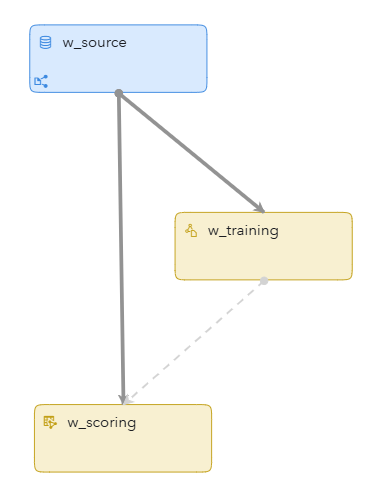
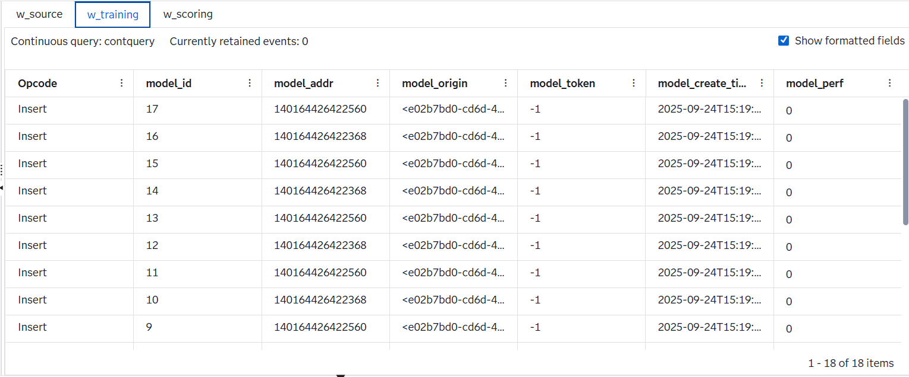
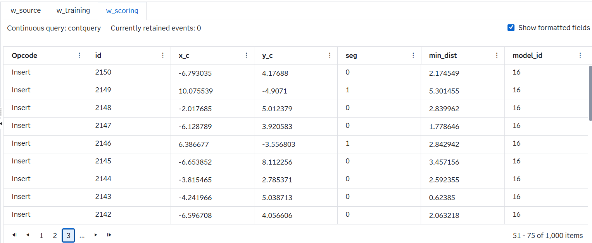

# Perform K-means Clustering on Streaming Data

## Overview
This example demonstrates the use of k-means clustering on streaming data. It includes a Source window that ingests signal samples, and Train and Score windows that build the k-means model and assign each incoming event to its closest cluster in real time.
 
For more information about how to install and use example projects, see [Using the Examples](https://github.com/sassoftware/esp-studio-examples#using-the-examples).

## Use Case

This project demonstrates how to perform real-time k-means clustering on continuous event streams using SAS Event Stream Processing. Unlike classic k-means clustering, streaming clustering updates clusters dynamically as new data arrives, making it ideal for time-sensitive environments. The following table highlights some differences between classic k-means clustering and streaming k-means clustering.

| Aspect | Classic K-means | Streaming K-means |
|--------|-----------------|------------------------------|
| **Data handling** | Works on a fixed data set. | Works on continuous incoming events. |
| **Iteration** | Repeats assignment and updates steps until convergence. | No full re-iteration; clusters update incrementally with each batch. |
| **Centroid update** | Centroids are recalculated as the mean of all assigned points. | Centroids updated using a damping factor, which weights recent data higher. |
| **Old data** | All points contribute equally, regardless of age. | Older points gradually lose influence. |
| **Cluster dynamics** | Number of clusters are fixed, only centroids move. | Clusters can fade out (`fadeOutFactor`) or split (`disturbFactor`). |
| **Use case** | Static data sets (for example, customer segmentation at a single point in time). | Real-time adaptive clustering (for example, IoT sensor streams, fraud detection, anomaly detection). |

Streaming k-means clustering is useful in the following scenarios:
- Anomaly Detection: Detects unusual behaviors in sensor data, financial transactions, or network traffic in real time.
- Segmentation: Continuously groups users, devices, or events into segments that update as behavior changes.
- Pattern Recognition: Identifies emerging patterns in fast-moving data such as IoT telemetry, clickstream activity, or fraud signals.

## Source Data

The input file is loaded through w_source using a file and socket connector. The file is called `events.csv`, and it contains a stream of example data that includes the following:  
  - `ID`: An event key
  - `x_c`: An x coordinate for the event
  - `y_c`: A y coordinate for the event
     
## Workflow

The following figure shows the diagram of the project:

 
- The w_source window is a Source Window that ingests incoming signal samples from the input file, `events.csv`.  
- The w_training window is a Train Window that builds and continuously updates the k-means clustering model in real time.  
- The w_scoring window is a Score Window that assigns each incoming event to the nearest cluster centroid and writes the cluster ID (`seg`) and distance (`min_dist`) to the **w_scoring** tab.

### w_source

Explore the settings for the w_source window:
1. Open the project in SAS Event Stream Processing Studio and select the w_source window.
2. In the right pane, expand **State and Event Type**. Notice that the project accepts only Insert events.
3. Expand **Input Data (Publisher) Connectors**. Notice the file and socket connector called **events_Connector**.
4. Select the connector and click . Notice that the value of **Fsname** is a path that points to `events.csv`.
5. Click **OK**.
6. Click . See the following fields:
   - `id`: Primary key 
   - `x_c`: An x coordinate of data
   - `y_c`: A y coordinate of data

### w_training

This window analyzes all of the events and periodically generates a new clustering model using the k-means algorithm. Generated clustering model events are published to the w_score window.

Explore the settings for the w_training window:
1. Open the project in SAS Event Stream Processing Studio and select the w_training window.
2. In the right pane, expand **Settings**. Then, expand **Parameters**. Notice the following parameters:
      - `nClusters`: Specifies the number of clusters.
      - `initSeed`: Specifies the random seed that is used during initialization when each point is assigned to a random cluster.
      - `dampingFactor`: Specifies the damping factor for old data points.
      - `fadeOutFactor`: Specifies the value for determining whether an existing cluster is fading out.
      - `disturbFactor`: Specifies the disturbance factor when splitting a cluster.
      - `nInit`: Specifies the number of data events that are used during initialization.
      - `velocity`: Specifies the number of events that arrive at a single timestamp.
      - `commitInterval`: Specifies the number of timestamps to elapse before committing a model to downstream scoring.
3. Expand **Input Map**. Notice that the **inputs** role specifies the variable names used in clustering: `x_c` and `y_c`.

### w_scoring

Explore the settings for the w_scoring window:
1. Open the project in SAS Event Stream Processing Studio and select the w_scoring window.
2. In the right pane, expand **Settings**. Then, expand **Streaming K-Means Clustering**.
3. Expand **Input Map**. Notice that the **inputs** role specifies the variable names used in clustering: `x_c` and `y_c`.
4. Expand **Output Map**. Notice the following roles:
     - The **labelOut** role specifies the name of the output variable that stores the cluster ID. The variable is called  `seg`. 
     - The **minDistanceOut** role specifies the name of the output variable that stores the distance to the nearest cluster. The variable is called `min_dist`. 
     - The **modelIdOut** role specifies the name of the output variable that stores the ID of the model used for scoring. The variable is called `model_id`.

## Test the Project and View the Results

When you test the project in SAS Event Stream Processing Studio, the results for each window appear on separate tabs in test mode. 

The **w_source** tab displays events to be scored:

The **w_training** tab displays the generated clustering model using the k-means algorithm:

The **w_scoring** tab displays the scored events:

If you see warnings in the **Log** pane about the w_source window being throttled, they can be safely ignored.

## Next Steps

You can enhance this project by doing any of the following:
- Replace the CSV source with a live sensor feed
- Experiment with different k-means training parameters to optimize clustering resolution

## Additional Resources

For more information, see [SAS Help Center: Training and Scoring with K-means Clustering](https://go.documentation.sas.com/doc/en/espcdc/default/espan/p1cvplf50cug5jn1mz8b5qrq6q36.htm#p01ejm2939294pn1jxmoiqqoh21q).

