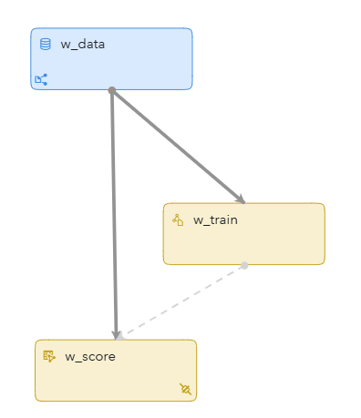
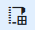
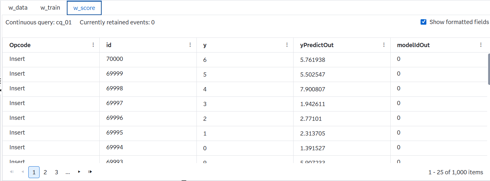

# Online Linear Regression on Streaming Data

## Overview

This example demonstrates how to use SAS Event Stream Processing to build and continuously update a linear regression model on a high-dimensional stream of data in real time. It includes a Source window that ingests streaming data, a Training window that updates a regression model, and a Scoring window that applies the model to incoming data points.

For more information about how to install and use example projects, see [Using the Examples](https://github.com/sassoftware/esp-studio-examples#using-the-examples).

## Use Case

The project shows how to perform online training and scoring using linear regression on incoming data streams. It is useful in the following scenarios:
- The data arrives continuously, and training must be performed in real time.
- The data includes a very high number of features (784 in this case).
- Continuous updates to the model are required without retraining them from scratch.

## Source Data

The `input.csv` file is loaded through a file and socket connector in the Source window. The stream of synthetic data includes the following:
  - `id`: Unique identifier
  - `y`: Target response variable
  - `x1` through `x784`: Input features

## Workflow
<!-- changed "figure" to "image" since an editor recently told me that the term "figure" is outdated -->
Here is a diagram of the project:

- **w_data**: A Source window that ingests example data from a CSV file using the `fs` (file and socket) connector.
- **w_train**: A Train window that performs online linear regression, generating updated models as new data arrives.
- **w_score**: A Score window that uses the current model to compute predictions on streaming data.

### w_data

Explore the settings for the w_data window by doing the following steps:
1. Open the project in SAS Event Stream Processing Studio and select the w_data window.
2. In the right pane, expand **Input Data (Publisher) Connectors**. Notice that the window is configured with a file and socket connector.
3. Expand **Retention**. Notice that the project only accepts Insert events.
4. Click . Fields include:
   - `id`: Primary key
   - `y`: Target variable
   - `x1` through `x784`: Predictor variables

### w_train

This window uses the Streaming Linear Regression algorithm and periodically updates the model using incoming data.

Explore the setting for the w_train window by doing the following steps:
1. Select the w_train window.
2. Expand **Settings** and then expand **Parameters**.  
Parameters:
    - `nInit`: 60000, which is the number of events for initialization
    - `commitInterval`: Model update frequency
    - `dampingFactor`: Controls the influence of older data
    - `centerFlag` and `scaleFlag`: Enable centering and scaling of dense data
    - `batchSize`: Specifies the batch size in processing the training samples. The specified value must be a positive integer. This property affects how much memory is used to buffer data events. If you have sufficient memory, set this to the maximum of `nInit` and `commitInterval`.
    - `maxSparseIndex`: Specifies the number of predictor variables contained in the sparse variable, if it exists. The value should be a nonnegative integer.

3. Expand **Input Map**.  
Input Map:
    - `inputs`: `y`, `x1` through `x784`
    - `target`: `y`
    - `sparse`: `Select an item`

### w_score

This window scores data using the model from w_train.

Explore the setting for the w_score window by doing the following steps:
1. Select the w_score window.
2. Expand **Settings**, expand **Streaming Linear Regression**, then expand **Input Map**.  
Input Map:
    - `inputs`: `y`, `x1` through `x784`
3. Expand **Output Map**.  
Output Map:
    - `yPredictOut`: Field for predicted `y`
    - `modelIdOut`: Model version used for prediction
    - `yOut`: Field for original `y`

The scoring results are written to an output file called `result.out`.

## Test the Project and View the Results
<!-- Not sure if we should include language telling the user to let the project run until it hits the 70000th id, otherwise the w_train and w_score tabs are empty -->
When you test the project in SAS Event Stream Processing Studio, the results for each window appear in separate tabs:

- **w_data**: Displays incoming data
- **w_train**: Displays model commit activity
- **w_score**: Displays predictions (`yPredictOut`) and associated model IDs (`modelIdOut`)

Here are the results in the w_score window:

## Next Steps

You can enhance this project by doing any of the following:
- Replacing the CSV source with a live sensor feed
- Adding filters or aggregations before training
- Incorporating Grafana to visualize predicted versus actual values over time
- Experimenting with different feature sets or preprocessing methods

## Additional Resources

- [SAS Help Center: Training and Scoring with Streaming Linear Regression](https://go.documentation.sas.com/doc/en/espcdc/default/espan/p07btvrqyc27h0n106jmlsrfj053.htm#p0vhvkecejjsgkn1r6oxe1446bde)
