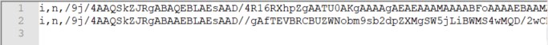
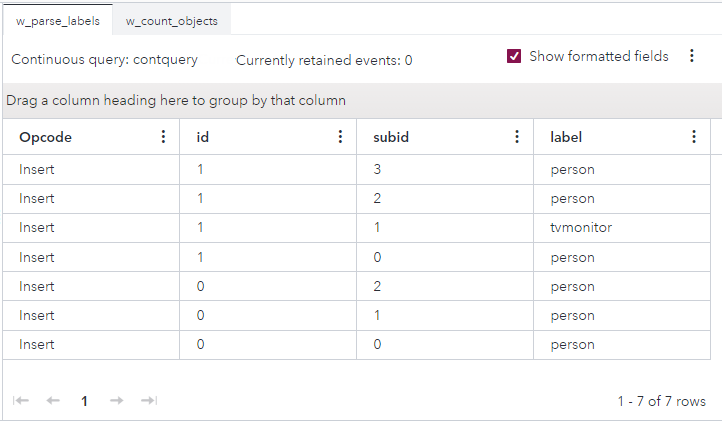
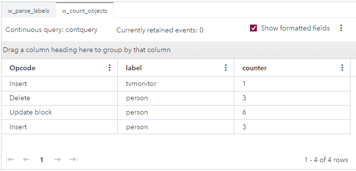

# Detecting Objects by Using an ONNX Model (Tiny YOLO Version 2)
## Overview
This example demonstrates how to use a project to reference an open-source ONNX model, in order to detect objects in still images.

---
**NOTE:**
Use this example with SAS Event Stream Processing 2021.2.2 and later. 

---

## Source Data and Other Files
- InputImages.csv contains the source data in the form of base64-encoded images.
- onnx_object_detection.xml is the project associated with this example.
- input_preproc.py, tensor_utils.py, and utils.py are Python modules for changing the images into a format that is suitable for the ONNX model and for changing the images back into a format that is suitable for SAS Event Stream Processing.
- ModelZoo-tinyolov2-8.onnx, ModelZoo-tinyoolov2-8.py, and Yolov2_decoder.py are an open source ONNX model and associated Python modules for detecting objects in images.

For more information about the source of the above files, see [Source of the Model and Image Files](#source-of-the-model-and-image-files).

## Prerequisites

### Check System Prerequisites

Check that the following system prerequisites are met. For more information, contact your system administrator.

- A supported version of ONNX Runtime has been deployed. For more information, see [Working with ONNX Models](https://go.documentation.sas.com/doc/en/espcdc/default/espan/p0b1zsgwrsirbln1typkfoz428y9.htm).
- A persistent volume is available. In a Kubernetes environment, using ONNX models requires that when SAS Event Stream Processing is deployed, it is configured to access persistent volumes. This configuration involves applying overlays. For more information, see [Managing Persistent Volumes (PVs)](https://go.documentation.sas.com/doc/en/espcdc/default/espex/n19tbdmek5u0rdn1f31lktl95r27.htm#n1liey9g57i1ntn19mkd4pnpt7pd).

The example is configured to use the CPU as the execution provider. Using this option means that hardware acceleration is not used. If you want to use an execution provider that supports hardware acceleration, ensure that a supported execution provider has been deployed. For more information, see [Understanding Execution Providers)](https://go.documentation.sas.com/doc/en/espcdc/default/espan/n04g09la3oqh59n0zls2jzllfgyf.htm).

This example is not intended for use with an ESP server that is running on an edge server.

### Place Example Files in the Root Directory of the Persistent Volume

Save the `ONNXExample` subdirectory and its contents at the root of the location that has been configured for the Kubernetes persistent volume.

---
**NOTE:**
SAS Event Stream Processing expects the base location of input files to be `/mnt/data`, but the corresponding location where you need to place your input files depends on how your file storage has been set up. If you require assistance, contact your system administrator.

---

If the `ONNXExample` directory is not placed at the root of the persistent volume, you must edit the example files (including Python code) to adjust references to directory locations.

## Workflow
The following figure shows the diagram of the project:

- w_data is a Source window. This is where base64-encoded versions of images from the InputImages.csv file enter the project.
- w_pre_process is a Calculate window. The Python code referenced by this window converts base64 image strings into tensors, so that the data can be processed by the ONNX model. A tensor is an n-dimensional array that contains the same type of data. The Python code referenced by this window can also perform other conversion tasks such as changing image size and image orientation. In general, a project that references an ONNX model is likely to require pre-processing of data before that data is ready to be scored.
- w_reader is a Model Reader window. This window reads the ONNX model and passes it to the w_score window.
- w_score is a Score window. This window executes the ONNX model’s code when data passes through the window. The input data is in tensor format. The data is scored: that is, objects are detected in images and labels are assigned to the objects. The output from this window includes a second set of tensors.
- w_post_process is a Calculate window. The Python code referenced by this window converts images that are in tensor format back into base64 strings, so that they can be handled by subsequent windows. In general, a project that references an ONNX model is likely to require post-processing of data after scoring has taken place.
- w_parse_labels is a Functional window. This window splits a comma-separated string that contains labels into separate events, so that each event contains one label. The labels relate to objects that were detected in images.
- w_count objects is an Aggregate window. This window counts the labels.

### w_data

Explore the settings for this window:
1. Open the project in SAS Event Stream Processing Studio and select the w_data window.
2. Click the w_data window.
3. In the right pane, expand **State and Event Type**. The window is stateless and the index type is `pi_EMPTY`. That is, the window acts as a pass-through for all incoming events. The `pi_EMPTY` index does not store events. The window is set to accept only Insert events and the key field is generated automatically.
4. To examine the window's output schema, on the right toolbar, click . Observe the following fields: 
   - `image`: This field holds the base64-encoded images.
   - `id`: Each image that the window receives is assigned an ID, and this field holds information about the ID.
5. Click . 
6. Expand **Input Data (Publisher) Connectors**.
7. Double-click the `publisher` file and socket connector. The Connector Configuration window appears. The **Fsname** field shows that the window reads incoming events from the `<path>/ONNXExample/Input/InputImages.csv` file.
8. Click Cancel.

The following figure shows the InputImages.csv file when it is opened in a text editor.

`i` denotes that an event’s opcode is Insert and `n` denotes that it is a normal event. The characters that follow `i,n,` are base64-encoded versions of images. The first line corresponds to the following image:

The second line corresponds to the following image:

---
**NOTE:**
The images provided in this example are to be used only with the onnx_object_detection.xml project. Using or altering these images beyond the example for any other purpose is prohibited.

---

You can edit the InputImages.csv file to add your own images or replace the example images with your own images. The example images show people but the model can detect other objects too. Try using images that contain different means of transport (such as car, bus, or bicycle) or animals. Use a suitable tool to convert images to base64 strings. Free conversion tools are available on the internet. If you edit the file in a text editor, press Enter at the end of the last line to ensure that there is a line ending. If a line ending is missing, the project does not run successfully.

### w_pre_process

Explore the settings for this window:
1. Click the w_pre_process window.
2. In the right pane, expand **Settings**. This window uses a user-specified calculation. That is, an online algorithm is not used.
3. In the **Handlers** section, double-click the `w_data` handler. The Input Handler window appears. Input handlers process incoming event streams in your project. The handler type is `SAS Micro Analytic Service`. The `tensorProcess` module is selected. The `tensorProcess` module (which is defined at the project level) contains two functions: `preprocess` and `postprocess`. The `preprocess` function is selected; this means that the `preprocess` function is used the handle data that comes in from the w_data window.
4. Click **Cancel**.

### tensorProcess Module

In general, a project that references an ONNX model is likely to require pre-processing of data before the data is ready to be scored, and post-processing of the data that has been scored. In this example, the Python code that performs this pre-processing and post-processing is referenced from the `tensorProcess` module.

Explore the tensorProcess Module:
1. Click  on the toolbar. Project-level properties are displayed in the right pane.
2. Expand **SAS Micro Analytic Service Modules**.
3. Double-click the `tensorProcess` row in the table. The SAS Micro Analytic Service Module window appears. A SAS Micro Analytic Service module is a named block of code that you execute within a SAS Event Stream Processing project. The **Embedded code** field contains the Python code that is referenced from the w_pre_process and w_post_process windows.
4. Click **Cancel**.

### Project’s User-Defined Properties

Expand **User-Defined Properties**. The user-defined properties that were referenced in the Python code (`DEMO_PATH`, `ONNX_MODELS_PATH`, and `ONNX_MODEL`) are defined here.

In addition, the `BASE_PATH` property is set to `/mnt/data`. This is the expected location in the Kubernetes persistent volume for the example’s input files.

### w_reader

Explore the settings for this window:
1. Click the w_reader window.
2. In the right pane, expand Settings.
   - The `<path>/ONNXExample/Models/tiny-yolov2/ModelZoo-tinyyolov2-8.onnx` file is the open-source model that is used to detect objects in the input images. You could replace this model with another model that you supply. However, changing the model would require you to also adjust other files in this example, including the Python code.
   - The selected execution provider is CPU, which means that hardware acceleration is not used. If an execution provider that supports hardware acceleration has been deployed, you can select that execution provider instead. SAS Event Stream Processing Studio does not detect which execution providers have been deployed. Contact your system administrator for more information about which execution providers are available to you.

### w_score 

Explore the settings for this window:
1. Click the w_score window.
2. In the right pane, expand **Settings**. The **Model source** field is set to `Offline`, which allows the **Model type** field to be set to `ONNX`. The ONNX model is not specified here: the model is selected in the w_reader window and passed to the w_score window.
3. Click  to display the window’s schema. The schema differs from the schema of the w_source window in that the schema for the w_score window also contains a field called `tensor1_out`, with a field type of `blob`. The data for this field contains the scored events.
4. Click .
5. Expand **Input Map**. The input map specifies the properties of the data to be scored. That is, input data is mapped to the variables that the ONNX model is expecting.
6. Expand **Output Map**. The output map specifies the properties of the data that has been scored. The `tensor1_out` field that is specified in the schema appears here.

### w_post_process

Explore the settings for this window:
1. Click the w_post_process window.
2. In the right pane, expand **Settings**. This window uses a user-specified calculation. That is, an online algorithm is not used.
3. In the **Handlers** section, double-click the `w_score` handler. The Input Handler window appears. Input handlers process incoming event streams in your project. The handler type is `SAS Micro Analytic Service`. The `tensorProcess` module is selected. The `tensorProcess` module (which is defined at the project level) contains two functions: `preprocess` and `postprocess`. The `postprocess` function is selected; this means that the `postprocess` function is used the handle data that comes in from the w_source window.
4. Click **Cancel**.

### w_parse_labels

Explore the settings for this window:
1. Click the w_parse_labels window.
2. In the right pane, expand **Event Generation**.
3. In the Event loops table, double-click the `Loop` event loop. The Event Loop window appears. The **Regular expression** field has the following content: `([^,]+)` This regular expression splits a comma-separated string that contains labels into separate events, so that each event contains one label. The labels relate to objects that are detected in images. For example, an incoming event that contains the `string person,person,tvmonitor,person` is split into four events: the first and the second event contain the label `person`, the third event contains the label `tvmonitor`, and the fourth event contains the label `person. The purpose of splitting the events is to enable the subsequent w_count_objects window to count the labels.
4. Scroll down to view the Functions table. The table contains two rows:  When you run the project in test mode later, the output from the w_parse_labels window includes columns that relate to the `label` and `subid` functions:
    - `label`: the values of the labels that were split from the comma-separated string.
    - `subid`: an additional event number (a “sub-ID”) for each event that was split from the comma-separated string. That is, each event contains information about the original ID (which associates that label with the other labels that came from the same comma-separated string) and the sub-ID. For example, for the original `string person,person,tvmonitor,person`, the first instance of `person` gets a sub-ID of 0, the second instance of `person` gets a sub-ID of 1, `tvmonitor` gets a sub-ID of 2, and the last instance of `person` gets a sub-ID of 3.
5. Click **Cancel**.

### w_count_objects   

Explore the settings for this window:
1. Click the w_count_objects window.
2. In the right pane, click . w_count_objects is an Aggregate window, and the aggregation is based on the `label` field (the key field). The `counter` field specifies that the ESP_aCountNonNull aggregation function is used. That is, the w_count_objects window counts the number of times when the `label` field is not null.

## Test the Project and View the Results

As discussed in the [w_data](#w_data) section, the w_data window includes a publisher connector that is configured to read incoming events from the InputImages.csv file. 

When you enter test mode in SAS Event Stream Processing Studio, in the left pane clear the check boxes for all windows except the w_parse_labels and w_count_objects windows, and then run the test. 

The results for each window appear in separate tabs in test mode. 
- The **w_parse_labels** tab shows the objects that were detected in the images. The id column shows the ID of the image. The subid column shows the ID that was assigned to each object that was detected in the image. The label column shows the label assigned to object that was detected. The following figure shows that in the first image (with `id` of 0), three person objects were detected. In the second image (with `id` of 1), four `person` objects and one `tvmonitor` object was detected.  As shown earlier in this example (see [Explore the w_data Window](#w_data)), the first image included two people in focus at the foreground and two people out of focus in the background. The model detects three of these people. In the second image, the model identifies all three people in the image. In addition, it identifies an item of computer equipment as a monitor.
- The **w_count_objects** tab shows the total number of objects that were detected in all images: six `person` objects and one `tvmonitor` object. 
 
To view test results for other windows, select different windows in the left pane and run the test again.

- The **w_data** tab shows that the Source window has received Insert events that contain images. This tab also shows the event IDs that have been assigned to the images. The image column shows the first few characters of each base64 image string.
- The **w_pre_process** tab shows, in addition to previously discussed fields, the tensors that have been created by the pre-processing Python code.
- The **w_reader** tab does not show any data. This is expected behavior. The w_reader window passes the ONNX model to the w_score reader. When a Model Reader window is handling an ONNX model, a model event is not published.
- The **w_score** tab shows, in addition to previously discussed fields, the tensors that contain the scored events.
- The **w_post_process** tab shows the following fields, in addition to previously discussed fields:
    - The model_name column shows the ONNX model’s name.
    - The model_type column shows the ONNX model’s type.
    - The n_objects column shows the number of objects that were detected in the image.
    - The coords column shows coordinates for the bounding box. If multiple objects are detected, the coordinates for the bounding box for each object are shown, one after another.
    - The coords_type column shows the coordinate type. The coordinate type for the ModelZoo-tinyolov2-8.onnx model is `yolo`. YOLO stands for You Only Look Once and uses a one-stage approach to object detection.
    - The scores column shows the inference scores for each object that was detected. A number that is close to 1 indicates a high level of confidence about the object’s identification, whereas a number that is close to 0 indicates a low level of confidence.

Running the example in test mode creates the following new directories that contain temporary files: `<path>/ONNXExample/_modules/_pycache and <path>/ONNXExample/Models/tiny-yolov2/_pycache_`.

## Source of the Model and Image Files

Some of the files in this example are reused from the SAS Software GitHub repository https://github.com/sassoftware/iot-sas-esp-onnx-runtime or have been adapted from files in that repository. 

### ONNX Model Source
Model Family: Tiny YoloV2 
Model Name: 20 classes object detection 	
File Name: ModelZoo-tinyyolov2-8.onnx 
Provider: ONNX Model Zoo 	
License: MIT 
Source URL: https://github.com/onnx/models/tree/master/vision/object_detection_segmentation/tiny-yolov2

### Image Credits
The base64-encoded strings in this example represent the original file "4940_SAS-018 (Large).jpg" and a cropped version of the original file "4940_SAS-037 (Large).jpg". Both images were captured at a SAS employee photoshoot. 

### Image Copyright
© 2021 SAS Institute Inc. All Rights Reserved.	

### Image Restrictions
The images provided in this example are to be used only with the onnx_object_detection.xml project provided. Using or altering these images beyond the example for any other purpose is prohibited.
