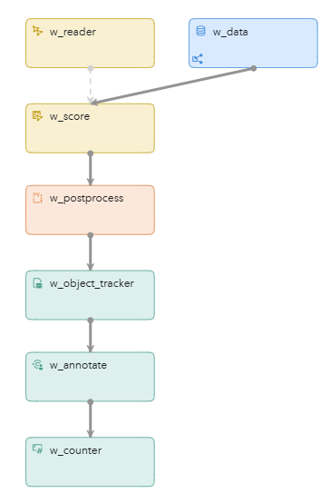

# Computer Vision Using an ONNX Model (Tiny YOLO Version 7)
## Overview
This example demonstrates how you can use an ONNX model to detect objects in an incoming video stream. Post-processing by a Python program converts scoring output to a more usable format.

---
**NOTE:**
Use this example with SAS Event Stream Processing 2025.06 and later.

---

For more information about how to install and use example projects, see [Using the Examples](https://github.com/sassoftware/esp-studio-examples#using-the-examples).

## Source Data and Other Files
- `video.mp4` is the video that is used as input for this example. When you have installed the example, you can access this video in the **Project Package** pane in SAS Event Stream Processing Studio and play it. The video is located in the `test_files` folder.
- `model.xml` is the project associated with this example.
- `yolov7-tiny_640x640.onnx` (within the project package ZIP file) is an open source ONNX model for object detection. 
- `labels.txt` contains the list of classes that the model can detect. 

For more information about the source of the above files, see [Source of the Model and Video Files](#source-of-the-model-and-video-files).

## Prerequisites

### Check System Prerequisites

Check that a persistent volume is available. In a Kubernetes environment, using ONNX models requires that when SAS Event Stream Processing is deployed, it is configured to access persistent volumes. This configuration involves applying overlays. For more information, see [Managing Persistent Volumes (PVs)](https://go.documentation.sas.com/doc/en/espcdc/default/espex/n19tbdmek5u0rdn1f31lktl95r27.htm#n1liey9g57i1ntn19mkd4pnpt7pd) and contact your system administrator.

The example is configured to use CUDA (Compute Unified Device Architecture) as the execution provider. For more information, see [Specifying Execution Providers](https://go.documentation.sas.com/doc/en/espcdc/default/espan/n04g09la3oqh59n0zls2jzllfgyf.htm). If CUDA is not available, you could adjust the w_reader window to change the execution provider to CPU.

This example is not intended for use with an ESP server that is running on an edge server.

## Workflow
The following figure shows the diagram of the project:



- w_data is a Source window. This is where individual frames from the input video enter the project.
- w_reader is a Model Reader window. This window reads the ONNX model and passes it to the w_score window. Pre-processing steps that need to be applied to the incoming events before scoring are also defined in this window. 
- w_score is a Score window. This window executes the ONNX model when data passes through the window. The events from the w_reader window are pre-processed (as defined in the w_reader window) and converted to a tensor format. A tensor is an n-dimensional array that contains the same type of data. The output from the w_score window is another tensor.
- w_postprocess is a Python window. The Python code converts the model output (tensor format) into easier formats, so that the outputs can be handled by subsequent windows. In general, a project that references an ONNX model is likely to require post-processing of data after scoring has taken place.
- w_object_tracker is an Object Tracker window that enables you to track objects over time. 
- w_annotate is a Python custom window. The Python code in this window annotates the image with the results from the model.
- w_counter is a Counter window that provides an indication of the overall performance.

### w_data

Explore the settings for this window:
1. Open the project in SAS Event Stream Processing Studio and select the w_data window.
2. Click the w_data window.
3. In the right pane, expand **State and Event Type**.<br/>The window is stateless and the index type is `pi_EMPTY`. That is, the window acts as a pass-through for all incoming events. The `pi_EMPTY` index does not store events.<br/>The window is set to accept only Insert events.
4. To examine the window's output schema, on the right toolbar, click . Observe the following fields: 
   - `id`: Each image that the window receives is assigned an ID, and this field holds information about the ID. This is a key field. 
   - `image`: This field holds the video frames.
5. Click . 
6. Expand **Input Data (Publisher) Connectors**.
7. Double-click the `video_publisher` Video Capture connector.<br/>The Connector Configuration window appears.
    - The **Filename** field shows that the window reads incoming events from the `video.mp4` file.
    - The **Publishformat** field is set to `wide`, meaning that the frames from the video are published in wide encoding. Wide encoding is an uncompressed format that results in higher overall performance.
8. Click **All properties**. 
    - Observe that the **inputrate** field is set to 10, meaning that 10 frames per second are read from the video. 
    - The **publishrate** field determines how many events are sent to the project per second. Because this field does not have a value, it defaults to the value of the **inputrate** field.
    - The fields **resize_x** and **resize_y** are set to `@PUBLISH_WIDTH@` and `@PUBLISH_HEIGHT@` respectively, which define the resolution of the published frames. The values of these user-defined properties can be found at project level.
    - The **repeatcount** field is set to 999 to repeat the video many times. If your environment includes Grafana, repeating the video makes it is easier to see the annotated video in Grafana. If this field were set to 0, the Video Capture publisher would be finished quickly and it would be harder to see the results in Grafana. For more information, see [Visualizing Objects in Grafana](#visualizing-objects-in-grafana). 
9. Click **Cancel** to close the All Properties window.
10.	Click **Cancel** to close the Connector Configuration window.

---
**NOTE:**
The input data provided in this example is to be used only with this project. Using or altering this data beyond the example for any other purpose is prohibited.

---

You can replace the `video.mp4` file with your own video file, RTSP (Real-Time Streaming Protocol) stream, or another input stream.


### w_reader

Explore the settings for this window:
1. Click the w_reader window.
2. In the right pane, expand **Settings**.
   - The `yolov7-tiny_640x640.onnx` file is the model that is used to detect objects in the input images.<br/>You could replace this model with another model. However, changing the model would require you to also adjust other parts of the example project, including Python code.
   - The selected execution provider is CUDA, which means that hardware acceleration is used. </br>SAS Event Stream Processing Studio does not detect which execution providers have been deployed. Contact your system administrator for more information about which execution providers are available to you.
3. Expand **Pre-processing**. The **Enable pre-processing** check box is selected and the pre-processing steps are defined below it. These settings are applied to each event that arrives in the w_reader window. In this example, four steps are defined: resize, color, normalize, and encode. These steps are necessary for the ONNX model to function properly. The order of the steps is also important. 

### w_score 

Explore the settings for this window:
1. Click the w_score window.
2. In the right pane, expand **Settings**. The **Model source** field is set to `Offline`, which allows the **Model type** field to be set to `ONNX`. The ONNX model is not specified here: the model is selected in the w_reader window and passed to the w_score window.
3. Click  to display the window’s schema. The schema differs from the schema of the w_source window in that the schema for the w_score window also contains a field called `output`, with a field type of `blob`. The data for this field contains the scored events. 
4. Click .
5. Expand **Input Map**. The input map specifies the properties of the data to be scored. That is, input data is mapped to the variables that the ONNX model is expecting.
6. Expand **Output Map**. The output map specifies the properties of the data that has been scored. The `output` field that is specified in the schema appears here.

### w_postprocess

Explore the settings for this window:
1. Click the w_postprocess window.
2. In the right pane, expand **Python Settings**.
    - The **Fields to copy** field specifies that the `output` field does not need to be copied to the output of this window.
    - Next, the fields to use in the Python code are specified. 
    - The **Expand parameters** check box is selected, meaning that you can use fields directly as Python variables, instead of referring to them by `data['my_field']`.
    - The **Events function** field is set to `postprocess_event`. This function is called every time the window receives a new event. 
3. Scroll down to the code editor.
    - Notice the `postprocess_event` function, which takes `output` as an argument.
    - In the first line of the function, the `event` variable is initialized as an empty dictionary (dict).
    - The line that follows transforms the output tensor of the ONNX model into a Numpy array by using the `esp_utils.onnx_tensor.tensor_to_np_array()` function that is provided with SAS Event Stream Processing. This function is part of a larger `esp_utils` package that is provided with SAS Event Stream Processing.
    - The next piece of code parses the output tensor to new fields. 
4. Click  to show the output fields that will be populated by the Python code. 

### w_object_tracker

Click the object_tracker window to explore its settings.
1. Click the w_object_tracker window.
2. In the right pane, expand **Tracking Properties**.
	- The **Tracking method** field specifies that the ByteTrack algorithm is being used. For more information about the ByteTrack algorithm, see [ByteTrack Method](https://documentation.sas.com/?cdcId=espcdc&cdcVersion=default&docsetId=espcreatewindows&docsetTarget=p0jsgd7e0fa40ln16wxod1qpj9d2.htm#n1xe73kilw1gt3n1jntjbqrk8zo1).

After an ONNX model is used to detect objects and post-processing is applied, tracking the detected objects over time can be a useful next step. For example, you could follow a person between multiple frames. In this example, the w_object_tracker window tracks a mobile phone and an apple on a table, rather than a person. 

Essentially, in addition to the bounding box, score, and label, each detected object is assigned a track ID by the window, represented by `Object0_id` array, as can be seen by clicking . In short, the Object Tracker window uses an algorithm to give an object that is detected in frame 1 and frame 2 the same track ID in both frames. A static camera position works best for tracking objects with the Object Tracker window.    

For more information, see [Using Object Tracker Windows](https://go.documentation.sas.com/doc/en/espcdc/v_043/espcreatewindows/p0jsgd7e0fa40ln16wxod1qpj9d2.htm). 


### w_annotate

The w_annotate window is the [Computer Vision Annotation Custom window](https://github.com/sassoftware/esp-studio-custom-windows/tree/main/Computer%20Vision%20Annotation). Click the w_annotate window to explore its settings. In the right pane, expand **Mappings** and click the **View file** button:
- The Python code in this window annotates the image with the results from the model.
- As in the previous Python window, w_postprocess, the `esp_utils` package is used for some common operations.
- The output of the window is now a JPG image, which can be visualized in Grafana. 

If you do not want to visualize the results in Grafana, it's best to remove this window for performance reasons. 

### w_counter
The last window of the project is a Counter window that checks the overall performance of the model. The value for **intervalRate** should be around 10 when running the model, as this is the value specified for the **inputrate** field in the Video Capture connector in the Source window. You can check this when you run the model in test mode in SAS Event Stream Processing Studio.

## Test the Project and View the Results

As discussed in the [w_data](#w_data) section, the w_data window includes a publisher connector that is configured to read incoming events from a video file.

When you enter test mode in SAS Event Stream Processing Studio, complete the following steps:
1.	In the left pane, select the check boxes for the windows whose events you want to examine. For example, select the w_postprocess window to view the postprocessed output of the model or the w_object_tracker window to see the tracked objects. Select the w_counter window to check whether the value of **intervalRate** is 10. 
2.	Select **Configure and Run Test**.

    <!--  -->
    

3.	In the Load and Start Project in Cluster window, click **Edit deployment settings**.
4.	In the Deployment Settings window, adjust the settings as shown in the following image:

    <!--  -->
    

5.	Click **OK** to close the Deployment Settings window.
6.	Click **OK** to close the Load and Start Project in Cluster window.

The results for each window appear in separate tabs in test mode. 

If it takes a long time for events to appear in test mode, contact your system administrator to check whether the minimum GPU node count is set to at least 1 in the cluster.

## Next Steps

### Using a Geofence
Geofences are virtual perimeters and can be used, for example, to trigger alerts when persons are detected in prohibited areas or when cars are parked in the wrong spot. For more information, see [Using Geofence Windows](https://go.documentation.sas.com/doc/en/espcdc/v_037/espcreatewindows/p0xru6q01dkxknn1t8gqo2q4zfu6.htm).

### Visualizing Objects in Grafana (recommended)
The detected objects can be visualized using the [SAS Event Stream Processing Data Source Plug-in for Grafana](https://github.com/sassoftware/grafana-esp-plugin). Import the [grafana.json](grafana.json) dashboard file to Grafana. 

---
**NOTE:**
- This dashboard uses the [Base64 Image/Video/Audio/PDF](https://grafana.com/grafana/plugins/volkovlabs-image-panel/) plug-in for Grafana.
- This dashboard was created using standalone SAS Event Stream Processing, running in the same namespace as Grafana. If you are using a different environment, such as the SAS Viya platform, you must recreate the queries because the connection URLs will differ.

---

The dashboard includes the following panel:


## Source of the Model and Video Files

### ONNX Model Source
Model Family: YOLOv7<br>
Model Name: 80 classes object detection<br>	
File Name: yolov7-tiny_640x640.onnx<br>
Provider: https://github.com/WongKinYiu/yolov7<br>	
License: GNU General Public License v3.0<br>

#### ONNX Export Instructions
The ONNX file for the example is provided, but can be re-created as follows. Clone https://github.com/WongKinYiu/yolov7 and switch to the `main` branch. Download `yolov7-tiny.pt` from https://github.com/WongKinYiu/yolov7/releases/tag/v0.1. Then, create the ONNX file:  

```bash
python export.py --weights yolov7-tiny.pt --grid --end2end --simplify --topk-all 100 --iou-thres 0.65 --conf-thres 0.35 --img-size 640 640 --max-wh 640
```


### Video Credits and Copyright

| File Name  | Copyright    | Notes               |
| ------------- | --------------- | ------------------- |
| `video.mp4` | © 2021 SAS Institute Inc. All Rights Reserved. | To be used only in the context of this demo. |


### Video and Image Restrictions
The videos and images provided in this example are to be used only with the project provided. Using or altering these videos and images beyond the example for any other purpose is prohibited.

