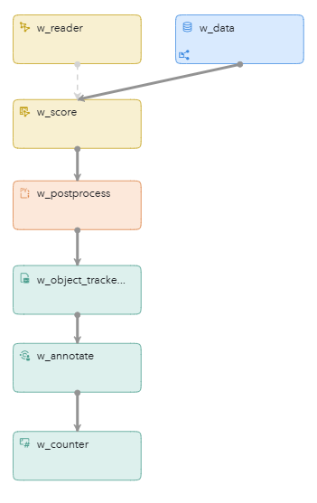

# Pose Estimation Using an ONNX Model (YOLO Pose Version 7)
## Overview
This example demonstrates how you can use an ONNX model to detect keypoints of a person in an incoming video stream. That is, this example uses pose estimation, which is a computer vision technique for recognizing and categorizing the positions of a human body. This example builds on the [Computer Vision Using an ONNX Model (Tiny YOLO Version 7)](https://github.com/sassoftware/esp-studio-examples/tree/main/Advanced/onnx_object_detection) example. It is recommended that you explore that example first.

---
**NOTE:**
 - Use this example with SAS Event Stream Processing 2025.06 and later.
 - This example contains more than one ZIP file. You cannot manually import this example to SAS Event Stream Processing Studio. Use the **Install example** button instead. For more information, see [Installing Examples Directly from SAS Event Stream Processing Studio](https://github.com/sassoftware/esp-studio-examples/tree/main?tab=readme-ov-file#installing-examples-directly-from-sas-event-stream-processing-studio).

---

For more information about how to install and use example projects, see [Using the Examples](https://github.com/sassoftware/esp-studio-examples#using-the-examples).

## Source Data and Other Files
- `video.mp4` is the video that is used as input for this example. When you have installed the example, you can access this video in the **Project Package** pane in SAS Event Stream Processing Studio and play it. The video is located in the `test_files` folder.
- `model.xml` is the project associated with this example.
- `yolov7-w6-pose_fp16_io_fp32.onnx` (within the project package ZIP file) is an open source ONNX model for pose estimation. 
- `skeleton.txt` contains the list of keypoints that the model can detect. 

For more information about the source of the above files, see [Source of the Model and Video Files](#source-of-the-model-and-video-files).

## Prerequisites

### Check System Prerequisites

Check that a persistent volume is available. In a Kubernetes environment, using ONNX models requires that when SAS Event Stream Processing is deployed, it is configured to access persistent volumes. This configuration involves applying overlays. For more information, see [Managing Persistent Volumes (PVs)](https://go.documentation.sas.com/doc/en/espcdc/default/espex/n19tbdmek5u0rdn1f31lktl95r27.htm#n1liey9g57i1ntn19mkd4pnpt7pd) and contact your system administrator.

The example is configured to use CUDA (Compute Unified Device Architecture) as the execution provider. For more information, see [Specifying Execution Providers](https://go.documentation.sas.com/doc/en/espcdc/default/espan/n04g09la3oqh59n0zls2jzllfgyf.htm). If CUDA is not available, you could adjust the w_reader window to change the execution provider to CPU.

This example is not intended for use with an ESP server that is running on an edge server.

## Workflow
The following figure shows the diagram of the project:



- w_data is a Source window. This is where individual frames from the input video enter the project.
- w_reader is a Model Reader window. This window reads the ONNX model and passes it to the w_score window. Pre-processing steps that need to be applied to the incoming events before scoring are also defined in this window. 
- w_score is a Score window. This window executes the ONNX model when data passes through the window. The events from the w_reader window are pre-processed (as defined in the w_reader window) and converted to a tensor format. A tensor is an n-dimensional array that contains the same type of data. The output from the w_score window is another tensor.
- w_postprocess is a Python window. The Python code converts the model output (tensor format) into easier formats, so that the outputs can be handled by subsequent windows. In general, a project that references an ONNX model is likely to require post-processing of data after scoring has taken place.
- w_object_tracker_array is an Object Tracker window that enables you to track objects and their associated keypoints over time. 
- w_annotate is a Python custom window. The Python code in this window annotates the image with the results from the model. 
- w_counter is a Counter window that provides an indication of the overall performance.

### w_data
This Source window contains a publisher connector that reads frames from an MP4 file. For more information, see [Computer Vision Using an ONNX Model (Tiny YOLO Version 7)](https://github.com/sassoftware/esp-studio-examples/tree/main/Advanced/onnx_object_detection).

### w_reader
This window reads the ONNX file and passes it to the w_score window. In addition, the pre-processing steps that need to be applied to each event coming from the w_data window are defined in the w_reader window. For more information, see [Computer Vision Using an ONNX Model (Tiny YOLO Version 7)](https://github.com/sassoftware/esp-studio-examples/tree/main/Advanced/onnx_object_detection).

### w_score
This window scores the incoming data from the w_data window. It first applies the pre-processing steps defined in the w_reader window and then the ONNX model is executed. The result is a tensor. 

### w_postprocess
The w_postprocess window in this example differs from the one in the object detection example [Computer Vision Using an ONNX Model (Tiny YOLO Version 7)](https://github.com/sassoftware/esp-studio-examples/tree/main/Advanced/onnx_object_detection). 

In the w_postprocess window in this pose estimation example, the output tensor is post-processed. The keypoints of the person detected by the ONNX model are displayed adjacent to the bounding box of each detected person. Examples of the keypoints that this model can detect are the nose, left eye, right eye, and left knee. See the `skeleton.txt` file in the project package ZIP file for a list of all keypoints that the model can detect. 

For each keypoint that has a confidence score of more than 0.3, the x coordinate (the `Object_kpts_x` field) and the y coordinate (the `Object_kpts_y` field) are obtained, as well as the confidence score (the `Object_kpts_score` field). The IDs of the keypoints are stored in the `Object_kpts_label_id` array. These IDs are mapped to labels (for example, left hip) in the `w_annotate` window. Finally, the `Object_kpts_count` field contains the number of keypoints for each detected person. 

### w_object_tracker_array
The w_object_tracker_array window in this example differs from the Object Tracker window in [Computer Vision Using an ONNX Model (Tiny YOLO Version 7)](https://github.com/sassoftware/esp-studio-examples/tree/main/Advanced/onnx_object_detection). 

Click the object_tracker window to explore its settings.
1. Click the w_object_tracker_array window.
2. In the right pane, expand **Tracking Properties**.
	- The **Tracking method** field specifies that the ByteTrack algorithm is being used. For more information about the ByteTrack algorithm, see [ByteTrack Method](https://documentation.sas.com/?cdcId=espcdc&cdcVersion=default&docsetId=espcreatewindows&docsetTarget=p0jsgd7e0fa40ln16wxod1qpj9d2.htm#n1xe73kilw1gt3n1jntjbqrk8zo1).

In this pose estimation example, both the bounding boxes and the detected keypoints are passed to the Object Tracker window. Each person is tracked over time using the bounding box as in the previous example, but now the detected keypoints for each track can also be retrieved. 

For more information, see [Using Object Tracker Windows](https://go.documentation.sas.com/doc/en/espcdc/default/espcreatewindows/p0jsgd7e0fa40ln16wxod1qpj9d2.htm). 

### w_annotate
The w_annotate window is the [Computer Vision Annotation Custom window](https://github.com/sassoftware/esp-studio-custom-windows/tree/main/Computer%20Vision%20Annotation). Click the w_annotate window to explore its settings. In the right pane, expand **Mappings** and click the **View file** button:
- The Python code in this window annotates the image with the results from the model. It annotates both the detected bounding box as well as the keypoints. 
- As in the w_postprocess Python window, the `esp_utils` package is used for some common operations.
- The output of the window is now a JPG image, which can be visualized in Grafana. 

If you do not want to visualize the results in Grafana, it's best to remove this window for performance reasons. 

## Test the Project and View the Results
When you enter test mode in SAS Event Stream Processing Studio, complete the following steps:
1.	In the left pane, select the check boxes for the windows whose events you want to examine. For example, select the w_postprocess window to view the postprocessed output of the model or the w_object_tracker_array window to see the tracked objects and keypoints. Select the w_counter window to check whether the value of **intervalRate** is 10; this is the value that is set in the Video Capture connector in the w_source window. 
2.	Select **Configure and Run Test**.

    <!--  -->
    

3.	In the Load and Start Project in Cluster window, click **Edit deployment settings**.
4.	In the Deployment Settings window, adjust the settings as shown in the following image:

    <!--  -->
    

5.	Click **OK** to close the Deployment Settings window.
6.	Click **OK** to close the Load and Start Project in Cluster window.

The results for each window appear in separate tabs in test mode. 

If it takes a long time for events to appear in test mode, contact your system administrator to check whether the minimum GPU node count is set to at least 1 in the cluster.

## Next Steps

### Predicting Activity
From the detected keypoints, you could predict the activity of a person. For example, you could check whether someone is picking up an object ergonomically or detect whether someone performs a certain yoga pose. These findings can be combined with a [Geofence window](https://go.documentation.sas.com/doc/en/espcdc/default/espcreatewindows/p0xru6q01dkxknn1t8gqo2q4zfu6.htm) to determine whether the activity takes place in a certain region of the frame. 

### Visualizing Objects in Grafana (recommended)
The detected objects can be visualized using the [SAS Event Stream Processing Data Source Plug-in for Grafana](https://github.com/sassoftware/grafana-esp-plugin). Import the [grafana.json](grafana.json) dashboard file to Grafana. 

---
**NOTE:**
- This dashboard uses the [Base64 Image/Video/Audio/PDF](https://grafana.com/grafana/plugins/volkovlabs-image-panel/) plug-in for Grafana.
- This dashboard was created using standalone SAS Event Stream Processing, running in the same namespace as Grafana. If you are using a different environment, such as the SAS Viya platform, you must recreate the queries because the connection URLs will differ.

---

The dashboard includes the following panel:


## Source of the Model and Video Files

### ONNX Model Source
Model Family: YOLOv7 (Pose)<br>
Model Name: YOLO-Pose<br>
File Name: yolov7-w6-pose.onnx (later converted into yolov7-w6-pose_fp16_io_fp32.onnx, see below)<br>
Provider: https://github.com/WongKinYiu/yolov7<br>	
License: GNU General Public License v3.0<br>


#### ONNX Export Instructions
The ONNX file for the example is provided, but can be re-created as follows. Clone https://github.com/WongKinYiu/yolov7 and switch to the `pose` branch. Download `yolov7-w6-pose.pt` from https://github.com/WongKinYiu/yolov7/releases/tag/v0.1. Then, create the ONNX file:  

```
cd models/
python export.py --weights yolov7-w6-pose.pt --img-size 640 640 --export-nms --simplify
```

###### Convert the Model into Half Precision
The next step is to convert the model into half precision, for better inferencing performance and a smaller file size. To convert the model to use half precision, install the following PIP packages: 
```
pip install onnx onnxconverter-common
```

Then, run the following Python code:
```python
import onnx
from onnxconverter_common import float16

model = onnx.load("yolov7-w6-pose.onnx")
model_fp16 = float16.convert_float_to_float16(model, keep_io_types=True)
onnx.save(model_fp16, "yolov7-w6-pose_fp16_io_fp32.onnx")
```


### Video Credits and Copyright

| File Name  | Copyright    | Notes               |
| ------------- | --------------- | ------------------- |
| `video.mp4` | © 2024 SAS Institute Inc. All Rights Reserved. | To be used only in the context of this demo. |


### Video and Image Restrictions
The videos and images provided in this example are to be used only with the project provided. Using or altering these videos and images beyond the example for any other purpose is prohibited.
