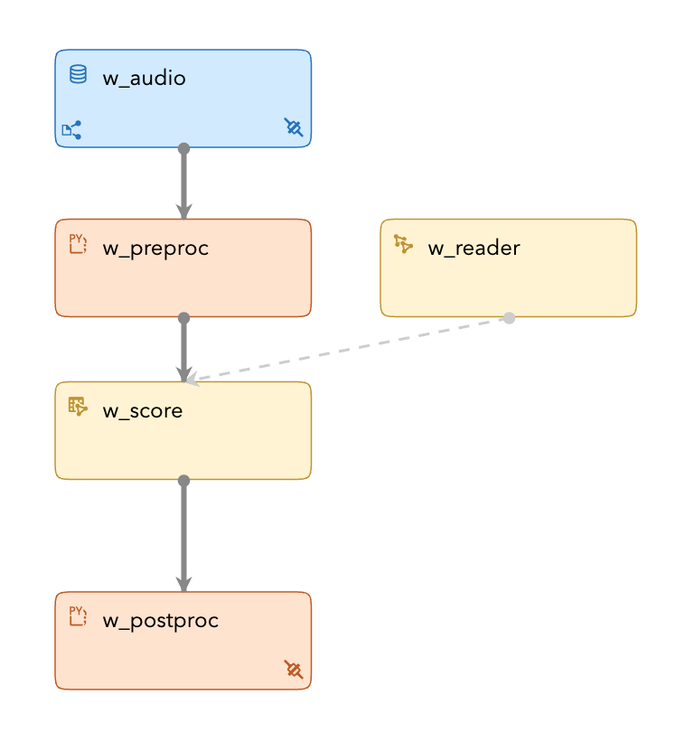
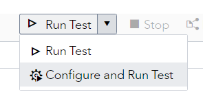
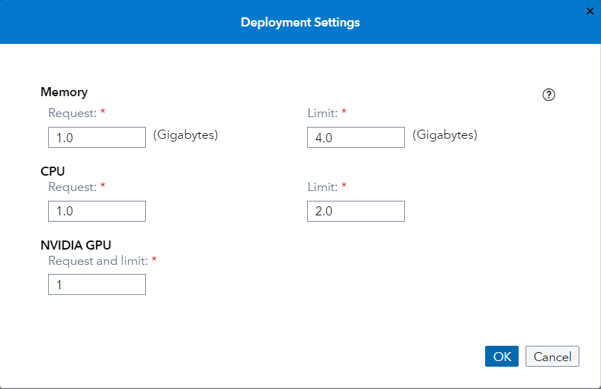
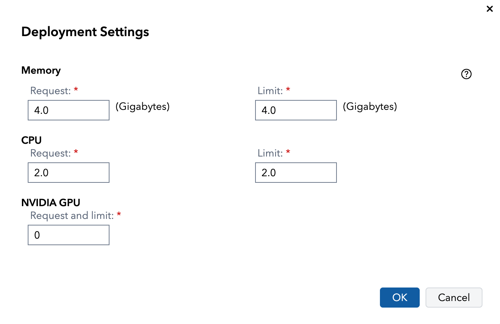
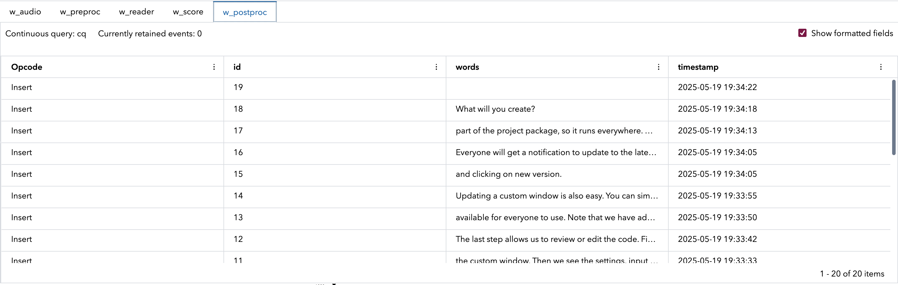

# Voice Transcription Using an ONNX Model (OpenAI Whisper)
## Overview
This example demonstrates how you can use an ONNX model to transcribe audio. Post-processing by a Python program converts the tokens that the model outputs into words.

---
**NOTE:**
Use this example with SAS Event Stream Processing 2025.04 and later.

---

For more information about how to install and use example projects, see [Using the Examples](https://github.com/sassoftware/esp-studio-examples#using-the-examples).

## Whisper Model

[Whisper](https://en.wikipedia.org/wiki/Whisper_(speech_recognition_system)) is an open-weights model released in 2022 by OpenAI.  Whisper transcribes accurately, even with background noise or multiple speakers. It has an extremely large vocabulary, even correctly transcribing proper nouns like "GitLab", file names like "requirements.txt", and acronyms like "ESP".

The Whisper model can be converted to ONNX and run it in SAS Event Stream Processing with minimal Python window code, avoiding the need to install additional packages.

## Source Data and Other Files
- `rik_customwindow_16k.wav` is the audio file used as the input for this example. When you have installed the example, you can access this audio in the **Project Package** pane in SAS Event Stream Processing Studio. The file is located in the `test_files` folder. You can replace this file with your own WAV file, but it must have a sample rate of 16K.
- `model.xml` is the project associated with this example.
- `whisper_sm_int8_cpu.onnx` (within the project package ZIP file) is an open source ONNX model for voice transcription. 
- `bpe_decoder.py` contains the mapping of tokens to words.

For more information about the source of the above files, see [Source of the Model and Video Files](#source-of-the-model-and-video-files).

## Prerequisites

### Check System Prerequisites

The example is configured to use the CPU as the execution provider, but could be configured to use CUDA (Compute Unified Device Architecture) as the execution provider. For more information, see [Specifying Execution Providers](https://go.documentation.sas.com/doc/en/espcdc/v_059/espan/p1hftm0oss1q3pn1stdkzrqjhdjo.htm#n04g09la3oqh59n0zls2jzllfgyf).

This example is configured for batch transcription of WAV files. For live transcription from a microphone, you must use an ESP server that is running on an edge server and configure the audio connector.

## Workflow
The following figure shows the diagram of the project:



- w_audio is a Source window. This is where individual amplitude values from a WAV file or microphone are streamed in.
- w_preproc is a Python window. The Python code converts individual amplitude values into a tensor suitable for ONNX runtime.
- w_reader is a Model Reader window. This window reads the ONNX model and passes it to the w_score window.
- w_score is a Score window. This window executes the ONNX model when data passes through the window. The events from the w_reader window are pre-processed and converted to a tensor format. A tensor is an n-dimensional array that contains the same type of data. The output from the w_score window is another tensor.
- w_postproc is a Python window. The Python code converts the model output (tensor format) into numpy format, and then converts the tokens to text using a BPE (byte-pair encoding) decoder.

### w_audio

Explore the settings for this window:

1. Click the w_audio window.
2. In the right pane, expand **State and Event Type**.<br/>The window is stateless and the index type is `pi_EMPTY`. This means the window acts as a pass-through for all incoming events. The `pi_EMPTY` index does not store events.
3. To examine the window's output schema, on the right toolbar, click . Observe the following fields: 
   - `id`: Each image that the window receives is assigned an ID, and this field holds information about the ID. This is a key field. 
   - `audio`: This field holds the audio amplitude values.
4. Click . 
5. Expand **Input Data (Publisher) Connectors**.
<br/>Observe there are two connectors, and only one is selected. The `python` connector reads batch WAV files. The `audio` connector, which is disabled in this example, streams data from the microphone. This requires an ESP server that runs on an edge device.
6. Double-click the `python` Video Capture connector.<br/>The Connector Configuration window appears. The **Code** field shows that the window runs the `publish_fun_ac` generator, which is defined in `files/esp_whisper_funs.py`.
7.	Click **Cancel** to close the Connector Configuration window.

You can replace the WAV file with your own audio file.

### w_preproc

Explore the settings for this window:
1. Click the w_preproc window.
2. In the right pane, expand **Python Settings**.
3. Scroll down to the **Code source** field and click **View file**.
 This window calls the `preproc` function from the `files/esp_whisper_funs.py` module. Here is the relevant function:
```python
blockid = 0
def preproc(data, foresp=True):
    """
    Processes the audio data, scales it, and converts to the tensor format
    When foresp is False, assume data is coming as a numpy array
    When foresp is True, assume data came as a dictionary containing a list (the event block)
        and convert that to a numpy array
    """
    global blockid
    if foresp:
        aud = np.array([d["audio"] for d in data])
    else:
        aud = data
    audio = aud / (2**15)
    audio = np.expand_dims(audio, axis=0)
    esp_in = dict(id=blockid) | get_model_inputs(audio, foresp=foresp)
    blockid += 1
    return esp_in
```

This function converts the data to numpy, scales it, and calls another function to add the ONNX parameters required by the Whisper model. The `foresp` keyword allows this function to be used in regular Python by disabling calls to functions in `esp_utils`, which convert SAS Event Stream Processing blobs to ONNX tensors. These functions are not needed outside SAS Event Stream Processing.

4. Click **Close**.
5. To examine the window's output schema, on the right toolbar, click . Observe the following fields, which can be read from the model file directly using the popular open-source tool [Netron](https://github.com/lutzroeder/netron), or in Python after importing the model with ONNX Runtime: 
    - `audio_pcm`: The audio data as a tensor blob.
    - There are six parameter fields: `max_length`, `min_length`, `num_beams`, `num_return_sequences`, `length_penalty`, and `repetition_penalty`. These parameters use the default values supplied when the model was exported with Olive. For more information, see [Source of the Model and Video Files](#source-of-the-model-and-video-files) below.


### w_reader

Explore the settings for this window:
1. Click the w_reader window.
2. Click  to go back to **Properties**. 
3. In the right pane, expand **Settings**.
   - The `whisper_sm_int8_cpu.onnx` file is the model that is used to transcribe the audio. You could replace this model with another Whisper model like `whisper-large-v3-turbo`. However, changing the model would require you to also adjust other parts of the example project, including Python code. This is because the larger Whisper model has different BPE decoder mappings.
   - The selected execution provider is CPU, which means that hardware acceleration is not used. If you have a GPU, you can switch this to CUDA for a substantial performance improvement.

### w_score 

Explore the settings for this window:
1. Click the w_score window.
2. In the right pane, expand **Settings**. The **Model source** field is set to `Offline`, which allows the **Model type** field to be set to `ONNX`. The ONNX model is not specified here: the model is selected in the w_reader window and passed to the w_score window.
3. Click  to display the window’s schema. The schema differs from the schema of the w_source window in that the schema for the w_score window also contains a field called `output`, with a field type of `blob`. The data for this field contains the scored events. 
4. Click .
5. Expand **Input Map**. The input map specifies the properties of the data to be scored. That is, input data is mapped to the variables that the ONNX model is expecting.
6. Expand **Output Map**. The output map specifies the properties of the data that have been scored. The `output` field specified in the schema appears here.

### w_postproc

Explore the settings for this window:
1. Click the w_postproc window.
2. In the right pane, expand **Python Settings**. The **Events function** field is set to `postproc`. This function is called each time the window receives a new event. 
3. Scroll down to the **Code source** field and click **View file**.
 This window calls the `postproc` function from the `files/esp_whisper_funs.py` module. Here is the relevant function:
```python
def postproc(data, context):
    event = {}
    raw_words = postproc_audio_tensor(data["generated_ids"])
    event["timestamp"] = datetime.datetime.now().strftime("%Y-%m-%d %H:%M:%S")
    event["words"] = raw_words
    return event
```

- In the first line of the function, the `event` variable is initialized as an empty dictionary (dict).
- Next, the tokens are processed with `postproc_audio_tensor`, which calls the BPE decoder.
- A timestamp is created.
- Finally, the raw words are returned to SAS Event Stream Processing as a string.

4. Click **Close**.

## Test the Project and View the Results

As discussed in the [w_audio](#w_audio) section, the w_audio window includes a publisher connector that is configured to read incoming events from an audio file.

When you enter test mode in SAS Event Stream Processing Studio, complete the following steps:
1.	In the left pane, select the check boxes for the windows whose events you want to examine. For example, select the w_postproc window to view the postprocessed output of the model.
2.	Select **Configure and Run Test**. 
    
    
3.	In the Load and Start Project in Cluster window, click **Edit deployment settings**.
4.	In the Deployment Settings window, adjust the settings as shown in the following image. Make sure you request 4 GB of memory, though it probably runs with only 2 GB.

    <!--  -->
    
5.	Click **OK** to close the Deployment Settings window.
6.	Click **OK** to close the Load and Start Project in Cluster window.

The results for each window appear in separate tabs in test mode, as shown below. The transcription appears in the `w_postproc` tab.



## Next Steps

You can upload different WAV files to transcribe. The names of the files to transcribe are specified in the Python file `esp_whisper_funs.py`. Scroll to the bottom and find the function `publish_fun_ac` and edit the path that contains `test_files/rik_customwindow_16k.wav`. You can use `*` as a wildcard syntax to match many files.

If you want to transcribe live audio, you need to deploy SAS Event Stream Processing as an edge server on a device with an attached microphone, such as an NVIDIA Jetson device. After setting that up, deactivate the Python connector and activate the audio connector to listen to the microphone.

If you require higher model accuracy, try using the larger model `whisper-large-v3-turbo`. You need to use a GPU for reasonable performance with this model. Edit the lines in [ONNX Export Instructions](#onnx-export-instructions) to refer to `whisper-large-v3-turbo` and to use `gpu_fp16` instead of `cpu_int8`. You also need to modify the `bpe_decoder.py` file to extract the new BPE encoding used by the larger model. You can extract the token map from the model once you create it. Before deleting the `BPEDecoder` node in the Python code described below, copy the parameters to the `BPEDecoder` node visible in that code into the `bpe_decoder.py` function. The parameter names match exactly because that node is the original source of the parameters.

## Source of the Model and Video Files

### ONNX Model Source
- Model Family: Whisper
- Model Name: whisper-sm.en
- File Name: whisper_sm_int8_cpu.onnx
- Provider: https://github.com/openai/whisper
- License: MIT

#### ONNX Export Instructions
The ONNX file for the example is provided, but can be re-created as follows. Install [Olive](https://microsoft.github.io/Olive/) (ONNX Live following their instructions. Next, see the example for Whisper [here](https://github.com/microsoft/Olive/tree/d4d424f9b370e736e79b17487c037d5aad766315/examples/whisper). After cloning the Olive repo at that specific Git commit, navigate to the Whisper directory and run

```
python prepare_whisper_configs.py --model_name openai/whisper-small --no_audio_decoder
olive run --config whisper_cpu_int8.json --setup
olive run --config whisper_cpu_int8.json 
```

This downloads the Whisper model from [Hugging Face](https://huggingface.co/openai/whisper-small.en) and converts it to ONNX, using INT8 quantization optimized for the CPU.

Next, you need to remove the `BPEDecoder` op from the ONNX graph because it requires a custom library not shipped with SAS Event Stream Processing. Install the `onnxconverter` package and

1. Run `python -m onnxconverter_common.onnx2py whisper.onnx out_whisper.py`
2. Remove the last node, which is `BPEDecoder`. Edit the output name, output dims, and type. The output name is `generated_ids` with type `INT64`.
3. You need to implement `BPEDecoder` yourself in Python later.
4. Run `python out_whisper.py whisper_cpu_sm.onnx` to get the ONNX model for SAS Event Stream Processing.

At this point, you have the final ONNX model and can upload it to SAS Event Stream Processing Studio.


### Audio Credits and Copyright

| File Name  | Copyright    | Notes               |
| ------------- | --------------- | ------------------- |
| `rik_customwindow_16k.wav` | © 2025 SAS Institute Inc. All Rights Reserved. | To be used only in the context of this demo. |

### Audio Restrictions
The audio provided in this example are to be used only with the project provided. Using or altering these videos and images beyond the example for any other purpose is prohibited.