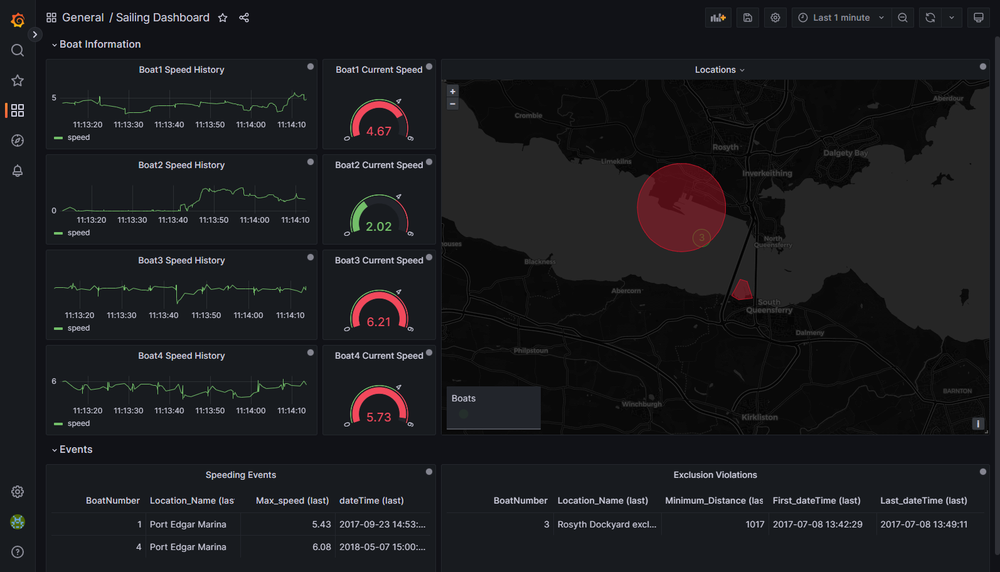

# Processing Data from Sailing Boats
## Overview
This example processes data gathered from sailing boats.

For more information about how to install and use example projects, see [Using the Examples](https://github.com/sassoftware/esp-studio-examples#using-the-examples).

## Use Case

This example identifies two geographical areas of interest. One area is a dockyard exclusion zone that boats are not permitted to enter. The other is a marina where a speed restriction has been applied.

This example uses CSV files that contain historical data. When a model similar to the one used in this example is deployed in a live environment, real-time data sources might be used instead.

## Source Data

The [geoArea.csv](geoArea.csv) file contains events that relate to the two geographical areas of interest.

The [boat1.csv](boat1.csv), [boat2.csv](boat2.csv), [boat3.csv](boat3.csv), and [boat4.csv](boat4.csv) files contain geographical coordinates of the boats' movements.

## Workflow

The following figure shows the diagram of the project:

- Four Source windows receive event streams from the four boats identified: Boat1, Boat2, Boat3, and Boat4.
- One Source window receives an event stream defining the two areas of interest that the boats are not permitted to enter: Areas_Of_Interest.
- Four Compute windows assign a boat number to each of the four boats identified: Compute_ID1, Compute_ID2, Compute_ID3, and Compute_ID4. This allows SAS Event Stream Processing to differentiate the boats before joining the streams together for processing.
- One Union window unifies the boats’ event streams: Union_All_Boats.
- One Geofence window defines the areas of interest: Geofence_Area_Check.
- One Copy window is used to transition the model from stateless to stateful.
- Two Filter windows identify if any of the boats have entered the exclusion zone and speed restriction zone, and if any of the boats were speeding: Filter_Inside_Exclusion_Zone and Last_Speeding_Event.
- Two Aggregate windows aggregate the last exclusion violation and the last speeding event: Last_Exclusion_Violation and Last_Speeding_Event.

## Test the Project and View the Results

If you do not use the **Install example** button in SAS Event Stream Processing Studio, note that this project includes connector orchestration and as a result, it is recommended that you do not use the **Publish** button in SAS Event Stream Processing Studio's test mode to publish events from CSV files to the Source windows. Instead, edit the file paths in the publisher connectors in the Boat1, Boat2, Boat3, Boat4, and Areas_Of_Interest windows so that they refer to the location in your system where you placed the CSV files. For more information, see [SAS Help Center: Configure a File and Socket Connector](https://go.documentation.sas.com/doc/en/espcdc/default/espstudio/n0esv2n0cbbpgcn1r281krr1iv6q.htm#n0y87cwr7q5vo6n1qlfcey182vt6).

When you test the project, the results for each window appear on separate tabs. The following figure shows the results for the Last_Speeding_Event tab:

The following figure shows the results for the Last_Exclusion_Violation tab. It takes several minutes before events appear in this tab. That is, speeding violations in the marina take place soon after the data stream starts, whereas dockyard exclusion zone violations take place later.

Note: If any table remains empty, check that the publisher connectors for all five Source windows are set correctly to point to the CSV files.

## Visualizing Objects in Grafana
The sailing boats and areas of interest can be visualized using the [SAS Event Stream Processing Data Source Plug-in for Grafana](https://github.com/sassoftware/grafana-esp-plugin). Import the [grafana.json](grafana.json) dashboard file to Grafana. The `grafana.json` file references the [sailing-areas-of-interest.geojson](sailing-areas-of-interest.geojson) file, which defines the areas of interest.

---
**NOTE:**
This dashboard was created using standalone SAS Event Stream Processing, running in the same namespace as Grafana. If you are using a different environment, such as the SAS Viya platform, you must recreate the queries because the connection URLs will differ.

---

## Additional Resources

- The [Using a Geofence to Find Wanted Vehicles](https://github.com/sassoftware/esp-studio-examples/tree/main/Advanced/geofence) example provides a more detailed discussion of the settings for a Geofence window and for connector orchestration. 
- For more information about the Geofence window, see [SAS Help Center: Using Geofence Windows](https://documentation.sas.com/?cdcId=espcdc&cdcVersion=default&docsetId=espcreatewindows&docsetTarget=p0xru6q01dkxknn1t8gqo2q4zfu6).
