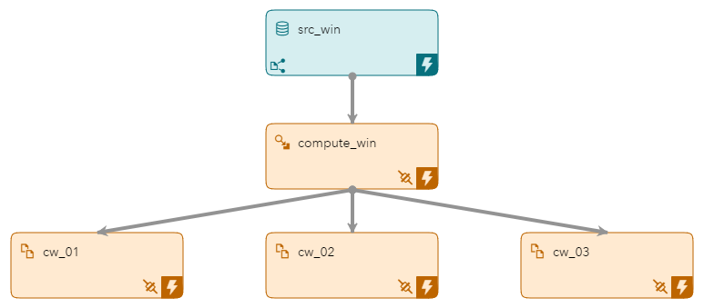
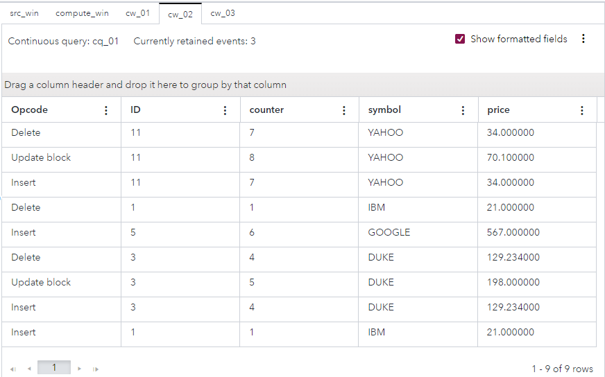

# Splitting Events across Output Slots
## Overview

This example enables you to send stock market events across a set of output slots. The Compute window in this example determines which output slot or slots should be used for each stock market event. Three Copy windows connect to the Compute window using different output slots.

Filtering events using window splitters with only one output slot can be more efficient than using multiple Filter windows. This is because the filtering is performed at the window splitter only, rather than multiple times for each filter. For example, performing an alpha-split across a set of trades results in less data movement and data processing than performing an alpha-split across multiple Filter windows.

## Source Data

The [stocktrades.csv](stocktrades.csv) file contains a list of stock prices. 

## Workflow
The following figure shows the diagram of the project:



- The src_win window is a Source window. This is where a list of securities transactions from the stocktrades.csv file enter the model.
- The compute_win window is a Compute window. This window determines which output slot or slots should be used for each stock market event. 
- The cw_01 window is a Copy window. The window retains the events that are allocated to slot 0.
- The cw_02 window is a Copy window. The window retains the events that are allocated to slot 1.
- The cw_03 window is a Copy window. The window retains the events that are allocated to slot -1.

### src_win

Explore the settings for the src_win window:
1. Open the project in SAS Event Stream Processing Studio and select the src_win window. 
2. In the right pane, expand **State and Event Type**. Observe that the window is stateful. The window retains all incoming events.
3. To examine the window's output schema, on the right toolbar, click . Observe the following fields: 
   - `ID`: This field is the stock trade's ID, which is also selected as the key field.
   - `symbol`: This field is the stock symbol. A stock symbol is a series of letters that are assigned to a security for trading purposes.
   - `price`: This field is the stock price.
4. Click . 

### compute_win

Explore the settings for the compute_win window:
1. Select the compute_win window.
2. In the right pane, expand **Compute Settings**. Observe that an engine initialization expression is used. The following Expression Engine Language (EEL) expression initializes a variable named `counter`:
   ```
   integer counter; 
               counter=0;
   ```                  
   For more information about EEL, see [SAS Help Center: Overview of the Expression Engine Language](https://go.documentation.sas.com/doc/en/espcdc/default/engelref/n1w06w1wjvul9en1xuyuuh5bn3u7.htm).
3. Expand **Advanced**. Observe that the following EEL expression is used to split the output: `ID%2`. The splitter directs events to an output slot. The splitter initializes the expression with a user-defined function written in EEL. The function is then applied to the incoming value of the `ID` field from the src_win window. The result is used to determine the slot number for the processed event.<br/>For more information about the modulo operator in EEL, see [SAS Help Center: Modulo Operator](https://go.documentation.sas.com/doc/en/espcdc/default/engelref/n1w06w1wjvul9en1xuyuuh5bn3u7.htm#n1cl5dp1ztgja8n1f2y8uvemaqqy).
4. To examine the window's output schema, on the right toolbar, click . Observe that the following details:
   - `ID`, `symbol`, and `price`: These fields are present in the src_win window and are passed through.
   - `counter`: This field contains an EEL expression, `counter=counter+1 return counter`. This code increments the `counter` variable and returns the value.
5. Click . 

### cw_01, cw_02, and cw_03

Explore the settings for the cw_01, cw_02, and cw_03 windows:
1. Select the edge that connects the compute_win window with the cw_01 window. 
2. In the right pane, observe that the slot assigned to this edge is `0`. That is, when the expression `ID%2` in the compute_win window's split method results in the value 0 being assigned to an event, that event is sent to cw_01 window.
3. Select the edge that leads from compute_win window to the cw_02 window and then the edge that leads to the cw_03 window, and observe the slot settings.
4. Select the cw_01 window. 
5. In the right pane, expand **Retention**. Observe that volume-based retention (row count) rather than time-based retention is used.
6. View the retention settings for the cw_02 and cw_03 windows and observe that the same settings are used in these windows.

## Test the Project and View the Results

When you test the project in SAS Event Stream Processing Studio, you can use the **Publish** button to publish events from the stocktrades.csv file into the src_win window. For more information, see [Publish Events from a CSV file](https://go.documentation.sas.com/doc/en/espcdc/default/espstudio/p124n2fohetwqzn109gsdel6o1cj.htm).

Alternatively, before you test the project, you can configure a publisher connector for the src_win window. For more information, see [Configure a File and Socket Connector](https://go.documentation.sas.com/doc/en/espcdc/default/espstudio/n0esv2n0cbbpgcn1r281krr1iv6q.htm#n0y87cwr7q5vo6n1qlfcey182vt6).

The results for each window appear in separate tabs in test mode:
- The **scr_win** tab displays all events.  
- The **compute_win** tab displays all events and also the `counter` variable that is assigned to each event.
- The **cw_01** tab displays the events that are allocated to slot `0`.
- The **cw_02** tab displays the events that are allocated to slot `1`.
- The **cw_03** tab displays the events that are allocated to slot `-1`.

The following figure shows the results for the cw_02 tab:



## Additional Resources
For more information, see [SAS Help Center: Using Compute Windows](https://documentation.sas.com/?cdcId=espcdc&cdcVersion=default&docsetId=espcreatewindows&docsetTarget=p0az3u020i6o7an14agtsdk1st0v).
