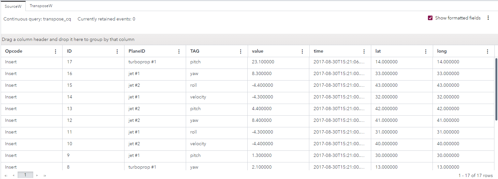
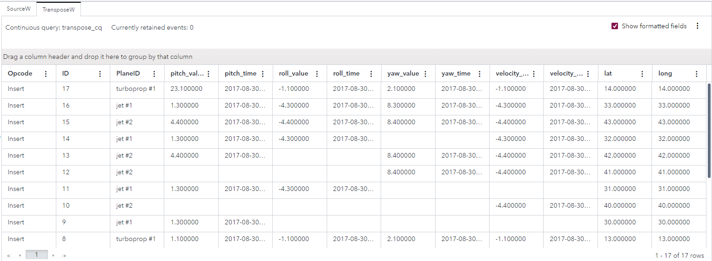
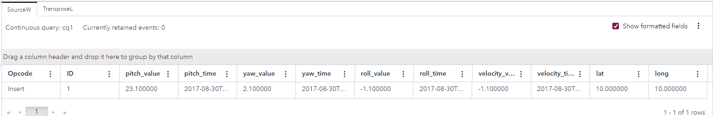
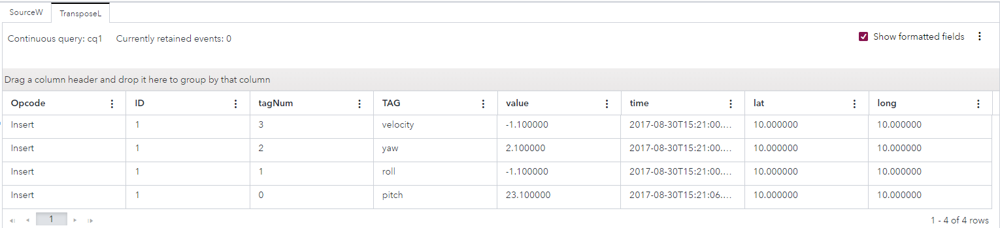

# Transposing Data from an Aircraft
## Overview

This example processes information about the pitch, yaw, roll, and velocity of an aircraft in flight. This example conceptualizes an event as a row that consists of multiple columns. A Transpose window is used to interchange an event’s rows as columns, and columns as rows. The attributes of the Transpose window govern the rearrangement of data. 

As the Transpose window has two modes, long and wide, this example consists of two parts:
- The [esp-studio-examples/Advanced/transpose_wide/](https://github.com/sassoftware/esp-studio-examples/tree/main/Advanced/transpose_wide) directory contains the resources for wide mode
- The [esp-studio-examples/Advanced/transpose_long/](https://github.com/sassoftware/esp-studio-examples/tree/main/Advanced/transpose_long) directory contains the resources for long mode

In the following instructions wide mode first is discussed first.

For more information about how to install and use example projects, see [Using the Examples](https://github.com/sassoftware/esp-studio-examples#using-the-examples).

## Source Data for Wide Mode

The [input-wide.csv](input-wide.csv) file contains event streams from the aircraft in flight.

The seventeen events in the file contain data about four planes: `turboprop #1`, `turboprop #2`, `jet #1`, and `jet #2`. Each event contains either a pitch, velocity, roll, or yaw value at a specific time, as well as the plane's latitude and longitude. It is not easy to find all the information for a specific plane, because information relating to each plane is located on several rows.

## Workflow for Wide Mode
The following figure shows the diagram of the project:

- The SourceW window is a Source window. This is where aircraft events from the `input-wide.csv` file enter the model.
- The TransposeW is a Transpose Window. This is where the transposition of the aircraft events occurs. The attributes of the Transpose window govern the rearrangement of data. 

### SourceW

Explore the settings for the SourceW window:
1. Open the project in SAS Event Stream Processing Studio and select the SourceW window. 
2. In the right pane, expand **State and Event Type**. Observe the following settings:
   - The **Window state and index** field is set to **Stateless (pi_EMPTY)**. This index does not store events.
   - The **Accept only “Insert” events** check box is selected. This causes the Source window to reject any events with an opcode other than Insert.
3. To examine the window's output schema, on the right toolbar, click . Observe the following fields: 
   - `ID`: This field is the event's ID, which is also selected as the key field.
   - `PlaneID`: This field identifies which aircraft provides the data.
   - `TAG`: This field specifies whether the data contains the aircraft’s pitch, yaw, roll, or velocity.
   - `value`: This field records the numerical value for pitch, yaw, roll, or velocity.
   - `time`: This field captures when the pitch, yaw, roll, or velocity is recorded.
   - `lat`: This field captures the plane's latitude.
   - `long`: This field captures the plane's longitude.
4. Click . 

### TransposeW

Explore the settings for the TransposeW window:
1. Select the TransposeW window.
2. In the right pane, expand **Settings**. Observe the following details:
   - Wide mode is selected. Wide mode produces one event per incoming event.
   - The **Tag name** field is set to `TAG`, which is a field from the SourceW window's output schema.
   - The **Included tags** field specifies the  `pitch`, `yaw`, `roll`, or `velocity` fields.
   - The **Tag values** field specifies that the `value` and `time` fields, from the SourceW window's output schema, provide the numerical values for the included tags.
   - The **Group by** field that the `PlaneID` field is to be used to group the data that the TransposeW rearranges.
3. To examine the window's output schema, on the right toolbar, click . Observe the following details:
   - The `ID`, `PlaneID`, `lat`, and `long` fields come from the SourceW window.
   - The other fields, such as `pitch_value` and `pitch_time`, contain the numerical value of pitch, yaw, roll, or velocity, or the time at which that data was recorded.
4. Click . 

## Test the Project and View the Results for Wide Mode

If you do not use the **Install example** button in SAS Event Stream Processing Studio, note that if you use the **Publish** button to publish events from the `input-wide.csv` file into the SourceW window, you must specify the following date format: `%Y-%m-%d %H:%M:%S`. For more information, see [Publish Events from a CSV file](https://go.documentation.sas.com/doc/en/espcdc/default/espstudio/p124n2fohetwqzn109gsdel6o1cj.htm).

When you test the project, the results for each window appear on separate tabs. The following figure shows the results for the SourceW tab. This tab displays the events received from the aircraft. Information relating to each plane is located on several rows. For example, the pitch for `turboprop #1` is on the first row but the yaw for the same plane is on the tenth row.

The following figure shows the results for the TransposeW tab, with the rearranged data. All the information for `turboprop #1` is on the first row. Observe the following points:
- Wide mode produces output events that contain multiple columns, each based on the input events.
- The **Included tags** field was used to specify which specific values of `TAG` are to be included in the output events. As a result, all four values of `TAG` are included: `pitch`, `yaw`, `roll`, and `velocity`. Output columns are formed by taking the cross product of the following: `{pitch, yaw, roll, velocity} times {value, time}`. This yields pitch_value, pitch_time, yaw_value, yaw_time, and so on as column names.
- Output events are grouped by the value of `PlaneID`. 

## Next Steps: Long Mode

When you use long mode, you obtain the inverse results of wide mode. The Transpose window produces a number of events for each wide event that it receives. Input schema for the Source window must reflect combinations of fields.

Use the resources in the [esp-studio-examples/Advanced/transpose_long/](https://github.com/sassoftware/esp-studio-examples/tree/main/Advanced/transpose_long) directory:
1. Observe that the [input-long.csv](https://github.com/sassoftware/esp-studio-examples/blob/main/Advanced/transpose_long/input-long.csv) file contains only one event. The event contains information for just one plane The value and time associated with pitch, yaw, roll, and velocity are included in this event. Latitude and longitude are included too. 
2. Open the project, and view the output schema and settings for the SourceW and TransposeL windows.
3. Test the example. If you use the **Publish** button to publish events from the `input-long.csv` file into the SourceW window, you must specify the following date format: `%Y-%m-%d %H:%M:%S`.

The following figure shows the results for the SourceW tab.

The following figure shows the results for the TransposeL tab, with the rearranged data.

## Additional Resources
For more information, see [SAS Help Center: Using Transpose Windows](https://documentation.sas.com/?cdcId=espcdc&cdcVersion=default&docsetId=espcreatewindows&docsetTarget=p0uxkz3ve828tmn1ijbd0tu5v23d).
