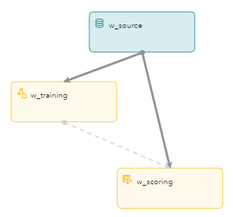
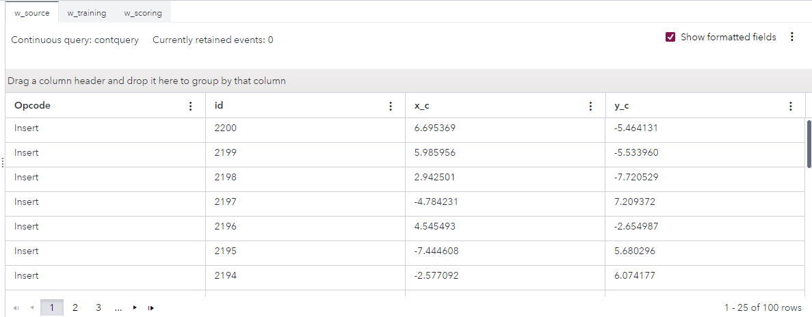
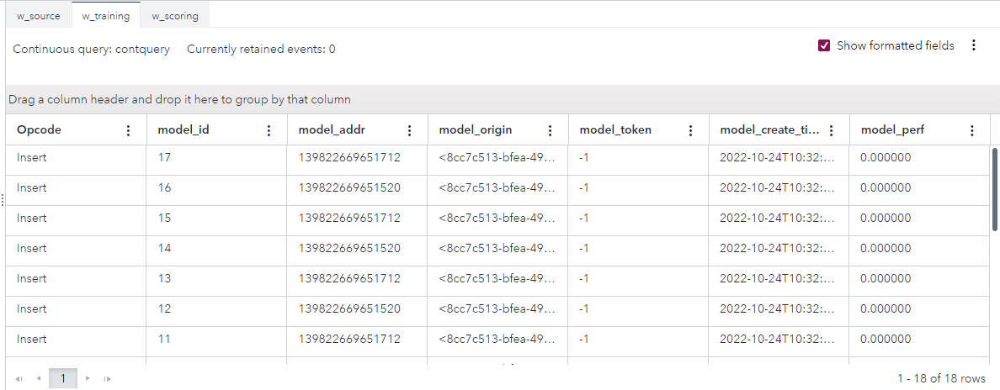
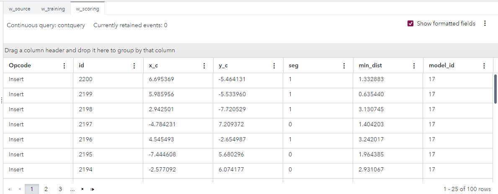

# Streaming Analytics with Scoring and Training
## Overview
This example demonstrates the use of the machine learning algorithm k-means, which is often used for cluster analysis in data mining. The algorithm assigns data points to their nearest cluster centroid. Each cluster centroid is then recomputed based on the average of the cluster’s data points. In k-means clustering, the input event is augmented with a cluster number. This indicates the cluster that the observation falls into.

## Source Data
The file [events.csv](events.csv) contains the events to be scored.

## Workflow
The following figure shows the diagram of the project:

### w_source

Events from the events.csv file enter the model in this Source window. The input data is placed into three fields: 
- An ID that acts as the data stream’s key, named `id`.
- An x coordinate of data, named `x_c`.
- A y coordinate of data, named `y_c`.

### w_training

This Train window looks at all events and periodically generates a new clustering model using the k-means algorithm. Generated clustering model events are published to the w_score window.

Open the project in SAS Event Stream Processing Studio and select the w_training window. In the right pane, in the **Settings** section, expand **Parameters**. Observe the following settings:
- The `nClusters` parameter specifies the number of clusters.
- The `initSeed` parameter specifies the random seed that is used during initialization when each point is assigned to a random cluster.
- The `dampingFactor` parameter specifies the damping factor for old data points.
- The `fadeOutFactor` parameter specifies the value for determining whether an existing cluster is fading out.
- The `disturbFactor` parameter specifies the disturbance factor when splitting a cluster.
- The `nInit` parameter specifies the number of data events that are used during initialization.
- The `velocity` parameter specifies the number of events that arrive at a single timestamp.
- The `commitInterval` parameter specifies the number of timestamps to elapse before committing a model to downstream scoring.

Expand the **Input Map** section. Observe that the `inputs` role specifies the variable names used in clustering: `x_c` and `y_c`.

### w_scoring

The events are scored in this Score window.

Select the w_scoring window. In the right pane, in the **Settings** section, expand **KMEANS**. Observe the following settings:
- In the **Input Map** section, the `inputs` role specifies the variable names used in clustering: `x_c` and `y_c`.
- In the **Output Map** section, observe the following settings:
  - The `labelOut` role specifies the output variable name that stores the cluster label. The variable name is `seg`. 
  - The `minDistanceOut` role specifies the output variable name that stores the distance to the nearest cluster. The variable name is `minDist`. 
  - The `modelIdOut` role specifies the output variable name that stores the ID of the model from which the score is computed. The variable name is `model_id`.

## Test the Project and View the Results

When you test the project in SAS Event Stream Processing Studio, you can use the **Publish** button to publish events from the events.csv file into the w_source window. For more information, see [Publish Events from a CSV file](https://go.documentation.sas.com/doc/en/espcdc/default/espstudio/p124n2fohetwqzn109gsdel6o1cj.htm).

Alternatively, before you test the project, you can configure a publisher connector for the w_source window.

The results for each window appear on separate tabs in test mode. The **w_source** tab displays events to be scored:

The **w_training** tab displays the generated clustering model using the k-means algorithm:

The **w_scoring** tab displays the scored events:

You might see warnings in the Log pane about the w_source window being throttled. You can ignore these warnings.
