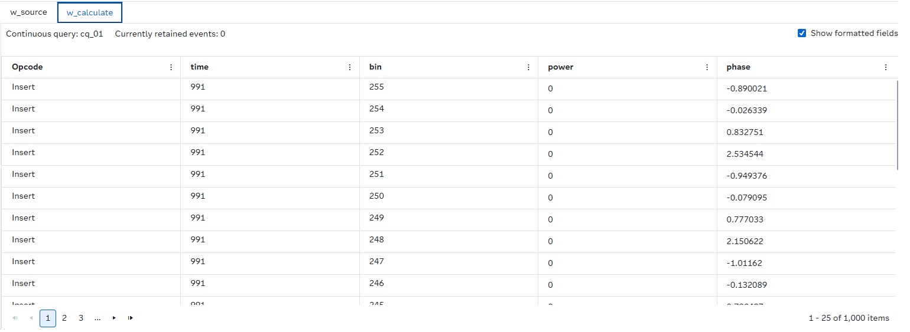
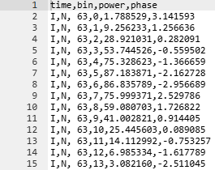

# Perform Short-Time Fourier Transform (STFT) on Streaming Data Using SAS Event Stream Processing

## Overview

This example demonstrates how to use SAS Event Stream Processing to perform Short-Time Fourier Transform (STFT) analysis on streaming data. It includes a Source window that ingests signal samples and a Calculate window that computes STFTs on incoming data. The Calculate window also publishes frequency-domain features such as power and phase.

For more information about how to install and use example projects, see [Using the Examples](https://github.com/sassoftware/esp-studio-examples#using-the-examples).

## Use Case

The project shows how to perform real-time spectral analysis on continuous signals. It is useful in the following scenarios:
- The signal data arrives continuously, and spectral features must be computed in real time.
- Time-varying frequency content needs to be monitored for anomalies or trends.
- Downstream applications require frequency-domain features for analysis or classification.

An example of a potential application is the detection of breathing patterns in healthcare:

For more details, see [Time-Frequency Analysis Using SAS®](https://support.sas.com/resources/papers/proceedings17/SAS0585-2017.pdf).

## Source Data

The `input.csv` file is loaded through a file and socket Connector in the Source window called w_source. The stream of example data includes the following:
  - `ID`: Unique time identifier for each sample
  - `y`: Signal amplitude, which is the value to be analyzed

## Workflow

Here is a diagram of the project:

- The w_source window is a Source window that ingests example data from `input.csv` using a file and socket connector.
- The w_calculate window is a Calculate window that applies the STFT algorithm to the incoming data and generates spectral features to a file called `result.txt`.

### w_source

Explore the settings for the w_source window by doing the following steps:
1. Open the project in SAS Event Stream Processing Studio and select the w_source window.
2. Expand **Input Data (Publisher) Connectors**. Notice the file and socket connector called **input_Connector**.
3. Click . Notice that the **Fsname** points to `input.csv`.
4. Click **OK**.
5. Expand **State and Event Type**. Notice that the project accepts only Insert events.
6. Click . Fields include:
   - `ID`: Primary key or time identifier
   - `y`: Signal value

### w_calculate

This window uses the STFT algorithm to compute frequency-domain features from the incoming signal.

Explore the settings for the w_calculate window by doing the following steps:
1. Open the project in SAS Event Stream Processing Studio and select the w_calculate window.
2. Expand **Settings** and then expand **Parameters**. Notice the following parameters: 
    - `windowLength`: This parameter specifies the length of the sliding window. The value that you specify must be greater than the value that you specify for overlap. The default value is **64**.
    - `windowType`: This parameter specifies one of the following window types: 1=Bartlett, 2=Bohman, 3=Chebyshev, 4=Gaussian, 5=Kaiser, 6=Parzen, 7=Rectangular, 10=Tukey, 11=Bartlett-Hann, 12=Blackman-Harris, 13=Blackman, 14=Hamming, 15=Hanning, and 16=Flat Top. The default value is **12**, which corresponds to Blackman-Harris.
    - `windowParam`: This parameter specifies the parameters for `windowType`. If it is not required for the selected window type, this value is ignored. The default value is **-1.0**.
    - `fftLength`: This parameter specifies the length to which windowed data should be expanded. Zeros are appended to the data before the Fast Fourier Transform (FFT) is performed. The specified value must be positive and greater than or least equal to `windowLength`. The value should be a power of two in order to maximize computational efficiency. The default value is **256**.
    - `overlap`: This parameter specifies the overlap between consecutive windows. The value must be less than `windowLength`. The default value is **32**.
    - `binsInSchema`: This parameter specifies the number of frequency bins to output. The value must be less than or equal to `fftLength`. The default value is **256**.

3. Expand **Input Map**. Notice the following roles:
    - `input`: This role specifies the input variable by its name in the source schema. It is associated with the `y` field.
    - `timeId`: This role specifies the time ID variable name in the input stream. It must be equally spaced. It is associate with the `ID` field.

4. Expand **Output Map**. Notice the following roles: 
    - `timeIdOut`: This role specifies the time ID variable name in the output stream. There is more than one output event for a given time ID. It is associated with `time`.
    - `keyOut`: This role specifies key variable name (unique for each output event) in the output stream. This field is not used in this example.
    - `binOut`: This role specifies the frequency bin variable name in the output stream. It is associated with `bin`.
    - `powerOut`: This role specifies the name of the power variable in the output stream. It is associated with `power`. 
    - `phaseOut`: This role specifies the name of the phase variable in the output stream. It is associated with `phase`.
    - `powerListOut`: This role specifies the list of power variables in the output stream. This field is not used in this example.
    - `phaseListOut`: This role specifies the list of phase variables in the output stream. This field is not used in this example.

## Test the Project and View the Results

When you test the project in SAS Event Stream Processing Studio, the results for each window appear in separate tabs:

- The **w_source** tab lists the incoming signal samples
- The **w_calculate** tab lists the calculated spectral features for each frequency bin

Here is an example of the output in the w_calculate window:

To view the `result.txt` file, do the following steps:
1. Navigate out of test mode and back to the project.
2. Click 
3. Expand **output**.
4. Double click **result.txt**.
  
Here is an example of the data in output `result.txt` file:  

## Next Steps

You can enhance this project by doing any of the following:
- Replace the CSV source with a live sensor or audio feed
- Add Filters or Aggregation windows before the STFT calculation
- Incorporate visualization tools (for example, Grafana) to display time-frequency spectrograms
- Experiment with different STFT parameters (for example, window type, length, or overlap) to optimize resolution

## Additional Resources

For more information, see [SAS Help Center: Calculating Short-Time Fourier Transforms](https://go.documentation.sas.com/doc/en/espcdc/default/espan/n1a24zmowg07opn1ul03ulh6g23c.htm#n0ghofy5wrzpvan1k24i6e45lcm7).
