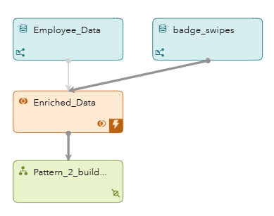
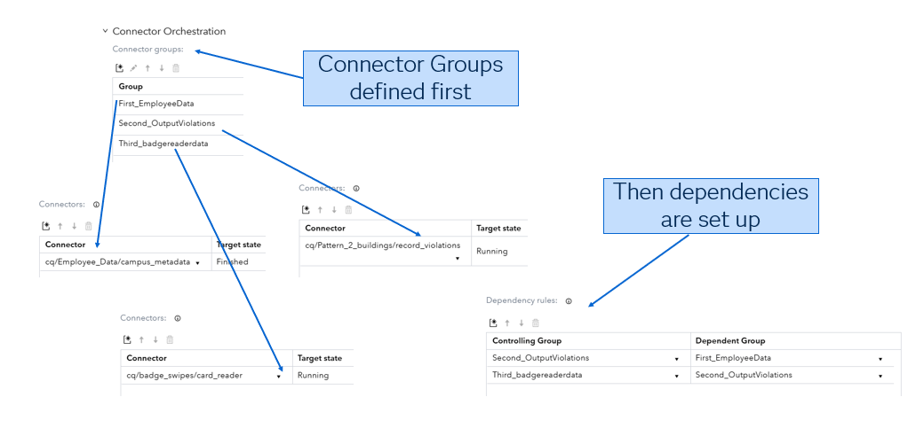
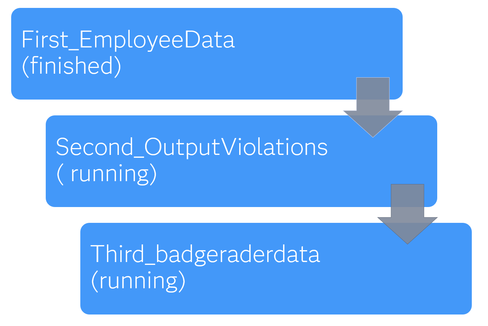
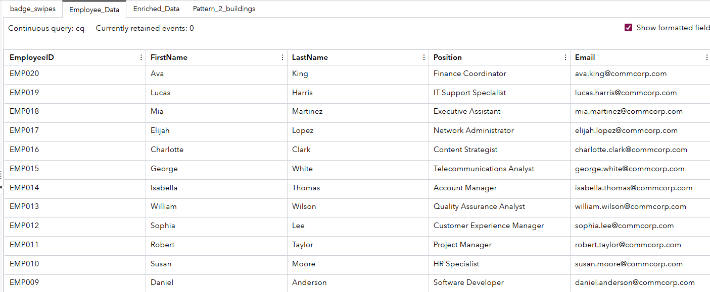
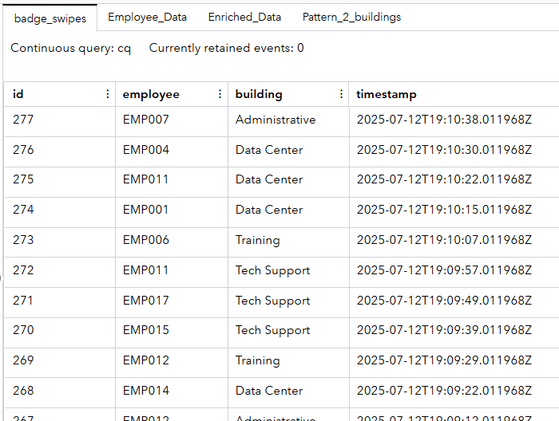
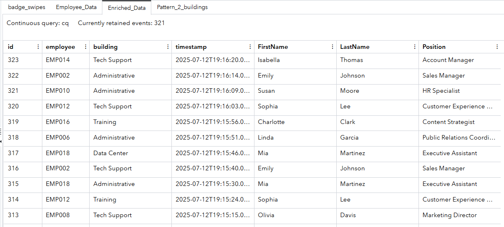
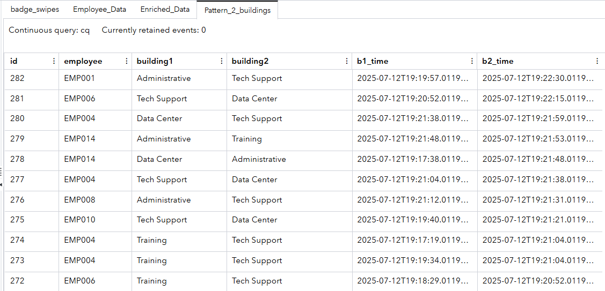
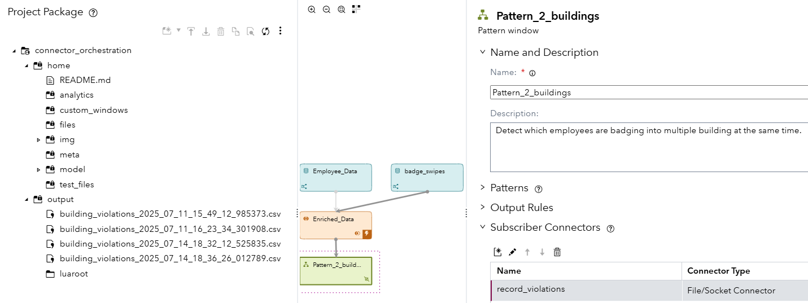

## How Does Connector Orchestration Work with ESP Connectors?

### Overview

This SAS Event Stream Processing project demonstrates connector orchestration. Connector orchestration is a feature that controls the sequence and state of connector execution. The goal of this project is to detect suspicious badge swiping behavior (for example, employees badging into multiple buildings within a short time span). It simulates real-time badge swipes, enriches them with employee metadata, and detects anomalies using Pattern windows. The project uses connector orchestration to ensure that data ingestion and output operations happen in a logical and controlled sequence.

### Source Data

There are two primary data sources in this project:

- `Employee Data`: Static reference data about employees (for example, name or position) published via a Python connector. This acts as metadata for enriching the swipe data.
- `Badge Swipes`: Simulated streaming data that represents badge swipes at different buildings. This data is generated using a Python-based publisher that emits random events over time.

**NOTE:** The project assumes that badge swipe data is enriched with employee information before being used for pattern detection.

### Workflow

The project consists of the following windows:
- `Employee_Data`: A Source window that ingests static employee records using a Python connector named campus_metadata.
- `badge_swipes`: A Source window that ingests simulated streaming badge swipe events using a Python connector named card_reader.
- `Enriched_Data`: A Join window that performs a left outer join of badge_swipes with Employee_Data on employee ID. This window combines real-time badge activity with descriptive metadata.
- `Pattern_2_buildings`: A Pattern window that detects cases where employees badge into two different buildings within five minutes. It outputs these violations to a local file using a file system connector named record_violations.

### Orchestration

	

To access the project's connector orchestration, do the following steps:
1. Click .
2. In the right pane, expand **Connector Orchestration**.

Rather than starting all the connectors simultaneously, this project uses connector groups and edges to define dependencies between them. Here is how the orchestration logic works:

1. **First_EmployeeData**
   - This connector group contains the campus_metadata connector for loading employee metadata.
   - The connector must reach its target state of **Finished** before other connectors begin. This ensures that reference data is available for joins.
2. **Second_OutputViolations**
   - This connector group contains the record_violations file system connector that outputs detected violations.
   - Employee data must finish loading before this group starts.
3. **Third_badgereaderdata**
   - This connector group contains the card_reader connector that generates swipe data.
   - It waits until the output connector is running to ensure that the system is ready to process and capture violations as they occur.

### Orchestration Graph

This orchestration ensures the following:

- Joins are not attempted until reference data is loaded.
- Violations cannot be written before swipe events are processed.
- Simulated data is not lost or processed prematurely.

### Test the Project and View the Results

When you test the project, the results for each window appear on separate tabs. The following figure shows the results for the **Employee_Data** tab, which represents the campus metadata:

The following figure shows the **badge_swipes** tab, which contains simulated badge reader data: 	

	

Once both sets of data are loaded, they are combined using a Join window. The combined data is displayed in the **Enriched_Data** tab:

A Pattern window is used to detect if an employee badges into two different buildings in a short period of time. Assuming a person cannot be in two places at once, a potential security violation is detected and the two buildings in question are logged in the **Pattern_2_buildings** tab: 

The results of the security audit are logged to a time stamped file and written to the output area of the project package:  

		

### Additional Resources

For more information about SAS Event Stream Processing connector orchestration, see the official documentation:  

For more information, see [SAS Help Center: Orchestrating Connectors](https://helpcenter.unx.sas.com/test/doc/en/espcdc/default/espca/p1nhdjrc9n0nnmn1fxqnyc0nihzz.htm#p00oj8brm4320nn1h6fjuxz8ayd4).

