# Introduction to the Copy Window and Types of Retention

## Overview
This example shows how to use the Copy window and the different types of retention that it supports. The Copy window replicates the schema and output of its connected parent window without modifying the data. Its primary purpose is to introduce retention policies that determine how long events are kept in memory. This enables you to add state to an otherwise stateless portion of the model, enabling features like aggregation over time. Retention settings help control the size of the maintained state, which is crucial for managing performance and resource usage in streaming applications.

To understand the Copy window, you need to understand state in SAS Event Stream Processing. By default, streaming data is ephemeral: each event passes through the system and is immediately discarded unless something explicitly retains it. The Copy window changes that by introducing state—a memory of past events—into the data flow. This is essential for operations that rely on historical context, like time-based aggregations. Retention settings also help manage how much of the historical data is kept, balancing memory and performance.

For more information about how to install and use example projects, see [Using the Examples](https://github.com/sassoftware/esp-studio-examples#using-the-examples).

## Use Case 
* The Copy window generally goes with the Aggregate window. If the model has been stateless until the point when an Aggregate window is first used, then a Copy window is needed too. Because the Aggregate window is always stateful, the Copy window helps manage the state of the Aggregate window and the rest of the model.
* In this example, multiple parallel Copy windows are used to add time-based retentions to achieve different retention-based use cases. Think of a scenario where you want to monitor averages over 5-second and 10-second periods.

## Source Data
The `input.csv` file contains dummy motor vibration data where the fields `motor` and `time` (in microseconds) together identify a unique event. The motors are emitting events at a rate of 1 event per second. 

## Workflow
The example shows the different retention options that you can use with the Copy window. The following figure shows the diagram of the project:

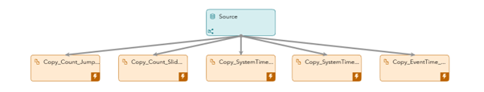	

Each Copy window shows a different retention format.
- The Source window is the entry point of the data. It reads the events at a rate of 1 event per second, as specified in this window's publisher connector.
- The Copy_Count_Jumping window uses jumping retention based on the number of events stored in memory.
- The Copy_Count_Sliding window uses sliding retention based on the number of events stored in memory.
- The Copy_SystemTime_Jumping window uses jumping retention based on the system time.
- The Copy_SystemTime_Sliding window uses sliding retention based on the system time.
- The Copy_EventTime_Sliding window uses sliding retention based on the timestamp field in the event.

### Copy_Count_Jumping
Select the Copy_Count_Jumping window to see the properties of the window in the right pane.

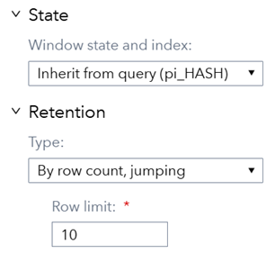

The window is stateful. You see this from the index, which is set to pi_HASH.

The retention is set as **By row count, jumping** with a row limit of 10.

This means that the window keeps track of 10 events at maximum, and as soon as the 11th event comes, a Delete event is generated for the 10 events before it.
You can confirm this by viewing the output for this window in test mode. It has 21 events. There are 11 input events and 10 deletes from the first 10 input events.

This behavior is useful when you want to reset the whole state of the model based on the number of events being published.

### Copy_Count_Sliding
Select the Copy_Count_Sliding window to see the properties of the window in the right pane.

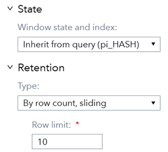

The window is stateful. You see this from the index, which is set to pi_HASH.

The retention is set as **By row count, sliding** with a row limit of 10.

This means that the window keeps track of 10 events at maximum, and as soon as the 11th event comes, a Delete event is generated for the first event. When the 12th event comes, a Delete event is generated for the second event and so on.
You can confirm this by viewing the output for this window in test mode. It has 12 events. There are 11 input events and one Delete event for the first input event. Also notice the **Currently retained events** value, which remains at 10.

This behavior is useful when you want to maintain a fixed state of the model based on the number of events being published.

### Copy_SystemTime_Jumping
Select the Copy_SystemTime_Jumping window to see the properties of the window in the right pane.

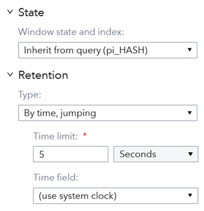

The window is stateful. You see this from the index, which is set to pi_HASH.

The retention is set as **By time, jumping** with a time limit of 5 seconds and the time field is set to **(use system clock)**, which tells SAS Event Stream Processing which clock to follow.

In this case, there is an internal timer that starts with the project. When the timer completes the specified time limit, in this case 5 seconds, the Copy window generates Delete events for all the events in its state. The timer is internal to SAS Event Stream Processing and is independent of the events being pushed. 

This type of retention is useful when you want to clear the whole state at fixed intervals regardless of the events that came in.

### Copy_SystemTime_Sliding
Select the Copy_SystemTime_Sliding window to see the properties of the window in the right pane.

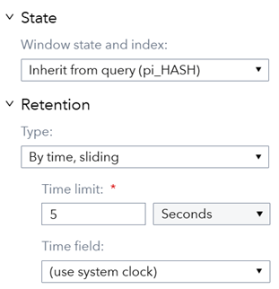

The window is stateful. You see this from the index, which is set to pi_HASH.

The retention is set as **By time, sliding** with a time limit of 5 seconds and the time field is set to **(use system clock)**, which tells SAS Event Stream Processing which clock to follow.

In this case, there is an internal timer that starts with the project. At every heartbeat (which is by default 1 second), the Copy window generates Delete events for all the events in its state that are older than the specified time, which in this case is 5 seconds. For an event that comes before 5 seconds a Delete event is generated. In the next second, the window checks again for events older than 5 seconds and generates a Delete event for them. The timer is internal to SAS Event Stream Processing and is independent of the events being pushed.

This type of retention is useful when you want to consistently manage the state of the window through time. The internal timer does not depend on the incoming events and keeps running even when there are no events or an influx of events.

### Copy_EventTime_Sliding
Select the Copy_EventTime_Sliding window to see the properties of the window in the right pane.

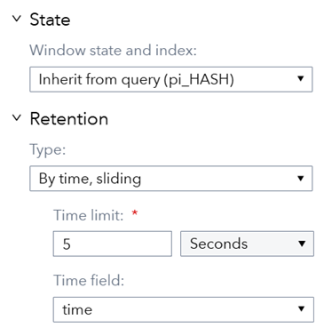

The window is stateful. You see this from the index, which is set to pi_HASH.

The retention is set as **By time, sliding** with a time limit of 5 seconds and the time field is set to **time**, which tells SAS Event Stream Processing to use the schema field named `time` to determine the time. The **Time field** drop-down list shows only fields whose data type is stamp or date.

In this case, the Copy window monitors the time based on the specified field. The Copy window reaches a time limit when it encounters an event where the difference between the value of the time field of the latest event and the first event in its state, is more than or equal to the specified time limit. In this case the difference is 5 seconds. When an event like this comes, the window generates a Delete event for all events that match the criteria for the time.

This type of retention is useful when events might not follow the exact system time. This might be because you are developing the model and passing the events rapidly, or there are inconsistent delays in production, which affect the arrival of the events due to network issues. 

## Test the Project and View the Results
When you test the project, the results for each window appear on separate tabs.

- The **Source** tab lists raw events published into the project.
- The **Copy_SystemTime_Sliding** tab lists Insert and Delete events generated because of sliding retention based on system time.
- The **Copy_EventTime_Sliding** tab lists Insert and Delete events generated because of sliding retention based on event time.
- The **Copy_SystemTime_Jumping** tab lists Insert and Delete events generated because of jumping retention based on system time.
- The **Copy_Count_Sliding** tab lists Insert and Delete events generated because of count-based sliding retention.
- The **Copy_Count_Jumping** tab lists Insert and Delete events generated because of count-based jumping retention.

The following figure shows the results for the Source window:

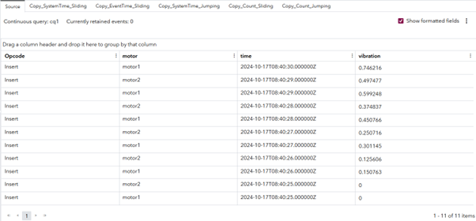

Notice the number of events published into the project.

The following figure shows the results for the Copy_SystemTime_Sliding window:

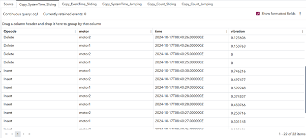

Notice that for all events, Delete events are generated. You can also confirm this with the **Current retained events** value, which is 0.

The following figure shows the results for the Copy_EventTime_Sliding window:

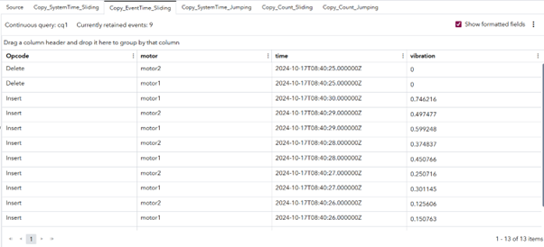

Notice that there are two deletes generated whose time field values are exactly 5 seconds less than the last event published. Because other events have time values less than 5 seconds from the last event, their Delete events are not generated.

The following figure shows the results for the Copy_SystemTime_Jumping window:

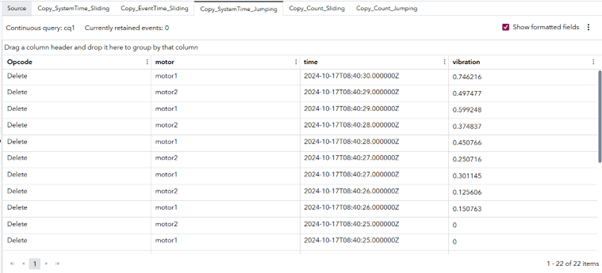

Notice that in this case, all Delete events are generated. However, the difference from the Copy_SystemTime_Sliding is that all Delete events are generated at the same time.

The following figure shows the results for the Copy_Count_Sliding tab:

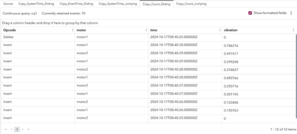

Notice that a single Delete event is generated. The 11th Insert event crosses the retention limit of 10 events. This leads to the deletion of the first event in the state. The number of retained events remains at 10.

The following figure shows the results of the Copy_Count_Jumping tab:

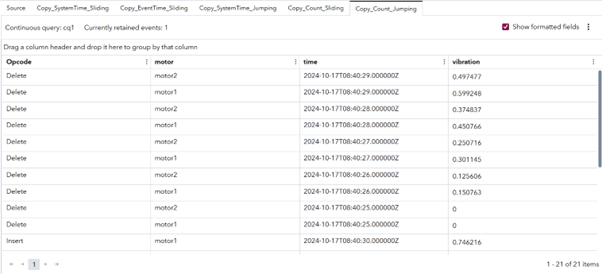

Notice that only 1 event is shown as **Currently retained events**. This happened because as soon as the 11th event arrived, the retention limit of 10 events was crossed, which leads to the deletion of all previous events.

## Additional Resources
For more information, see [SAS Help Center: Using Copy Windows](https://documentation.sas.com/?cdcId=espcdc&cdcVersion=default&docsetId=espcreatewindows&docsetTarget=n03rea4fhvohcgn15o9970mq9jea).
