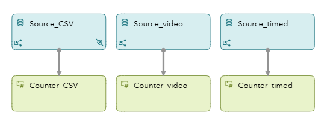
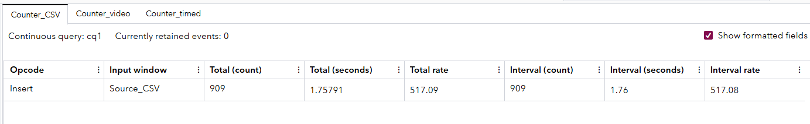
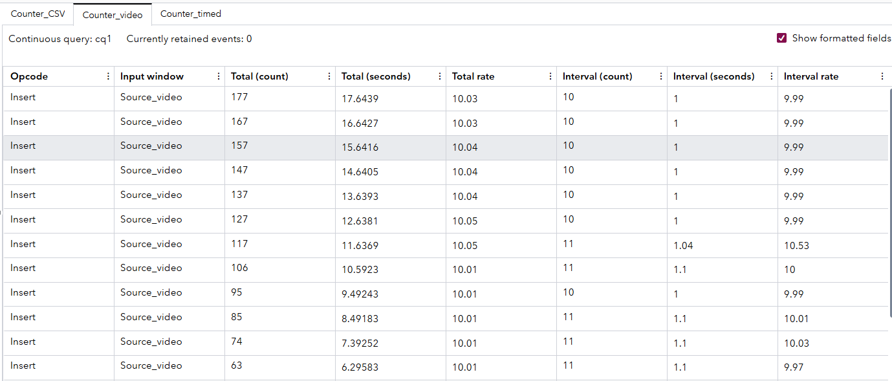
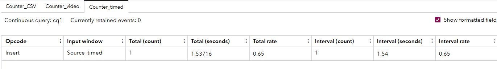

# Using Counter Windows to Compare Data Flow
## Overview

This SAS Event Stream Processing project demonstrates the use of the Counter window. A Counter window is a simple but powerful analytic tool used to track the number of events passing through a data stream. This project showcases three different types of source connectors: file and socket, video capture, and timer connector. It pairs each source connector with a  Counter window to monitor throughput. The Counter window is useful for observing data flow rates, detecting anomalies (for example, data dropouts or surges), and measuring performance. It is commonly used in monitoring, debugging, and benchmarking real-time event pipelines.

## Workflow

The following figure shows the workflow of this project:

	

This project has three Source windows:

- Source_CSV: Ingests location data from a CSV file using a file and socket connector. The schema includes a timestamped key along with latitude and longitude coordinates.
- Source_video: Uses a videoc capture connector to load video frames from a sample video file. Each frame is treated as an event with an ID and image blob.
- Source_timed: Uses a timer connector to emit synthetic events at fixed intervals. Each event includes an ID, timestamp, and label.

Each Source window feeds directly into its corresponding Counter window. The Counter windows increment a count each time they receive a new event from their upstream source. This provides a clear, real-time metric of how many events have passed through each stream. This setup enables you to directly compare data flow behavior across different source types.

### Source_CSV with File Connector

Explore the settings for the Source_CSV window:
1. Open the project in SAS Event Stream Processing Studio.
2. Select the Source_CSV window. 
3. In the right pane, expand **Input Data (Publisher) Connectors**.
      - `iss_input`: This connector reads the file from beginning to end once. It is useful for batch-style loading.
      - `iss_input_repeat`: This connector repeats the file input a specified number of times (for example, repeatcount = 100). It is useful for simulations or testing with looped input data.
      - `iss_input_rate`: This connector adds a pacing mechanism to simulate streaming input (for example, rate = 1 record per second). It is useful for...FILL THIS IN  
      NOTE: You can view a connector's configuration by selecting the connector from the table, and then clicking . These connectors are set to inactive by default. You can enable one or more connectors depending on your scenario.
4. Expand **Subscriber Connectors**. Notice that this window includes a different type of connector. The MQTToutput connector is configured as a subscriber connector. Subscriber connectors output data from a project to an external file or system. 
5. Click . Fields include:
      - `key`: A unique identifier for each record
      - `dt`: A date field parsed using a specified format
      - `long`: Longitude
      - `lat`: Latitude

### Source_video with Videocap Connector

Explore the settings for the Source_video window:
1. Open the project in SAS Event Stream Processing Studio.
2. Select the Source_video window. 
3. In the right pane, expand **Input Data (Publisher) Connectors**.
4. Select video_publisher from the table, and then click . In the **Connector Configuration** window, notice the following properties:
      - `Connector type`: The type is **Video Capture Connector**.
      - `Filename`: This is set to **@ESP_PROJECT_HOME@/test_files/intersection.mp4**, which is the path to the input video file.
      - `Publishformat`: This is set to **wide**, which formats each frame as a single record with the entire image in the blob field.
5. Click **All properties...**
      - `inputrate`: This is set to **10** and specifies the desired frame rate in units of frames per second.
      - `repeatcount`: This is set to **999**, which makes the video file repeat multiple times to simulate a continuous feed.
      - `resize_x` and `resize_y`: Resizes each frame to a resolution of `resize_x` by `resize_y` pixels before it is published.
      - `blocksize`: This is set to **1**, which means that one frame is published per batch.
6. Click **OK** to exit the **Connector Configuration** window. 
7. Click . Fields include:
      - `id`: A unique identifier for each frame
      - `image`: A large, binary object containing the raw video frame data

### Source_timed with Timer Connector

Explore the settings for the Source_timed window:
1. Open the project in SAS Event Stream Processing Studio
2. Select the Source_timed window.
3. Expand **Input Data (Publisher) Connectors**. Notice the connector named timer_connector. 
4. Select timer_connector from the table, and then click . In the **Connector Configuration** window, notice the following properties:
   - `Connector type`: The type is **Timer Connector**, which indicates that the connector is time-based.
   - `Basetime`: This property is set to **2020-06-08 00:56:00**, which is the starting point for the simulated time field. This is helpful for repeatable tests.
   - `Interval`: The interval is set to **60**, which means that events are generated every 60 seconds.
   - `Unit`: The unit is **second**, which works conjointly with the set interval to specify its units.
5. Click **All properties...**
   - `label`: This is set to **minutely**. This is a fixed string value for the label field in each record.  
6. Click **OK** to exit the **Connector Configuration** window.
7. Click . Fields include:
    - `id`: A unique identifier for each generated record
    - `time`: A timestamp value associated with the generated event
    - `label`: A string label that describes of categorizes the event 
 
## Test the Project and View the Results

To test the project, do the following steps:
1. Click **Enter Test Mode**.
2. Click **Run Test**.

When you test the project, the results for each window appear on separate tabs. The main idea of this project is to show how event volume and counter output vary significantly depending on the Source window type and connector configuration.

The following figure shows the results for the Counter_CSV tab:

The Source_CSV window reads a file containing many rows of data. When using an unrestricted file connector (for example, `repeatcount` without throttling), it can emit hundreds or thousands of events rapidly. As a result, the Counter_CSV window often shows the highest count in the shortest time. This makes it ideal for stress testing or measuring batch ingestion rates.

The following figure shows the results for the Counter_video tab:

The Source_video window reads a video file and emits one event per frame, based on the `inputrate` and `blocksize`. In this case, the video connector is configured to emit events at 10 frames per second. As a result, the Counter_video window reflects a moderate and consistent stream of events. The count increases at a steady rate that is also slower than the CSV source.

The following figure shows the results for the Counter_timed tab:

The Source_timed window is designed to emit one event every sixty seconds using the timer connector. This makes it the slowest source in terms of event generation. Therefore, Counter_timed increases very gradually, which makes it useful for low-rate event simulation and benchmarking long-running processes.

Understanding the differences between Counter windows is critical for debugging, system benchmarking, and monitoring. By comparing the event rates across the Counter windows, this project clearly shows how different source types affect the overall streaming pipeline performance.

## Video Credits and Copyright

| File Name          | Copyright                                      | Notes                                        |
| ------------------ | ---------------------------------------------- | -------------------------------------------- |
| `intersection.mp4` | © 2024 SAS Institute Inc. All Rights Reserved. | To be used only in the context of this demo. |

## Video and Image Restrictions

The videos and images provided in this example are to be used only with the project provided. Using or altering these videos and images beyond the example for any other purpose is prohibited.

## Additional Resources

For more information about the Counter window and how to configure it, see [SAS ESP Counter Window Documentation](https://go.documentation.sas.com/doc/en/espcdc/default/espcreatewindows/titlepage.htm).

