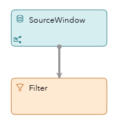
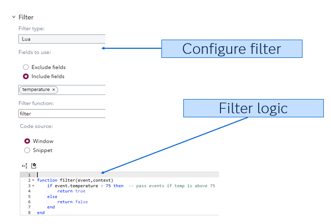
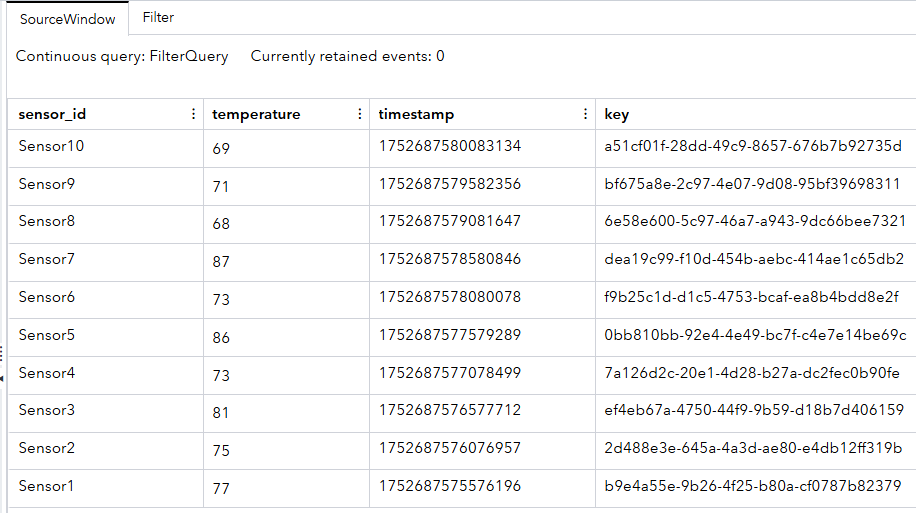
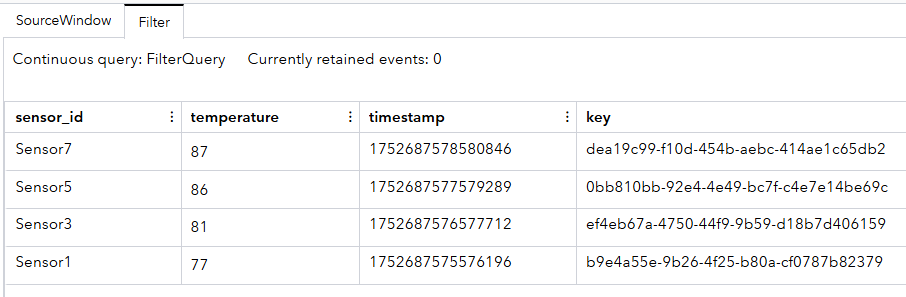

# How do Filter Windows Work in SAS Event Stream Processing?

## Overview

This project demonstrates how Filter windows operate in SAS Event Stream Processing. This project shows how data from simulated sensors can be evaluated in real time, and how records that meet certain conditions are passed downstream for further action or analysis.

## Source Data

The source data is generated by a Lua connector that simulates 10 temperature sensor readings. Each reading contains the following:

- `sensor_id`: Identifier for the sensor (for example, “Sensor1” to “Sensor10”).
- `temperature`: A randomly generated temperature between 65°F and 90°F.
- `timestamp`: The system time when the reading is generated.
- `key`: A unique string used as the primary key.

This data is published at an interval of 500 milliseconds.

## Workflow

		

This project contains two windows that are connected with a simple linear workflow:
<!-- Wondering if these should be bullets instead of numbers -->
1. **SourceWindow**: This is a Source window that receives data from the Lua connector. It defines the schema and structure for incoming events.
2. **Filter**: This is a Filter window that contains logic to check if the temperature is above 75°F. If the temperate is over 75°F, the event is forwarded; otherwise, the event is discarded.  Filter logic can be coded in Lua, Python, C, or Expression Engine Language. The following figure shows how the Filter window is configured to filter the temperatures:

## Test the Project and View the Results
<!-- When I ran this project, I got different data. I think it's worth mentioning that every time you run this test you will get 10 different temperature readings. That way, the user is not alarmed if their data doesn't match the screenshots shown in this README file. -->
Remember that the Lua connector generates random temperatures between 65°F and 90°F, so the data you see might not match the figures below. These figures are just examples of what your screen can look like. 

When you test the project, the results for each window appear on separate tabs:
- The **SourceWindow** tab shows all events with various opcodes:
  
	

- The **Filter** tab shows all of the temperate readings greater than 75°F:
  
	

## Additional Resources

For more information about Filter windows, see:  [Using Filter Windows](https://go.documentation.sas.com/doc/en/espcdc/default/espcreatewindows/p1laytbc862ix9n1w5rm9reywors.htm).

