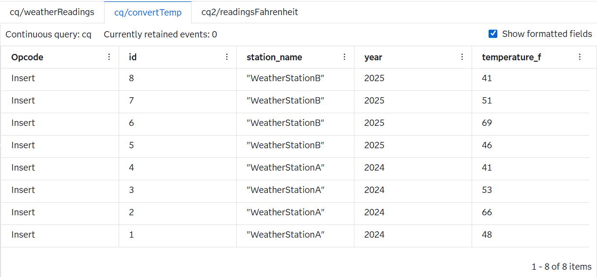

# Introduction to Python-Based Event Forwarding: Weather Station Temperature Conversion  

## Overview
This SAS Event Stream Processing (ESP) project demonstrates how to use a Python window to transform and forward streaming events between continuous queries. The example shows how to ingest batched temperature readings from weather stations, split them into individual events, and convert temperatures from Celsius to Fahrenheit. 

In this project, the Python window is configured to emit multiple events per input row and forward them to another source window using the event forwarding feature available on Python and Lua windows.

For more information about how to install and use example projects, see [Using the Examples](https://github.com/sassoftware/esp-studio-examples#using-the-examples).

## Use Case

Here are a few scenarios when event forwarding is useful:
- Inbound events contain arrays or batched values that benefit from being extrapolated and processed as individual events.
- Different continuous queries need to be connected through forwarding.

This example illustrates these patterns through weather sensor data processing.

## Source Data

The `weather_input.csv` file contains sample weather station data.  

Each row contains the following data:
- Station identifier  
- Station name  
- Year  
- An array of temperatures measured in Celsius  

### Example Data:

| id    | station_id        | year      | readings    |
| ---   | ---               |---        | ---         |
|1      | WeatherStationA   | 2024      | [9;19;12;5] |
|2      | WeatherStationB   | 2025      | [8;21;11;5] |

## Workflow
The workflow contains two Continuous Queries:

### Continuous Query 1
  

### Continuous Query 2


- The weatherReadings window is a Source window that reads the input file.
- The convertTemp window is a Python window that performs the transformation.
- The readingsFahrenheit window is a Source window that receives the forwarded events and writes them to an output file.

**NOTE:** In SAS Event Stream Processing Studio, you can toggle between the two continuous queries to see all of the windows. At the top of your screen, select **cq2** from the drop down list.  

### weatherReadings

Explore the settings for the weatherReadings window:
1. Open the project in SAS Event Stream Processing Studio and select the weatherReadings window. 
2. Click . The window produces events that contain the following fields:
  - `station_id`  
  - `station_name`  
  - `year`  
  - `temperatures` 

### convertTemp

Explore the settings for the convertTemp window:
1. Open the project in SAS Event Stream Processing Studio and select the convertTemp window. 
2. In the right pane, expand **Properties**.
3. Expand **Python Settings**. In the **Code source** window, notice the function that converts Fahrenheit to Celcius:     
    ```
         f = int(c * 1.8 + 32)  # Celsius → Fahrenheit
    ```

4. Expand **Event Forwarding**. Notice that the continuous query is `cq2`, the window is `readingsFahrenheit`, and the block size is `1`. 

### readingsFahrenheit

Explore the settings for the readingsFahrenheit window:
1. Open the project in SAS Event Stream Processing Studio and select the readingsFahrenheit window. 
2. In the right pane, expand **Properties**.
3. Expand **Event Forwarding**. Notice the text that says, **Incoming connection for event forwarding**. It points to the `convertTemp` window in the `cq` continuous query, and the block size is `1`. 

## Test the Project and View the Results

As this test passes data between continuous queries, you need to manually enable the window in the **cq2** continous query. To enable the window, do the following steps:
1. Click **Enter Test Mode**.
2. From the **Continuous query** drop down, select **cq2**.
3. Select **readingsFahrenheit**.
4. Run the project.

This is what the settings should look like once the window is enabled:  


When you test the project in ESP Studio, you will see results on the following tabs:

 - The cq/weatherReadings tab lists the incoming data:  
  

 - The cq/convertTemp and cq2/readingsFahrenheit tab list the same results. This makes sense because the convertTemp window produces the event and then forwards them to the readingsFahrenheit window, which produces the `result.out` file:  
  


## Next Steps

Event forwarding enables Source windows to act as destinations for transformed event streams. This allows continuous queries to be chained without external connectors. After creating the readingsFahrenheit stream, there are several extension options:

 - Add further processing by applying aggregations, threshold checks, anomaly detection, or rolling statistics in downstream continuous queries.
 - Output to external systems by forwarding the transformed events to databases, message queues, or files for integration with other applications.
 - Extend Python logic by enriching events, adding validation, or incorporating lightweight analytics or model inference after forwarding.
 - Create branching pipelines by forwarding events to multiple destination windows or additional continuous queries to build modular, multi-stage event stream pipelines.
 - Apply the pattern to other data types by using the same expansion-and-forwarding approach for any batched or nested sensor, financial, or multimedia data.

## Additional Resources

For more information, see [SAS Help Center Working with Python Windows](https://go.documentation.sas.com/doc/bo/espcdc/default/espstudio/n07ceo2bin2787n1s1askvbca871.htm).