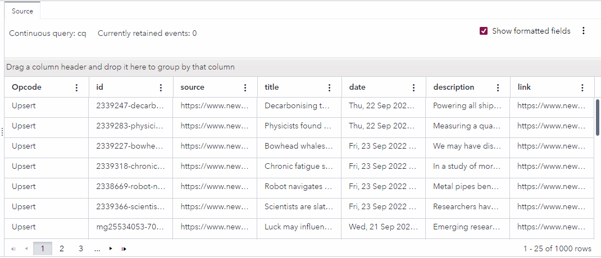

# Use a Lua Connector to Read RSS Feeds
## Overview
This example contains a Source window with a Lua connector that reads RSS feeds from scientific sites and publishes them into the project every five seconds.

---
**NOTE:**
Use this example with SAS Event Stream Processing 2024.03 and later.

---

For more information about how to install and use example projects, see [Using the Examples](https://github.com/sassoftware/esp-studio-examples#using-the-examples).

## Use Case
This example provides a simple demonstration of how you can use a Lua connector to feed data into a Source window. In a real-life scenario, a project might also contain additional windows to analyze the data.

## Source Data
Data is streamed from RSS feeds. No input files are required for this example.

## Workflow
The following table explains the Lua code in the connector for the Source window. To view the Lua code in context, see the [model.xml](model.xml) file.

<table>
<tr>
<th>Step</th> <th>Lua Code Section</th>
</tr>
<tr>
<td> Specifies the RSS feeds that the connector reads. </td>
<td>


```
local   feeds = {
  "https://feeds.bbci.co.uk/news/science_and_environment/rss.xml",
  "https://beta.nsf.gov/rss/rss_www_news.xml",
  "https://www.newscientist.com/section/news/feed/"
  }
```


</td>
</tr>
<tr>
<td> Publishes events into the project. The "publish" function is required to use the Lua connector. When the "publish" function returns the value "true", the connector is finished. When the function returns the value "false", the connector keeps running.</td>
<td>

  
```
function publish()
  for i,feed in ipairs(feeds)
  do
    events = getFeed(feed)

    if esp_inject(events) == false
    then
      return true
    end
  end

  return false
end
```

  
</td>
</tr>
<tr>
<td> Maps the data from the RSS feeds into the project's output. For example, "event.source = feed" causes a feed's URL to appear in the "source" column in the output. "event.date = entry.item.pubDate" causes data within the "pubDate" XML element in the feed to appear in the "date" column in the output. "event._opcode = "upsert"" causes the opcode of each event to be set to Upsert. <br>"request.tolua = true" causes the results to be processed as a Lua object instead of XML.</td>
<td>


```
function getFeed(feed)
  local   request = {}

  request.url = feed
  request.tolua = true

  local   data = esp_sendHttp(request)
  local   events = {}
  local   index = 1

  for i,entry in ipairs(data.response.rss.item_array)
  do
    local   event = {}
    event.id = entry.item.guid["*value"]
    event.source = feed
    event.title = entry.item.title
    event.date = entry.item.pubDate
    event.description = entry.item.description
    event.link = entry.item.link
    event._opcode = "upsert"
    events[index] = event
    index = index + 1
end
```


</td>
</tr>
<tr>
<td> Returns results as SAS Event Stream Processing events. </td>
<td>


```
    return events
end
```


</td>
</tr>
</table>

## Test the Project and View the Results
The following figure shows the result of running the project in test mode in SAS Event Stream Processing Studio:



The actual events that appear in test mode depend on the events that are available in the RSS feeds at the time when you run the project.

## Next Steps
You can add windows to the project to further analyze the data. For example, you might add a Filter window to extract stories that contain the word "climate".

## Additional Resources
For more information, see [SAS Help Center: Using the Lua Connector](https://documentation.sas.com/?cdcId=espcdc&cdcVersion=default&docsetId=espca&docsetTarget=p0ofbx04mv7n85n1mds3bck22qq0.htm).

