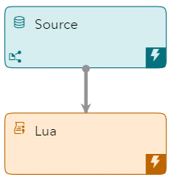
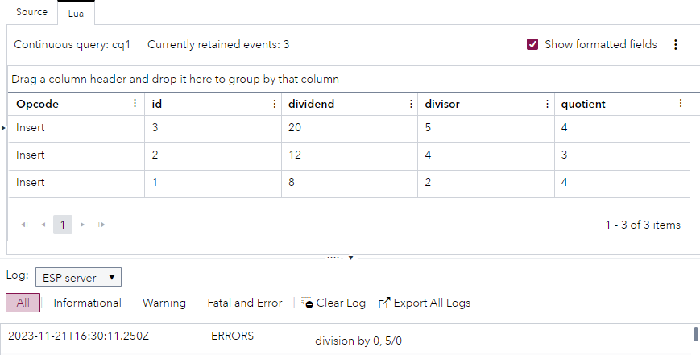

# Use a Lua Module to Define Logging Functionality
## Overview
This example demonstrates how you can define useful functions in a Lua module at project level and reference those functions from other Lua code in the project.

---
**NOTE:**
Use this example with SAS Event Stream Processing 2023.12 and later. 

---

For more information about how to install and use example projects, see [Using the Examples](https://github.com/sassoftware/esp-studio-examples#using-the-examples). 

## Use Case

The Lua window in this project performs division calculations and logs an error message when there is an attempt to divide a number by zero. To log the error, the Lua window references a Lua module that defines the logging functionality. 

## Source Data
The [lua_module.csv](lua_module.csv) file contains information about calculations.

## Workflow
The following figure shows the diagram of the project:



### logger Module
1. Open the project in SAS Event Stream Processing Studio and click  on the toolbar. Project-level properties are displayed in the right pane.
2. Expand Lua Modules
3. In the table in this section, double-click the **logger** row.
4. In the Edit Lua Code Module window, explore the Lua code.

    <table>
    <tr>
    <th>Step</th> <th>Lua Code Section</th>
    </tr>
    <tr>
    <td>Create a table named Logger.</td>
    <td>

      
    ```
   Logger = {
                _context = nil
            }

    ```

      
    </td>
    </tr>
    <tr>
    <td>Define the Logger class.</td>
    <td>

      
    ```
            function Logger:new(context)
                o = {}
                setmetatable(o,self)
                self.__index = self
                self._context = context or "mylogger"
                return o
            end
      
    ```

      
    </td>
    </tr>
    <tr>
    <td> Define the logging functions that are used to create log messages at different severity levels. These functions use a SAS Event Stream Processing function called esp_logMessage.</td>
    <td>


    ```
            function Logger:error(msg,line)
                esp_logMessage(self._context,msg,"error",line)
            end

            function Logger:warn(msg,line)
                esp_logMessage(self._context,msg,"warn",line)
            end

            function Logger:fatal(msg,line)
                esp_logMessage(self._context,msg,"fatal",line)
            end

            function Logger:info(msg,line)
                esp_logMessage(self._context,msg,"info",line)
            end

            function Logger:debug(msg,line)
                esp_logMessage(self._context,msg,"debug",line)
            end

            function Logger:trace(msg,line)
                esp_logMessage(self._context,msg,"trace",line)
            end

    ```


    </td>
    </tr>
    </table>

### Source

The Source window streams information from the [lua_module.csv](lua_module.csv) file to the Lua window.

Explore the settings for this window:
1. Select the Source window on the workspace. 
2. To examine the window's output schema, on the right toolbar, click . Observe the following fields: 
   - `id`: This is the ID that is assigned to each calculation. It is also selected as the Key.
   - `dividend`: This is a number that is to be divided by the number in the `divisor` field.
   - `divisor`: This is a number that is used as the divisor in the calculation.
   - `quotient`: This is the result of the division.
3. Click . 

### Lua

The Lua window performs division calculations.

Explore the settings for this window:
1. Select the Lua window in the workspace.
2. In the right pane, expand **Lua Settings**.
   - To increase the efficiency of the Lua code processing, you can specify which fields to copy from the source file and which fields to use in the Lua code. 
     - The **Fields to copy** field shows that the fields `id` and `dividend`, and `divisor` are copied from the source file.
     - The **Fields to use in Lua code** field shows that the fields `dividend` and `divisor` are used in the Lua code.
   - The **Events function** field shows the Lua function that is used (in this case, the `create` function).
   - The **Required modules** field specifies that the `logger` module is required by this window. 
3. Scroll down in the right pane, to view the Lua code that performs the calculations for this example:
   
    <table>
    <tr>
    <th>Step</th> <th>Lua Code Section</th>
    </tr>
    <tr>
    <td>Define a function called create and set three variables to represent an event and information about the dividend and the divisor.</td>
    <td>

      
    ```
   function create(data)

      local   e = {}
      local   dividend = data["dividend"]
      local   divisor = data["divisor"]
    ```

      
    </td>
    </tr>
    <tr>
    <td> Check whether the divisor is zero. If so, use the Logger class (defined in the Lua module) to log an error message.</td>
    <td>


    ```
      if (divisor == 0)
      then
          local   logger = Logger:new("modules.example")
          logger:error("division by 0, "..tostring(dividend).."/"..tostring(divisor))
          return nil
      end
    ```


    </td>
    </tr>
    <tr>
    <td> If the divisor is not zero, perform the calculation and return a SAS Event Stream Processing event.</td>
    <td>


    ```
      e["quotient"] = dividend / divisor

      return(e)
    end
    ```


    </td>
    </tr>
    </table>


## Test the Project and View the Results

When you test the project in SAS Event Stream Processing Studio, the results for each window appear in separate tabs. The following figure shows the **Lua** tab. The [lua_module.csv](lua_module.csv) file contains four events, but only three events appear in the Lua tab. The fourth event, where the number five was to be divided by zero, has caused the following error to be logged in the **Log** pane: `division by 0, 5/0`



## Next Steps

In this simple example, the Lua module is referenced from one location. In a real-life scenario, creating a Lua module is most useful when you want to reference common Lua code from multiple locations.

## Additional Resources
For more information, see [SAS Help Center: Using Lua Modules](https://documentation.sas.com/?cdcId=espcdc&cdcVersion=default&docsetId=espcreatewindows&docsetTarget=p0y0gfmxu4xp0wn16tlo0jbqhyke.htm) and [SAS Help Center: ESP Server Log Debugging](https://documentation.sas.com/?cdcId=espcdc&cdcVersion=default&docsetId=espcreatewindows&docsetTarget=p0es0j4alwxukqn1fmpi24ndl12n.htm#n0oo3y1qdfl79bn1e2k0po0rmpvz).
