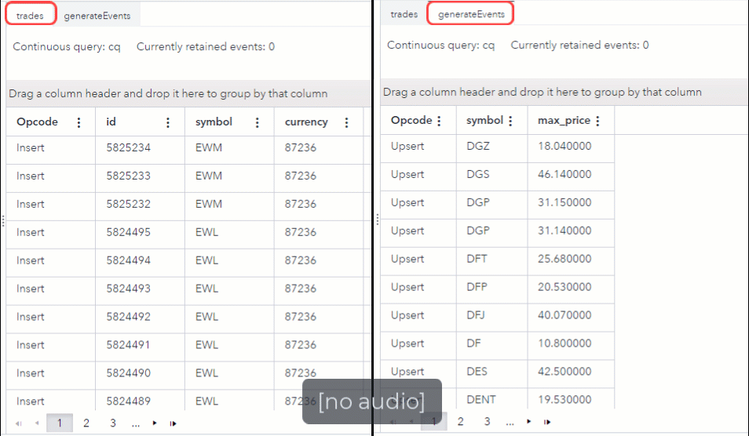

# Use the Lua Window to periodically output events

## Overview

The Lua window in SAS Event Stream Processing enables you to maintain and use event state to generate events.

---

**NOTE:**
Use these examples with SAS Event Stream Processing 2022.10 and later.

---

For more information about how to install and use example projects, see [Using the Examples](https://github.com/sassoftware/esp-studio-examples#using-the-examples).

## Example

### Use Case

This example is built on the following scenario:

The Acme Stockbroking firm wants to track and analyze the maximum price for all incoming stock trade data in SAS Event Stream Processing. To do so, the Data Engineer creates an ESP project that performs the following steps:

1. Receive the stock trade data.
2. Use a Lua window to generate events every time a new stock symbol price exceeds the current maximum price for that stock symbol.

To view the project in its entirety, see the [model.xml](model.xml) file.

### Source Data

The file `luaStateInput.csv` contains stock trade data. It is formatted as a CSV file to simplify the process for the purposes of this example. In a real-life scenario, this data would likely enter the project via a message broker such as RabbitMQ. To download a ZIP file containing `luaStateInput.csv`, click [here](luaStateInput.zip).

### Workflow

#### trades

The trades window is a Source window. It receives input data from the file [luaStateInput.csv](luaStateInput.zip).

#### generateEvents

The generateEvents window is a Lua window. It contains Lua code that analyzes the input data and generates multiple events. To view the Lua code in context, see the [model.xml](model.xml) file.

---

**NOTE:**
To optimize performance, the variables `symbol` and `price` have been selected for the **Fields to use in Lua code** option. For more information, see [Working with Lua Windows in SAS Event Stream Processing Studio](https://documentation.sas.com/?cdcId=espcdc&cdcVersion=default&docsetId=espstudio&docsetTarget=n1n3kx16nz64jfn1tzkgddvobeus.htm).

---

<table>
<tr>
<th>Step</th> <th>Lua Code Section</th>
</tr>
<tr>
<td> Creates a variable that contains a table with the highest price for each stock symbol. </td>
<td>

```
local   symbolData = {}
```

</td>
</tr>
<tr>
<td> Defines and initializes local variables for the event and maximum price. </td>
<td>

```
function create(data,context)
  local   event = nil
  local   maxPrice = symbolData[data.symbol]
```

</td>
</tr>
<tr>
<td> For every key-value pair in the symbolData table, determines whether the maximum price has been exceeded.

If so, generates an event and upsert (update or insert) the maximum price for the symbol. </td>

<td>

```
if (maxPrice == nil or data.price > maxPrice)
   then
      symbolData[data.symbol] = data.price
      event = {}
      event.symbol = data.symbol
      event.max_price = data.price
      event._opcode = "upsert"
   end
```

</td>
</tr>
<tr>
<td> Returns results as SAS Event Stream Processing events. </td>
<td>

```
    return(event)
end
```

</td>
</tr>
</table>

### Test the Project and View the Results

When you test the project, the results for each window appear on separate tabs. In the following animated image, the window to the right shows input events as they are streamed into the trades window. The window to the left shows how the Lua code uses those events to periodically update the stock symbols, based on their price.



### Next Steps

Now that you have generated events from the stock trade data, you can add windows to the project to analyze the data.

### Additional Resources

For more information, refer to the following resources:

- [Working with Lua Windows in SAS Event Stream Processing Studio](https://documentation.sas.com/?cdcId=espcdc&cdcVersion=default&docsetId=espstudio&docsetTarget=n1n3kx16nz64jfn1tzkgddvobeus.htm)
- [Working with Lua-based Pattern Windows in SAS Event Stream Processing Studio](https://documentation.sas.com/?cdcId=espcdc&cdcVersion=default&docsetId=espstudio&docsetTarget=n0wrk2qxns2isen11mlsevb8w0gi.htm)
