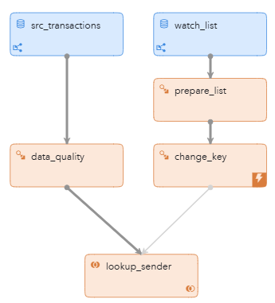
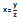
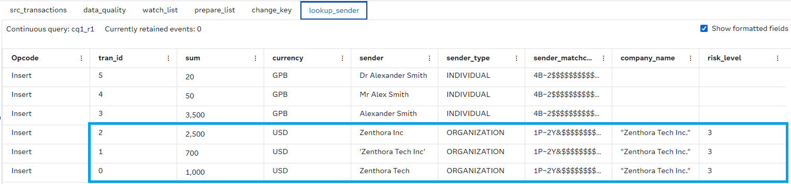

# Fuzzy Lookup of Organization Names in Transactions Using SAS Data Quality

## Overview

This example demonstrates how to use SAS Event Stream Processing (ESP) to perform fuzzy lookups on streaming data using SAS Data Quality. This project uses Expression Engine Language (EEL) to load the SAS Quality Knowledge Base (QKB). The SAS Quality Knowledge Base is a collection of files that stores data and logic that define data management operations. This example also builds match codes, which are necessary to enable fuzzy matching. Then, it performs lookups using a Join window.

For more information about how to install and use example projects, see [Using the Examples](https://github.com/sassoftware/esp-studio-examples#using-the-examples).

## Source Data

This example has two Source windows called src_transactions and watch_list. Both windows ingest synthetic data records that act as the streaming data for this project.

- The Source window named `watch_list` uses the Lua connector to ingest synthetic data records with the following fields:
  - `company_name`: The registered name of the company
  - `risk_level`: An integer indicating the associated risk level

- The Source window named `src_transactions` also uses the Lua connector to ingest synthetic transaction records with the following fields:
  - `tran_id`: A unique card transaction ID
  - `sum`: The transaction amount
  - `currency`: The transaction currency
  - `sender`: The sender's name, which might be an individual or an organization

## Prerequisites

This example requires you to install SAS Data Quality. You must also configure two environment variables in SAS Event Stream Processing Studio. 

- `DFESP_QKB`: Set this to the shared folder under the SAS Data Quality installation.  
  On Linux systems, this typically looks similar to the following path: `/QKB/data/ci/<qkb_version_number>`  

- `DFESP_QKB_LIC`: Set this to the full path of the SAS Data Quality license file.

For more information, see:  
- [How To (Kubernetes)](https://go.documentation.sas.com/doc/en/calqkb/latest/p190zlzdh3b4z3n1kunelaojxs0w.htm)  
- [Setting Up SAS Data Quality in ESP](https://documentation.sas.com/doc/en/espcdc/default/espcreatewindows/n19ijp61ldn7vrn10czlree4uqir.htm)

## Workflow

The following figure shows the diagram of the project:



- src_transactions: A Source window that ingests synthetic transaction data using the Lua connector.
- watch_list: A Source window that ingests synthetic watchlist data using the Lua connector. A watchlist is a list of individuals or organizations that require further risk assessment because they are considered high risk.
- data_quality: A Compute window that loads data quality functions from the SAS Quality Knowledge Base and performs identification and match code generation for the sender name.
- prepare_list: A Compute window that loads data quality functions from the SAS Quality Knowledge Base and performs identification and match code generation for watchlist items.
- change_key: A Compute window that modifies the primary key of each event and builds an in-memory hash index to enable a left join operation.
- lookup_sender: A Join window that performs a fuzzy lookup by matching the sender’s match code from the transaction stream against the watchlist.

### Data_quality

This window is responsible for initializing the SAS Quality Knowledge Base and applying data quality functions for entity identification and match code generation.

Explore the settings for the data_quality window:
1. Open the project in SAS Event Stream Processing Studio.
2. Select the data_quality window.
3. Expand **Compute Settings**.
4. Click . You should see the following code in the **Expression Editor**:

```xml
dq dataq
string error
dataq = DQ_INITIALIZE()
print("DQ init value:" & dataq)
error=dataq.LOADQKB("ENUSA")
print("DQ locale read:" & error)
```
Notice that the locale is set to English with the line `error=dataq.LOADQKB("ENUSA")`.  

5. Click .
6. Click . In the **Expression** column, you see: 

```EEL
string output;
dataq.IDENTIFY("Field Content", sender, output);
return output;
```
When you run the project, either **INDIVIDUAL** or **ORGANIZATION** is displayed next to each record.  

7. In the **Expression** column for `sender_matchcode` field, you see: 

```EEL
string output2;
if output=="INDIVIDUAL"   
dataq.matchcode("NAME", 65, sender, output2);
else 
dataq.matchcode("ORGANIZATION", 65, sender, output2);
return output2;
```
The appropriate match code is generated using either the NAME or ORGANIZATION context with a sensitivity level of 65.

The match code function standardizes the input so that any form of the name is treated as equivalent. The table below shows an example:

| Input Name         | Match Code                         |
| ------------------ | --------------------------------- |
| Mr Alex Smith      | 4B7\~2\$\$\$\$\$\$&W\_3\$\$\$\$\$ |
| Dr Alexander Smith | 4B7\~2\$\$\$\$\$\$&W\_3\$\$\$\$\$ |

### Prepare_list

This window is responsible for initializing the SAS Quality Knowledge Base (QKB) and generating match codes for the `company_name` field in the watchlist.

Explore the settings for the prepare_list window:
1. Open the project in SAS Event Stream Processing Studio.
2. Select the prepare_list window.
3. Click .
4. Click . In the **Expression** column, you see:  

```EEL
string output_mc;
dataq.matchcode("ORGANIZATION", 65, company_name, output_mc);
return output_mc;
```
It uses the same match code expression as the `sender_matchcode` field in the data_quality window.

### Change_key

Once the SAS Quality Knowledge Base is initialized and the match codes are generated, the change_key window uses the newly generated match codes as the new key. The `match_code` field becomes the new key and sets the index.

Explore the settings for the change_key window:
1. Open the project in SAS Event Stream Processing Studio.
2. Select the change_key window.
3. Expand **State**. Notice that the window state is set to **Stateful (pi_HASH)**. This means pi_HASH builds an index on the `match_code` field, which enables a left join operation between change_key and lookup_sender.
4. Click .
5. Click . Notice that the key field is `match_code` instead of `company_name` like it was in the prepare_list window. Defining the key is a prerequisite for creating the index. <!-- why does the key need to be changed? it was defined before, was it not? -->

### Lookup_sender

This window performs a left join between the transactions and the watchlist using the match code key.

Explore the settings for the lookup_sender window:
1. Open the project in SAS Event Stream Processing Studio.
2. Select the lookup_sender window.
3. Expand **Join Conditions**. You can change the lookup criteria by selecting a different key from the drop-down list for the left or right sides.

## Test the Project and View the Results

When you test the project in SAS Event Stream Processing Studio, the results of the fuzzy lookup appear in the lookup_sender tab:



As shown above, the system successfully matches the `sender` name with the watchlist entry, even when different spellings are used. This demonstrates the effectiveness of using match codes for fuzzy matching.

**NOTE:** If the project fails to run, make sure you have SAS Data Quality installed on your environment. To verify this, check the log of the project. If you see a message similar to, `Set expression failed for window expression engine when initializing expression dq dataq string error`, contact your administrator to install SAS Data Quality.

## Next Steps

You can enhance this project by incorporating additional SAS Data Quality function such as the functions below:
  - DQ.CASE
  - DQ.EXTRACT
  - DQ.GENDER
  - DQ.PARSE
  - DQ.PATTERN
  - DQ.STANDARDIZE
  - DQ.TOKEN

For more information about supported functions, see: 🔗 [SAS Data Quality Functions in ESP](https://documentation.sas.com/doc/en/espcdc/v_062/espcreatewindows/n0qr20xa01a5kcn1kvk185dzgnpt.htm).

## Additional Resources

- [SAS Help Center: Using Expression Engine Language (EEL)](https://documentation.sas.com/doc/en/espcdc/v_062/espcreatewindows/n19ijp61ldn7vrn10czlree4uqir.htm)
- [SAS Help Center: Quality Knowledge Base: User Guide: QKB Definition Types](https://go.documentation.sas.com/doc/en/sasadmincdc/v_067/qkb/p0013v6doxf8f1n12w81udna30gm.htm)
