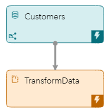
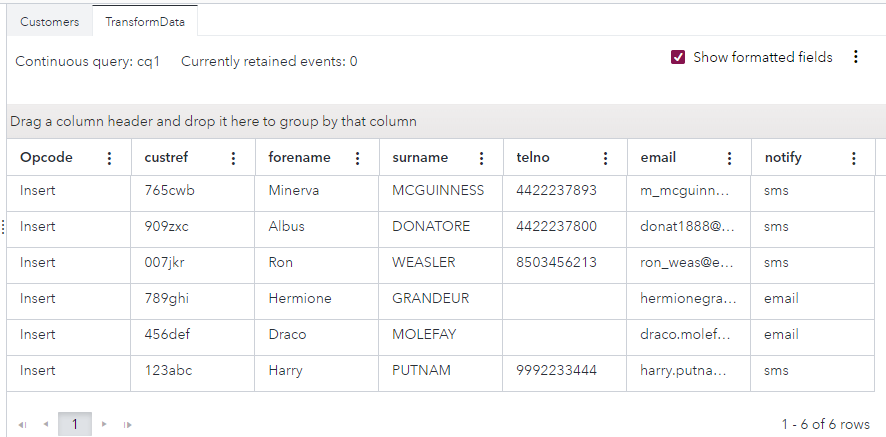

# Computing with a Python Window
## Overview
This example demonstrates how you can use Python code to modify user data. The Python window in this example serves as an alternative to a Compute window to enable a one-to-one transformation of input events to output events.

---
**NOTE:**
Use this example with SAS Event Stream Processing 2024.03 and later. 

---

For more information about how to install and use example projects, see [Using the Examples](https://github.com/sassoftware/esp-studio-examples#using-the-examples). 

## Use Case

The model handles customer information for a telecommunications company. A Python window called TransformData is configured to perform several actions:

- Capitalize each customer’s surname.
- Determine each customer’s preferred method of communication and save it to a new field, `notify`.
  - If the customer has a telephone number, then set the preferred method of communication to `sms`.
  - If the customer does not have a telephone number but does have an email address, then set the preferred method of communication to `email`.
- Convert each telephone number to a standard format by reading the final ten digits and removing all non-alphanumeric characters.

## Source Data
The file [python_compute.csv](python_compute.csv) contains customer information.

## Workflow
The following figure shows the diagram of the project:



### Customers

The Customers window streams customer information from the python_compute.csv file to the TransformData window.

Explore the settings for the Customers window:
1. Open the project in SAS Event Stream Processing Studio and select the Customers window. 
2. To examine the window's output schema, on the right toolbar, click . Observe the following fields: 
   - `custref`: This is the customer reference ID. It is also selected as the Key.
   - `forename`: This is the customer’s first name.
   - `surname`: This is the customer’s last name.
   - `telno`: This is the customer’s telephone number.
   - `email`: This is the customer’s email address.
3. Click . 

### TransformData

The TransformData window is configured to perform several actions. For more information, see [Use Case](#use-case).

Explore the settings for this window:
1. Select the TransformData window in the workspace.
2. In the right pane, expand **Python Settings**.
   - To increase the efficiency of the Python code processing, you can specify which fields to copy from the source file and which fields to use in the Python code. Note the following details in this example:
     - The **Fields to copy** field shows that the fields `surname` and `telno` are excluded. All other fields from the source file can be copied because they are not transformed by the Python code.
     - The **Fields to use in Python code** field shows that the fields `surname` and `telno` are included. These fields are transformed by the Python code.
   - Observe that the **Events function** field shows the Python function that is used (in this case, the `create` function).
3. Scroll down in the right pane, to view the Python code that performs the calculations for this example:
   
    <table>
    <tr>
    <th>Step</th> <th>Python Code Section</th>
    </tr>
    <tr>
    <td>Import the esp module, which facilitates the use of SAS Event Stream Processing functions with Python.</td>
    <td>

      
    ```
   import esp
    ```

      
    </td>
    </tr>
    <tr>
    <td>Read in the data from the python_compute.csv file.</td>
    <td>

      
    ```
    def create(data,context):
      event = {}
    ```

      
    </td>
    </tr>
    <tr>
    <td> Capitalize each customer’s surname.</td>
    <td>


    ```
      event['surname'] = data.get('surname', '').upper()
    ```


    </td>
    </tr>
    <tr>
    <td> Retain the final ten digits of each telephone number.</td>
    <td>


    ```
      event['telno'] = cleanNumber(data.get('telno', ''))
    ```


    </td>
    </tr>
    <tr>
    <td>If a customer has a telephone number, then assign the value sms.

    </td>
    <td>


    ```
      if (event['telno'] != ''):
        if (len(event['telno']) > 10):
          event['telno'] = event['telno'][1:11]
        event['notify'] = 'sms'
    ```


    </td>
    </tr>
    <tr>
    <td>Otherwise, if a customer does not have telephone number, then assign the value email.</td>
    <td>


    ```
      else:
        event['notify'] = 'email'

      return event
    ```


    </td>
    </tr>
    <tr>
    <td>To bring the telephone numbers into a standardized format, remove all non-alphanumeric characters from each telephone number.</td>
    <td>


    ```
    def cleanNumber(telno):
      str = ''
      if (telno != '' and telno is not None):
        str = ''.join(ch for ch in telno if ch.isdigit())
    
      return str
    ```
    </td>
    </tr>
    </table>


## Test the Project and View the Results

When you test the project in SAS Event Stream Processing Studio, the results for each window appear in separate tabs. The following figure shows the customer data in the **Customers** tab. Note the following details:
- Each customer’s surname is in title case.
- The telephone numbers were not entered using the same format.
- The customers Hermione Grandeur and Draco Molefay have no entry for `telno`.


The following figure shows the transformed data in the **TransformData** tab. Note the following changes:
- All surnames are now in all capital letters.
- Each telephone number shows ten digits with no spaces or non-numerical characters.
- A new variable, `notify`, has been created. Each customer with a telephone number has been assigned the value `sms`, whereas the customers without a telephone number (Hermione Grandeur and Draco Molefay) have been assigned the value `email`.



## Additional Resources
For more information, see [SAS Help Center: Using Python Windows](https://documentation.sas.com/?cdcId=espcdc&cdcVersion=default&docsetId=espcreatewindows&docsetTarget=p0e7tn8o6onj93n11vu60llatasz.htm).
