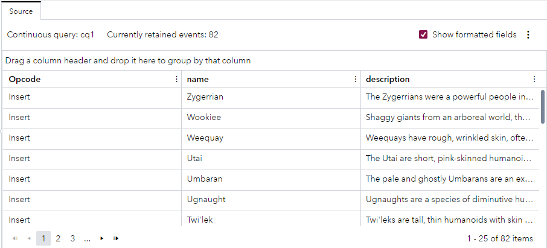

# Use a Python Connector to Publish Data from a JSON API
## Overview
This example contains a Source window with a Python connector that calls a JSON API to read Star Wars data and publish that data into the project every five seconds.

---
**NOTE:**
Use this example with SAS Event Stream Processing 2023.12 and later.

---

For more information about how to install and use example projects, see [Using the Examples](https://github.com/sassoftware/esp-studio-examples#using-the-examples).

## Source Data
Data is obtained by calling a JSON API. No input files are required for this example.

## Workflow

The Python code in the connector reads information about Star Wars species. The connector makes a call to https://starwars-databank-server.vercel.app/api/v1/species/?page=1 to get the first 10 species, yielding 10 events. The `next` field in the received data provides information about the URL that the connector needs to call to get more events. After three seconds the connector makes a call to https://starwars-databank-server.vercel.app/api/v1/species/?page=2. This continues until the connector reaches https://starwars-databank-server.vercel.app/api/v1/species/?page=9, which contains the last results. The connector stops at page 9 because the `next` field does not contain another link. 

The `interval` property of the connector is set to `3` so that the connector waits for three seconds between API calls. This means that the server will not be overloaded and data is streamed in rather than the entire data set being published at once. Reading data in this way is common when an API is used to fetch a large data set. In a real-life scenario, you might use a business API that also requires authentication.

The following table explains the Python code in the connector. To view the Python code in context, see the [model.xml](model.xml) file.

<table>
<tr>
<th>Step</th> <th>Python Code Section</th>
</tr>
<tr>
<td> Imports the esp, json, and urllib Python modules. The esp module enables the example to write log messages to the ESP server log. urllib is a Python module for fetching URLs.</td>
<td>


```
import esp
import json
import urllib.request
```


</td>
<tr>
<td> Specifies the JSON API that the connector reads and prepares for the first page of data to be read.</td>
<td>


```
STARWARS_SPECIES_URL = 'https://starwars-databank-server.vercel.app/api/v1/species'  # Star Wars Species
next_page = f"{STARWARS_SPECIES_URL}?page=1"
```


</td>
</tr>
<tr>
<td> Logs a message to indicate that an API call is made, makes an HTTP request to the API, decodes the response by using UTF-8, and parses the response as JSON.</td>
<td>

  
```
def publish():
    global next_page
    esp.logMessage(logcontext="my_connector",
                        message=f'Making API call to {next_page}',
                        level="info")
    response = urllib.request.urlopen(next_page)
    response = response.read().decode('utf-8')
    response = json.loads(response)
```

  
</td>
</tr>
<tr>
<td> Creates a list of species events by using data from specified fields (name and description).</td>
<td>


```
    events = []
    # loop through species results
    for result in response['data']:
        keep_keys = ['name', 'description']
        event = dict((k, result[k]) for k in keep_keys if k in result)
        events.append(event)
```


</td>
</tr>
<tr>
<td> Fetches the next page of results until there are no more pages to fetch. </td>
<td>


```
    done = False
    
    if response['info']['next'] is None:
        done = True
        esp.logMessage(logcontext="my_connector",
                        message='Connector finished',
                        level="info")
    elif type(response['info']['next']) == str:
        next_page = 'https://starwars-databank-server.vercel.app' + response['info']['next']
```


</td>
</tr>
<tr>
<td> Returns results as SAS Event Stream Processing events.</td>
<td>


```
    return {
        "events": events,
        "done": done
    }
```


</td>
</tr>
</table>

## Test the Project and View the Results
The following figure shows the result of running the project in test mode in SAS Event Stream Processing Studio:



The actual events that appear in test mode depend on the events that are available in the JSON feed at the time when you run the project.

## Next Steps
You could adjust this example to call a business API that requires authentication.

## Additional Resources
For more information, see [SAS Help Center: Using the Python Connector](https://documentation.sas.com/?cdcId=espcdc&cdcVersion=default&docsetId=espca&docsetTarget=n11ojcpdv0jd12n15mzwrwv7v2t3).

