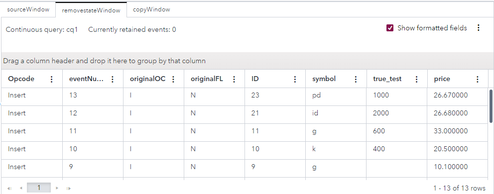

# Transitioning a Model from Stateful to Stateless
## Overview

This example demonstrates how to facilitate the transition of a stateful part of a model to a stateless part of a model. A Remove State window in this example converts all events that it receives into Inserts and adds a field named `eventNumber`.

For more information about how to install and use example projects, see [Using the Examples](https://github.com/sassoftware/esp-studio-examples#using-the-examples).

## Source Data

The [InputRemove.csv](InputRemove.csv) file contains a list of stock market trades. 

## Workflow
The following figure shows the diagram of the project:

- The sourceWindow window is a Source window. This is where events from the `InputRemove.csv` file enter the model.
- The removestateWindow is a Remove State Window. This is where the model transitions to stateless.
- The copyWindow window is a Copy window. This is where information is retained, to show the transition to a stateless model.

### sourceWindow

Explore the settings for the sourceWindow window:
1. Open the project in SAS Event Stream Processing Studio and select the sourceWindow window. 
2. In the right pane, expand **State and Event Type**. Observe that the index type is PI_HASH. That is, the window is stateful. The window retains all incoming events.
3. To examine the window's output schema, on the right toolbar, click . Observe the following fields: 
   - `ID`: This field is the stock trade's ID, which is also selected as the key field.
   - `symbol`: This field is the stock symbol. A stock symbol is a series of letters that are assigned to a security for trading purposes.
   - `true_test`: This field is the "true_test" value for each trade.
   - `price`: This field is the stock price.
4. Click . 

### removestateWindow

Explore the settings for the removestateWindow window:
1. Select the removestateWindow window.
2. In the right pane, expand **Settings**. Observe that Updates, Deletes, Retention Updates, and Retention Deletes are the opcodes that are to be removed by this window.
3. Observe that the **Include opcode and flag fields** check box is selected. This causes two fields to be added to the output schema.
4. To examine the window's output schema, on the right toolbar, click . Observe the following details:
   - `eventNumber`: This field is an event number that is assigned to each event. The event number is a monotone-increasing sequential integer. The output schema for a Remove State window always includes this field. This field is the only key of a Remove State window.
   - `originalOC` and `originalFL`: These fields are present in the output schema because the **Include opcode and flag fields** check box is selected for this window. For each event, these fields contain the event's original opcode and the event's original flag.
   - `ID`, `symbol`, `true_test`, and `price`: These fields are present in the sourceWindow window and are passed through, but the `ID` field is no longer a key field.
5. Click . 

### copyWindow

Explore the settings for the copyWindow window:
1. Select the copyWindow window.
2. In the right pane, expand **State**. Observe that the window is stateful. The window retains all incoming events, except when a retention policy is used.
3. Expand **Retention**. Observe that time-based retention is used. Events are retained for 30 seconds.

## Test the Project and View the Results

When you test the project, the results for each window appear on separate tabs. The following figure shows the results for the sourceWindow tab. This tab displays all events, with various opcodes. 

The following figure shows the results for the removestateWindow tab. The eventNumber, originalOC, and originalFL columns are present. The originalOC column shows that only Insert events entered into the window, as specified in the window's settings.

The following figure shows the results for the copyWindow tab. This tab initially displays 13 Insert events. The window retains these events for 30 seconds. After this, 13 Delete events appear.

## Next Steps

To understand more about how Remove State windows work:
1. Stop the test and return to the removestateWindow window. 
2. In **Settings**, clear all checkboxes for the **Opcodes to be removed** option.
3. Save the project and test it again. 
4. Select the removestateWindow tab. The originalOC column shows that events with various opcodes entered into the window. However, the Opcode column shows that each event has been turned into an Insert. A Remove State window converts all events that it receives into Inserts.

## Additional Resources
For more information, see [SAS Help Center: Using Remove State Windows](https://documentation.sas.com/?cdcId=espcdc&cdcVersion=default&docsetId=espcreatewindows&docsetTarget=p0usk3uf3bcnebn1m99g1jbvvhxu).
