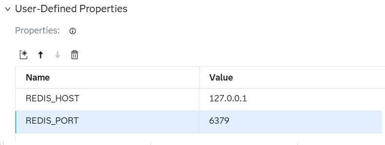
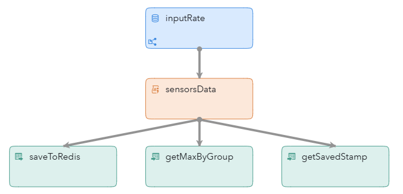
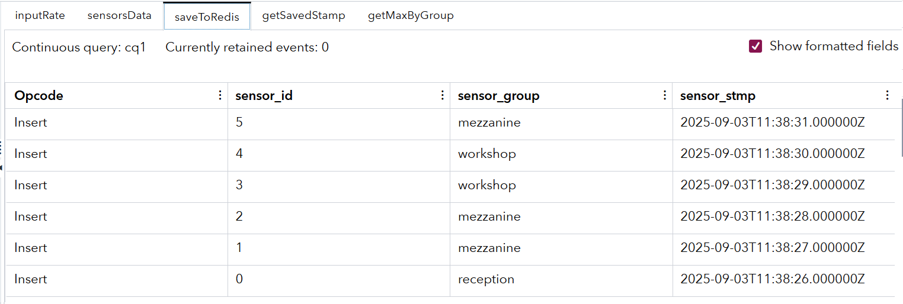
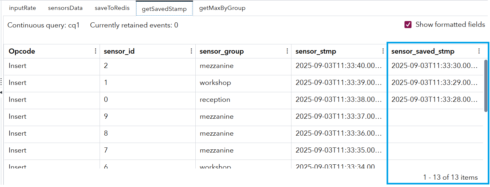
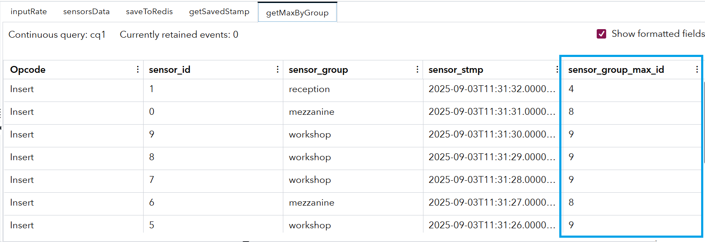

# Using StateDB Windows with the In-Memory Key–Value Database Redis

## Overview

This example demonstrates how to use the StateDB Writer Window and StateDB Reader Window in SAS Event Stream Processing.

For more information about installing and using example projects, see [Using the Examples](https://github.com/sassoftware/esp-studio-examples#using-the-examples).

## Use Case

This project demonstrates how to perform Insert, Lookup, and Aggregate operations on an in-memory Redis hash table. This is useful in the following scenarios:
- Performing fast lookups against large tables.
- Reducing the start up time of SAS Event Stream Processing projects by minimizing the container’s memory footprint.
- Building a compute cluster where multiple SAS Event Stream Processing Kubernetes pods run as replicas of the same project. The pods run in parallel, sharing and aggregating different parts of the input stream.

## Prerequisites

This example requires [**Redis database**](https://redis.io/) to be installed and available in the SAS Event Stream Processing environment.
To install and start Redis server, copy and paste the following command into your terminal and run it:
```bash
sudo docker run --name test-redis -p 6379:6379 -d redis
```
For more information, see: [**Redis Docker**](https://hub.docker.com/_/redis). 

After the Redis setup is finished and running, two variables must be configured in SAS Event Stream Processing Studio. Do the following steps to configure the variables:
1. Click  to navigate to the project.
2. Click  and expand **User-Defined Properties**. You should see a similar table:


- `REDIS_HOST`: Set the value to the Redis database server IP or host name. You must specify the IP address of the Redis host that can be resolved from the SAS Event Stream Processing container. The default value is **127.0.0.1**.
- `REDIS_PORT`: Set the value to Redis database connection port. You do not need to change the value unless you modified it during the Redis installation. The default value is **6379**.

## Source Data

To simulate data streaming during testing, a Source window and timer connector are used to produce one event per second. Then, a Lua window generates dummy sensor data that consists of the following components:
  - `sensor_id`: A sensor identifier that has a numeric value between zero to nine
  - `sensor_group`: A label that sorts the sensor into one of three values: mezzanine, reception, or workshop
  - `sensor_stmp`: The sensor reading timestamp

## Workflow

Here is a diagram of the project:



- InputRate is a Source window that ingests dummy events using a Timer Connector.
- SensorsData is a Lua window that generates dummy sensor events.
- SaveToRedis is a StateDB Writer window that saves and updates records in Redis hash tables.
- GetSavedStamp is a StateDB Reader window that looks up keys in Redis hash tables and retrieves the saved timestamp value for each key.
- GetMaxByGroup is a StateDB Reader window that performs aggregate functions on Redis hash tables by a selected group value and returns the result.

### saveToRedis

This StateDB Writer window saves or updates key-value records in Redis tables using incoming data from the sensorsData window.

Explore the settings for the saveToRedis window:
1. Open the project in SAS Event Stream Processing Studio and select the saveToRedis window.
2. In the right pane, expand **Database Write Properties**. Notice the following properties:
   - `Redis prefix`: Enables you to set a unique prefix for the Redis hash table. The default value is **stream**.
   - `Time to live`: Sets the retention period in seconds for each key-value record. This is useful for retention-based aggregations. The default value is **60** seconds.
   - `Time field`: Defines the time reference used for retention counting. The default value is **(use system clock)**, but you can change it and specify a timestamp field from the Input event.
   - `Secondary Indexes`: This table assigns additional indexes on **SENSOR_GROUP**. The additional field is **sensor_group** by default.

### getMaxByGroup

This StateDB Reader window aggregates Redis table data using keys that come from incoming data through the sensorsData window.

Explore the settings for the getMaxByGroup window:
1. Open the project in SAS Event Stream Processing Studio and select the getMaxByGroup window.
2. In the right pane, expand **Database Query**.
   - `Redis prefix`: Enables you to set a unique prefix for the Redis hash table. The prefix must be the same as the prefix that you set in the saveToRedis window so that it can perform a lookup. The default value is **stream**.
   - `Query`: This table sets the query condition. This is the condition used to query data from the Redis hash table before performing aggregation. In this example, all records are selected from the Redis table where the `sensor_group` from the Input event matches the `SENSOR_GROUP` field in the Redis hash table. Then, the aggregation function is applied in the output mapping. 
   - `Time field`: Defines the time reference used for retention counting. The default value is **(use system clock)**, but you can change it and specify a timestamp field from the Input event.
3. Click  . 
4. Click  . The following fields are listed:
    - `sensor_id`: This field is mapped to **Input, so it is received from the Input event.
    - `sensor_group`: This field is mapped to **Input, so it is received from the Input event.
    - `sensor_stmp`: This field is mapped to **Input, so it is received from the Input event.
    - `sensor_group_max_id`: This field is mapped to **Query**, which means it is calculated based on data from the Redis hash table. Notice that the **Source Field** value is set to **SENSOR_ID** and the **Aggregate Function** value is **ESP_aMax**. This means that for each input event for a `sensor_group`, it returns the value of the `SENSOR_ID` that is stored in Redis for 60 seconds according to the retention policy.
  
### getSavedStamp

This StateDB Reader window performs a lookup of a record in the Redis table using keys from incoming data from the sensorsData window.

Explore the settings for the getSavedStamp window:
1. Open the project in SAS Event Stream Processing Studio and select the getSavedStamp window.
2. In the right pane, expand **Database Query**.
   - `Redis prefix`: Enables you to set a unique prefix for the Redis hash table. The default value is **stream**.
   - `Query`: This table sets the query condition. In this example, the Redis hash table is searched for a record where the input field, `sensor_id`, is equivalent to the field `SENSOR_ID`.
    - `Time field`: Defines the time reference used for retention counting. The default value is **(use system clock)**, but you can change it and specify a timestamp field from the Input event.
3. Click . 
4. Click . The following fields are listed:
    - `sensor_id`: This field is mapped to **Input, so it is received from the Input event.
    - `sensor_group`: This field is mapped to **Input, so it is received from the Input event.
    - `sensor_stmp`: This field is mapped to **Input, so it is received from the Input event.
    - `sensor_saved_stmp`: This field is mapped to **Query**. Notice the **Source Field** column value is set to **SENSOR_STMP**, which means this field is received from the Redis `SENSOR_STMP` value. 

## Test the Project and View the Results

When you test the project in SAS Event Stream Processing Studio, the results for each window appear in separate tabs:
- The **saveToRedis** tab lists incoming data. The `sensor_id`, `sensor_group`, and `sensor_stmp` fields are stored in a Redis hash. Redis creates indexes on `sensor_id` and `sensor_group` to support future aggregations. The following figure shows the results for the **saveToRedis** tab:
  

- The **getSavedStamp** tab lists incoming data and data from Redis. In the **sensors_saved_stmp** column, you can see fetched data for the `sensor_id` key, which is currently stored in the Redis hash. At the beginning of the test, no data is cached. As the saveToRedis window starts to run, the data appears. The following figure shows the results for the **getSavedStamp** tab:
  

- The **getMaxByGroup** tab lists the results of the aggregation. For each Input event, a new field called `sensor_group_max_id` is calculated. It represents the maximum `sensor_id` value stored in Redis within the last 60 seconds for the specific `sensor_group` of the Input event. The following figure shows the results for the **getMaxByGroup** tab:
  

## Next Steps

You can enhance this project by doing any of the following:
- Replacing the dummy source with a live sensor feed
- Experimenting with different aggregations in the StateDB Reader
- Adjusting the TTL (time-to-live event retention) in the StateDB Writer

## Additional Resources

For more information, see: [SAS Help Center: Using StateDB Windows](https://go.documentation.sas.com/doc/en/espcdc/default/espcreatewindows/n01c9h6p6pmlcmn11w46am1xgnum.htm).
