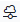

# Importing the Grafana Dashboard

## Prerequisites

Before you begin the process of importing the Grafana dashboard, make sure you have the following prerequisites:
- The SAS Event Stream Processing and Grafana services are running on the same cluster.
- The SAS Event Stream Processing Data Source Plug-in for Grafana are installed and configured. For more information, see [SAS Event Stream Processing Data Source Plug-in for Grafana](https://github.com/sassoftware/grafana-esp-plugin/blob/main/README.md#add-the-sas-event-stream-processing-data-source).
- A data source that is configured in Grafana for the SAS Event Stream Processing Studio application. For more information, see [Add the SAS Event Stream Processing Data Source](https://github.com/sassoftware/grafana-esp-plugin/blob/main/README.md#add-the-sas-event-stream-processing-data-source).
- The example project is installed on the SAS Event Stream Processing Studio application and is running in test mode. For more information, see [Using the Examples](../README.md#using-the-examples).

## Update the grafana.json file

Before you import the dashboard, you must update `grafana.json` for your environment because the ESP Server connection URL is different in each cluster.

1. Download the `grafana.json` file to your system.
2. Find the Kubernetes namespace where SAS Event Stream Processing and Grafana are running. You can do this in SAS Event Stream Processing Studio or your command line interface (CLI).
   1. To find the namespace in SAS Event Stream Processing Studio, do the following:
      1. In SAS Event Stream Processing Studio, open a project.
      2. In the toolbar, select the **ESP server** drop-down list. The namespace is displayed next to 
   2. To find the namespace using the command line interface, use the following command:
      ```bash
      kubectl get deployment sas-event-stream-processing-studio-app -o jsonpath="{.metadata.namespace}"
      ```
3. Replace all instances of `%NAMESPACE%` with the Kubernetes namespace.
4. You can do this manually or through your command line interface (CLI).
    - For PowerShell, use the following command:
      ```
      (Get-Content grafana.json) -replace '%NAMESPACE%', 'your-namespace' | Set-Content grafana.json
      ```
    - For bash, use the following command:
      ```
      sed -i 's/%NAMESPACE%/your-namespace/g' grafana.json
      ```

## Import the dashboard

After you have updated your `grafana.json` file, you must import the dashboard into Grafana:

1. In Grafana, select **Dashboards** from the navigation bar.
2. Click **New**.
3. From the drop-down list, select **Import**.
4. Click **Upload dashboard JSON file** and select your updated `grafana.json` file.
5. In the **Name** field, enter a name for the dashboard.
6. From the **Folder** drop-down list, select a folder for the dashboard.
7. (Optional) Change the unique identifier (UID) by clicking **Change uid** and entering a unique identifier for the dashboard.
8. From the **SAS Event Stream Processing Datasource** drop-down list, select the datasource that you configured with the SAS Event Stream Processing Studio application.
9. Click **Import (Overwrite)**.

