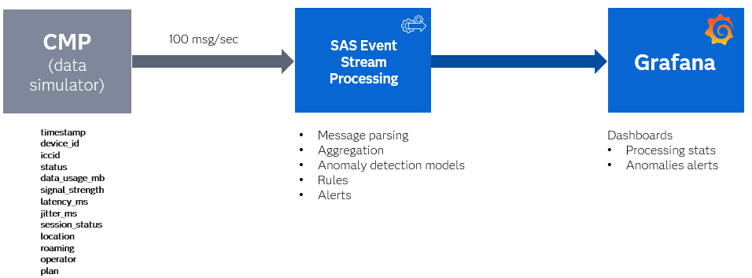
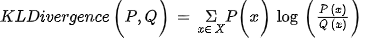

# Connectivity Analytics for Telemetry Data in Telecom Networks

## Overview

This example demonstrates how to use SAS Event Stream Processing to analyze telemetry data from a Connectivity Management Platform (CMP). Telemetry data refers to the automated collection and transmission between devices over a network without human intervention. The Connectivity Management Platform is a cloud-based system that manages the Internet of Things (IoT) and machine-to-machine (M2M) device connectivity. The CMP also manages subscriber identity modules (SIM) and data usage.

For more information about how to install and use example projects, see [Using the Examples](https://github.com/sassoftware/esp-studio-examples#using-the-examples).

## Use Case

This example demonstrates different approaches for monitoring CMP data using synthetic data that encapsulates three types of events.
Each event type illustrates a specific stream processing technique:
- For the `Device Outside Coverage Area` event sample where devices (for example, in tunnels) have no signal, rule-based stream processing is used to detect missing or delayed events.
- For the `Attacked Device or Malware` event sample, rule-based aggregation is applied over a defined time window to identify suspicious activity patterns.
- For the `Equipment Failures Due to High Demand` event sample, change detection using the Kullback-Leibler (KL) Divergence method is applied to identify abnormal behavior trends.

## Source Data and Other Files

- The source window uses a file and socket connector to ingest a stream of synthetic data from an input file called `anomalies.csv` that includes:

  - `timestamp`: Unique identifier
  - `device_id`: Unique device identifier
  - `iccid`: Unique network cell identifier
  - `status`: Device status
  - `data_usage_mb`: Device network traffic usage
  - `signal_strength`: Device connection signal strength
  - `latency_ms`: Latency in microseconds for receiving or sending network packages
  - `jitter_ms`: Variation in latency over time
  - `session_status`: Connection session status for the currently registered network
  - `location`: Country name of the device home region
  - `roaming`: Whether the current region is the home region for the device
  - `operator`: Network provider where the device is currently registered
  - `plan`: Network provider tariff

To make changes to the synthetic data sample, do the following:
1. Navigate to the [Git project](/Advanced/connectivity_analytics).
2. Download the file [generate_anomalies.ipynb](Generate_anomalies.ipynb).
3. Open the file in Jupyter Notebook.
4. Make the necessary changes to the data generation steps, and run the code.
5. Download the new version of `anomalies.csv`.
6. Replace the existing file in the project package with the updated one.

## Workflow

The following diagram shows the data flow. Prepared CMP data is published to SAS Event Stream Processing at ten events per second. SAS Event Stream Processing preprocesses the data, detects anomalies, applies rules, and generates alerts. Grafana dashboards connect to various SAS Event Stream Processing windows to visualize alerts and statistical data from the project.



The following figure shows the diagram of the project:


- w_cmp_stream: A Source window that receives synthetic CMP data from the file. 
- w_parsing: A Lua window that applies standard JSON message parsing using the **esp_parseJsonFrom** function.
- w_retention: A Copy window that applies a data retention policy of four days.
- w_usage_profile: An Aggregate window that aggregates average data usage for each device ID and indicates whether a device is roaming.
- w_join_avg: A Join window that joins back current average values to the Input event as a new field.
- w_change_latency: A Calculate window that detects anomalies in latency data from CMP. The supported algorithms are based on the Kullback-Leibler (KL) Divergence approach. 
- w_latency_spike: A Filter window that filters out events and keeps only the events where `changeDetected` is equal one.
- w_cells: A Source window that reads latitude and longitude data for `cell_id`.
- add_cell_pos: A Join window that joins back the values from w_cells to the Input event.
- w_rules: A Lua window that implements alert generation logic.
- w_rate: A Counter window that calculates the event processing rate for visualization on a Grafana gauge chart. 
- w_copy: A Copy window that retains input events for aggregation in the `w_aggr_stat` window.
- w_aggr_stats: An Aggregate window that computes data metrics for Grafana charts.

### w_cmp_stream

Explore the settings for the w_cmp_stream window:
1. Open the project in SAS Event Stream Processing Studio and select the w_cmp_stream window.
2. In the right pane, expand **Input Data (Publisher) Connectors**. Notice the connector called **anomalies_Connector**, which is the file and socket connector used to ingest the synthetic CMP data.  
3. Click . Notice the following fields:
    - `id`: Autogenerated event key field. 
    - `json_data`: The output data text field written in JSON format.
        
### w_parsing

Explore the settings for the w_parsing window:
1. Open the project in SAS Event Stream Processing Studio and select the w_parsing window.
2. In the right pane, expand **Lua Settings**.
3. Under **Code source**, you see the following window of code:

```lua
function create(data,context)
    local   message_info = esp_parseJsonFrom("json_data")
    if message_info == nil then
        print("ERROR: Failed to parse message")
        return {}
    end
    local   e = {}
    e.timestamp = esp_getSystemMicro()
    e.device_id = message_info.device_id
    e.iccid = message_info.iccid
    e.status = message_info.status
    e.data_usage_mb = message_info.data_usage_mb
    e.signal_strength = message_info.signal_strength
    e.latency_ms = message_info.latency_ms
    e.jitter_ms = message_info.jitter_ms
    e.session_status = message_info.session_status
    e.location = message_info.location
    e.roaming = message_info.roaming
    e.operator = message_info.operator
    e.plan = message_info.plan
    return(e)
end
```
This code uses the built-in JSON parser function called **esp_parseJsonFrom** to extract important JSON data fields and puts them into event fields for further processing. 

### w_retention, w_usage_profile, and w_join_avg

These three windows use a standard design pattern to enrich incoming events with aggregated information.

Explore the settings for the w_retention window:
1. Open the project in SAS Event Stream Processing Studio and select the w_retention window.
2. In the right pane, expand **Retention**. Notice that the **Time limit** is set to four days, which means that data is retained for the previous four days.

Explore the settings for the w_usage_profile window:
1. Open the project in SAS Event Stream Processing Studio and select the w_usage_profile window.
2. Click . Notice the following fields:
    - `device_id`:The unique ID of each device.
    - `roaming`: Displays true of false to indicate if a device is roaming.
    - `data_usage_md`: The average data usage in megabytes of each device.

Explore the settings for the w_join_avg window:
1. Open the project in SAS Event Stream Processing Studio and select the w_join_avg window.
2. In the right pane, expand **Join Criteria**. Notice that the **Join type** is set to **left outer**.
3. Expand **Join Conditions**. Notice that this join combines data from w_parsing and w_usage_profile.

### w_change_latency

This window identifies sudden or unexpected deviations in a time series or data stream. It uses the KLDivergenceDiff measure that is pictured directly below: 


For more details, see [SAS Help Center: Change Detection](https://go.documentation.sas.com/doc/en/espcdc/v_063/espan/n0jveogr5iwzyxn1w7imhj73d4zf.htm).

Explore the setting for the w_change_latency window:
1. Open the project in SAS Event Stream Processing Studio and select the w_change_latency window.
2. Expand **Settings** and then expand **Parameters**. See the following parameters:  
    - `slidingAlpha`: Specifies the fading factor for the sliding window. The value range is 0<α<=1, and the default value is **0.98**.
    - `slidingHalfLifeSteps`: Specifies the number of steps at which the weight of the input reaches half of its original weight for the sliding window. The default value is **0**.
    - `refWindowSize`: Specifies the size of the reference window. The default value is **100**.
    - `changeThreshold`: Specifies the threshold that determines whether a change occurred. The default value is **0.2**. 
    - `nBins`: Specifies the maximum number of bins in the histogram for reference and sliding windows. This value also determines the number of bins when computing KL divergence. The default value is **50**. 
    - `maxEvalSteps`: Specifies the maximum number of steps before performing a new evaluation. The default value is **100**.
    - `adaptiveEval`: Specifies whether to use the adaptive evaluation step size or not. The default value is **1**, which means the adaptive evaluation step size is used. <!-- I'm guessing 1 is yes and 0 is no? Like binary? --> <!-- A: right ,  according to doc: adaptiveEval is int32 and default value is 1 which means "true" -->
    - `measure`: Specifies the measure used to compare the data streams from the reference window and from the sliding window. The default value is **KLDivergenceDiff**.
    - `showEval`: Specifies whether to show evaluation events regardless of whether a change is detected. The default value is **0**, which means evaluation events are not shown. It is set to **1** for debugging purposes. 
    - `showAll`: Specifies whether to show all events, regardless of whether an evaluation occurs. The default value is **0**, which means all events are not shown. It is set to **1** for debugging purposes.

3. Expand **Input Map**.  
    - `input`: Specifies the input variable for change detection. In this example, it analyzes `latency_ms`, which is the registered signal latency.
      
4. Expand **Output Map**.  
    - `evaluatedOut`: Specifies the name of the output variable that indicates whether an evaluation occurred. This value is used as a supporting indicator of the anomaly detection algorithm’s performance on the Grafana dashboard.
    - `changeValueOut`: Specifies the name of the output variable that contains the change value. This value is used as a supporting indicator of the anomaly detection algorithm’s performance on the Grafana dashboard. 
    - `changeDetectedOut`: Specifies the name of the output variable that indicates whether a change has been detected. This value indicates whether an anomaly has been detected in the observed `latency_ms`. It is used in the w_latency_spike window to filter out latency anomalies.
      
### w_latency_spike

Explore the setting for the w_latency_spike window:
1. Open the project in SAS Event Stream Processing Studio and select the w_latency_spike window.
2. In the right pane, expand **Filter**.
3. Under **Code source**, you see the following window of code:

```lua
function filter(event,context)
    return (event.changeDetected==1)
end
```
This code filters out events and keeps the events where `changeDetected` is equal to one.

### w_cells and add_cell_pos

These two windows enrich incoming data with geolocation information from an additional data source.  
The `w_cells` source window retrieves cell positions from a text file, while the `add_cell_pos` join window looks up `cell_id` and adds latitude and longitude to the incoming event fields if a match is found in the `w_cells` window.

Explore the settings for the w_cells window:
1. Open the project in SAS Event Stream Processing Studio and select the w_cells window.
2. In the right pane, expand **Input Data (Publisher) Connectors**. Notice there is a Lua connector called **geo_data**.
3. Click **output schema icon**. Notice the following fields:
    - `cell_id`: The unique cell ID.
    - `cell_id_lat`: The latitude data that the window reads from `cell_id`.
    - `cell_id_lon`: The longitude data that the window reads from `cell_id`.
  
Explore the settings for the add_cell_pos window:
1. Open the project in SAS Event Stream Processing Studio and select the add_cell_pos window.
2. In the right pane, expand **Join Criteria**. Notice that the **Join type** is set to **left outer**.
3. Expand **Join Conditions**. Notice that this join combines data from w_latency_spike and w_cells.

### w_rules

There are three types of alerts: ANOMALY_NO_SIGNAL, ANOMALY_USAGE, and ANOMALY_LATENCY_SPIKE. The ANOMALY_NO_SIGNAL alert means that the device is outside the coverage area. The ANOMALY_USAGE alert means that the device is being attacked or there is malware. The ANOMALY_LATENCY_SPICE alert means there are equipment failures due to high demand. This Lua window applies alert generation logic to Input event fields, aggregated fields, and events where change is detected by the analytics algorithm. 

Explore the setting for the w_rules window:
1. Open the project in SAS Event Stream Processing Studio and select the w_rules window.
2. In the right pane, expand **Lua Settings**.
3. Under **Code source**, you see the following window of code:
   
```lua
local alert_id = 1
function create(data,context)
    local   alerts = {}
    local array_idx = 1
    -- Monitoring rules --
    -- RULE 1: zero data, no signal
    if context.input=="w_join_avg" and data.session_status == "dropped" and data.status == "inactive" and data.data_usage_mb == 0.0 then
        local alert = {}
        alert.alert_id = alert_id
        alert.id = data.id
        alert.timestamp = data.timestamp
        alert.device_id = data.device_id
        alert.iccid = data.iccid
        alert.alert_type = esp_toString("ANOMALY_NO_SIGNAL")
        alert.alert_description = esp_toString("Device outside coverage area")
        alert.alert_priority = 2
        alert.cell_id_lat =  0
        alert.cell_id_lon = 0
        alerts[array_idx] = alert
        alert_id = alert_id + 1
        array_idx = array_idx + 1
    end
    -- RULE 2: unusual high traffic consumption
    if context.input=="w_join_avg" and ((data.data_usage_mb -  data.data_usage_avg_mb)>1000) and (data.data_usage_mb ~= 0)   then
        local alert = {}
        alert.alert_id = alert_id
        alert.id = data.id
        alert.timestamp = data.timestamp
        alert.device_id = data.device_id
        alert.iccid = data.iccid
        alert.alert_type = esp_toString("ANOMALY_USAGE")
        alert.alert_description = esp_toString("Attacked device or malware")
        alert.alert_priority = 3
        alert.cell_id_lat =  0
        alert.cell_id_lon = 0
        alerts[array_idx] = alert
        alert_id = alert_id + 1
        array_idx = array_idx + 1
    
    end
    
    -- Detected anomalies --
    -- higher latency, jitter, dropped session
    if context.input == "add_cell_pos" and data.changeDetected==1  then

        local alert = {}
        alert.alert_id = alert_id
        alert.id = data.id
        alert.timestamp = data.timestamp
        alert.device_id = data.device_id
        alert.iccid = data.iccid
        alert.alert_type = esp_toString("ANOMALY_LATENCY_SPIKE")
        alert.alert_description = esp_toString("Equipment failures due to high demand")
        alert.alert_priority = 1
        alert.cell_id_lat =  24.7743 + math.random(0, 1)/100
        alert.cell_id_lon = 46.7386 + math.random(0, 1)/100
        alerts[array_idx] = alert
        alert_id = alert_id + 1
        array_idx = array_idx + 1
    end
    if array_idx > 1 then
        return(alerts)
    else 
        return false
    end
end
```
This code is the alert generation logic used to create alerts.

### w_rate, w_copy, and w_aggr_stats

These windows collect aggregated data for Grafana dashboards.

Explore the settings for the w_rate window:
1. Open the project in SAS Event Stream Processing Studio and select the w_rate window.
2. In the right pane, expand **Counter**. Notice that the **Time period** is set to 1 second. This value is the refresh rate for a Grafana gauge chart. 

Explore the settings for the w_copy window:
1. Open the project in SAS Event Stream Processing Studio and select the w_copy window.
2. In the right pane, expand **Retention**. Notice that the **Time limit** is set to 1 hour, which means the window retains input events for aggregation up to 1 hour in the w_aggr_stat window. It is best practice to pair any streaming aggregation window with a copy window to limit the number of events retained in memory. 

Explore the settings for the w_aggr_stats window:
1. Open the project in SAS Event Stream Processing Studio and select the w_aggr_stats window.
2. Click . These fields are used to visualize the synthetic data distribution:
    - `latency_ms`
    - `jitter_ms`
    - `signal_strength`  

## Test the Project and View the Results
When you test the project, the results appear on separate tabs. The following figure shows the results for the w_rules tab:  


## Next Steps
Alerts, model performance, and streaming data can be visualized using the [SAS Event Stream Processing Data Source Plug-in for Grafana](https://github.com/sassoftware/grafana-esp-plugin). Do the following steps to import [grafana.json](grafana.json) to Grafana:
1. From the navigation bar, click **Dashboards**.
2. Click **New**.
3. From the drop down list, select **Import**.
4. Click **Upload dashboard JSON file** and select `grajana.json` using the file selector.
5. Click **Import**.

The following figures show an example of a Grafana dashboard:


**NOTE:** This dashboard was created using standalone SAS Event Stream Processing running in the same namespace as Grafana. If you are using a different environment, such as the SAS Viya platform, you must re-create the queries because the connection URLs are different.  

**Real-Time Monitor Pane**
- `Input Data`: This table displays CMP events using data from the w_cmp_stream window.
- `Rate (msg/sec)`: This gauge shows the events processing rate in messages per second. Based on the processing speed, you can tell whether SAS Event Stream Processing is still reading and processing the input file.
  
**Analytics Pane**
- `Latency distribution`: This histogram displays the distribution of `jitter_ms`, `latency_ms`, and `signal_strength`.
- `KLDivergenceDiff (latency_ms)`: This bar gauge displays the model evaluation from the w_change_latency window.

**Alerts Pane**
- `group:latency`: This table displays alerts on changes in latency pattern, indicating possible equipment failures due to high demand.
- `group:signal`: This table displays ANOMALY_NO_SIGNAL alerts when a device is outside the coverage area.
- `group:usage`: This table displays ANOMALY_USAGE alerts when a device has malware.
- `Latency spikes`: This geomap shows the location of devices where latency anomalies are detected.
- `Logs`: These logs display aggregated alert data by alert type.

You can further enhance this project by doing any of the following:
- Replacing the CSV source with a live sensor feed.
- Adjusting rules logic for new types of anomalies that are observed in the Input stream.
- Using other change detection methods in the Calculate window to improve detection accuracy.

## Additional Resources

For more information, see [SAS Help Center: Change Detection](https://go.documentation.sas.com/doc/en/espcdc/default/espan/n0jveogr5iwzyxn1w7imhj73d4zf.htm#p0fydwd77vhobwn1c4c89qbv6r7f).
