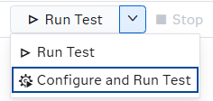
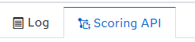

# Fire Exit Obstruction Detection Using Connected Component Labeling
## Overview
This example demonstrates how to use the **SAS Event Stream Processing Scoring API** with raw binary image data. A JPEG frame is POSTed directly to a running ESP project, which processes it through a multi-stage image processing pipeline and returns a result — either an annotated image or structured JSON — in a single synchronous request-response call.

The pipeline is built entirely from built-in SAS Event Stream Processing algorithms (background subtraction, grayscale conversion, contrast enhancement, Gaussian blurring, adaptive binarization, and Connected Component Labeling) and requires **no prior model training**. This makes it a practical starting point for detecting unknown or unidentified objects in any fixed-camera scenario — evacuation routes, ATMs, restricted areas, and so on.

The specific use case demonstrated here is **worker safety**: the project detects objects (bins, bags, persons) obstructing a fire exit door and produces both annotated images and structured bounding-box data that can feed downstream alerting or logging systems.

For more information about how to install and use example projects, see [Using the Examples](https://github.com/sassoftware/esp-studio-examples#using-the-examples).

## Use Case
A fixed camera monitors a fire exit corridor. When a person, bag, bin, or any other object enters and remains in front of the exit, safety regulations may be violated. This example processes individual JPEG frames from that camera feed and flags each distinct foreground object that overlaps with a defined region of interest (ROI) around the fire exit door. The output includes a colourised label map as well as the original frame annotated with bounding boxes and object IDs, making it straightforward to integrate a downstream alerting or logging step.

## Source Data and Other Files
- `model.xml` is the project associated with this example.
- `test_files/static.jpg` is a reference image of the empty corridor with no obstructions. It is used as the static background for background subtraction.
- `test_files/frame_bin.jpg` is a sample input frame showing a bin placed in front of the fire exit.
- `test_files/frame_bag.jpg` is a sample input frame showing a bag placed in front of the fire exit.
- `test_files/frame_person.jpg` is a sample input frame showing a person standing in front of the fire exit.

---
**NOTE:**
The input data provided in this example is to be used only with this project. Using or altering this data beyond the example for any other purpose is prohibited.

---

## Prerequisites
This example requires SAS Event Stream Processing with Python window support and the `esp_utils` and `opencv-python` (`cv2`) packages available in the Python environment used by the ESP server.

The `test_files/static.jpg` background image must be present in the `test_files` directory of the project package before the project is started. The path is resolved at run time via the `ESP_PROJECT_HOME` environment variable.

To use the Scoring API, the project must be running in test mode in SAS Event Stream Processing Studio or deployed to a cluster. For more information, see [Using the Scoring API](#using-the-scoring-api).

## Workflow
The following figure shows the diagram of the project:


The pipeline is made up of the following windows:

- **w_source** is a Source window. Each incoming event carries one JPEG image frame. It is also the configured **score input window**: when a request is received via the Scoring API, the image is injected here.
- **w_background_subtract** is a Python window. It converts both the incoming frame and the cached background to the HSV colour space and subtracts them to suppress shadows and brightness-only changes while preserving foreground objects with distinct colour.
- **w_gray** is a Calculate window using the HighDimensionalDSP algorithm. It converts the background-subtracted frame to a single-channel grayscale image.
- **w_contrast** is a Calculate window using the HighDimensionalDSP algorithm. It applies gamma-based contrast stretching to enhance the visibility of foreground objects.
- **w_blur** is a Calculate window using the TwoDimensionalConvolution algorithm. It applies a Gaussian blur to smooth pixel-level gradients and prevent over-segmentation.
- **w_thresh** is a Calculate window using the HighDimensionalDSP algorithm. It converts the blurred grayscale image into a binary mask using the Sauvola adaptive thresholding method. Its output feeds both w_thresh_viz and w_ccl.
- **w_thresh_viz** is a Python window. It stretches the binary mask's pixel values to the full 0–255 range so that the mask is clearly visible when previewed as a JPEG. This window exists solely for inspection and does not affect the processing pipeline.
- **w_ccl** is a Calculate window using the ConnectedComponentLabeling algorithm. It groups connected foreground pixels into labelled objects and outputs a label-map image together with bounding-box metadata for up to 20 objects.
- **w_fire_exit_filter** is a Python window. It inspects the bounding boxes from w_ccl and retains only those objects that overlap with the defined fire-exit ROI, emitting one event per qualifying object.
- **w_join** is a Join window. It performs a left-outer join between the CCL output (left) and the original source frames (right) on the `index` key, so that the annotation window has access to both the label-map metadata and the raw input image.
- **w_annotate** is a Python window. It colourises the CCL label map, filters bounding boxes to those with at least 30% overlap with the fire-exit ROI, and draws the filtered boxes onto both the label-map image and the original frame. It is the configured **score output window** in the default configuration.

### w_source

The w_source window is a stateless, insert-only Source window that acts as the entry point for the project. Its schema contains two fields:

| Field   | Type    | Description                                  |
|---------|---------|----------------------------------------------|
| `index` | int64   | Auto-generated key that uniquely identifies each frame. |
| `image` | blob    | The raw JPEG image frame.                    |

To explore the settings for this window:
1. Open the project in SAS Event Stream Processing Studio and click the **w_source** window.
2. In the right pane, expand **State and Event Type**.<br/>The window is stateless and the index type is `pi_EMPTY`. The `pi_EMPTY` index does not store events; all incoming events are passed through immediately.
3. Expand **Input Data (Publisher) Connectors** to configure a connector that publishes test frames. Point the connector to one of the test JPEG files located in the `test_files` folder (for example, `frame_person.jpg`).

### w_background_subtract

This Python window subtracts a pre-loaded static background from every incoming frame in order to isolate moving or recently placed objects. The background image (`test_files/static.jpg`) is read once from disk and cached in a module-level variable (`_BG`). At run time, the following operations are applied to each frame:

1. The incoming frame blob is decoded to an OpenCV image using `esp_utils.image_conversion.blob_image_to_opencv_image`.
2. The cached background is resized to match the incoming frame dimensions if they differ.
3. Both the frame and the background are converted to the HSV colour space. Absolute per-channel differences are computed for hue (H), saturation (S), and value (V) and combined with weighted coefficients (H×1.5, S×1.2, V×0.3). The lower weight on the value channel suppresses brightness-only changes such as shadows and glass reflections, while the higher weights on hue and saturation preserve foreground objects that have a distinct colour relative to the background.
4. Pixels with a combined difference value below 25 are zeroed out to suppress low-amplitude noise.
5. A morphological opening with a 9×9 elliptical kernel removes isolated noise blobs.

The resulting `subtracted_image` blob is passed to the next window for grayscale conversion.

### w_gray

The w_gray window uses the **HighDimensionalDSP** algorithm with the `COLORSPACE` transformation type and the `RGB2GRAY` function to convert the three-channel background-subtracted image to a single-channel grayscale image. This reduces the amount of data that subsequent windows need to process and is a prerequisite for the thresholding step.

To explore the settings for this window:
1. Click the **w_gray** window.
2. In the right pane, expand **Settings** and then expand **Parameters**.<br/>Observe that `transformationType` is set to `COLORSPACE` and `function` is set to `RGB2GRAY`.
3. Expand **Input Map**. The `imageInput` property is mapped to the `subtracted_image` field produced by w_background_subtract.
4. Expand **Output Map**. The `imageOutput` property is mapped to the `gray_image` field.

### w_contrast

The w_contrast window uses the **HighDimensionalDSP** algorithm with the `CONTRAST` transformation type and the `GAMMA` function to perform contrast stretching on the grayscale image. Contrast stretching expands the range of pixel intensities so that objects stand out more clearly from any remaining background clutter before thresholding.

Key parameter values:

| Parameter  | Value | Description |
|------------|-------|-------------|
| `lowIn`    | 0.08  | Input level below which pixels are clipped to black. |
| `highIn`   | 0.92  | Input level above which pixels are clipped to white. |
| `gamma`    | 1     | Gamma correction exponent. |
| `stretch`  | 1     | Enables linear contrast stretching. |

To explore the settings for this window:
1. Click the **w_contrast** window.
2. In the right pane, expand **Settings** and then expand **Parameters** to review the values listed above.
3. Expand **Input Map**. The `imageInput` property is mapped to `gray_image`.
4. Expand **Output Map**. The `imageOutput` property is mapped to `contrast_image`.

### w_blur

The w_blur window uses the **TwoDimensionalConvolution** algorithm to apply a separable Gaussian filter to the contrast-enhanced image. Blurring smooths abrupt pixel-level gradients so that the subsequent binarization step produces fewer fragmented regions and, therefore, fewer spurious connected components.

Key parameter values:

| Parameter          | Value                                                   | Description                          |
|--------------------|---------------------------------------------------------|--------------------------------------|
| `kernel`           | `0.27406861906119, 0.4518627618776, 0.27406861906119`  | 1-D row kernel coefficients.         |
| `kernelCol`        | `0.27406861906119, 0.4518627618776, 0.27406861906119`  | 1-D column kernel coefficients.      |
| `kernelRowSize`    | 3                                                       | Effective kernel height in pixels.   |
| `kernelColumnSize` | 9                                                       | Effective kernel width in pixels.    |

To explore the settings for this window:
1. Click the **w_blur** window.
2. In the right pane, expand **Settings** and then expand **Parameters** to review the kernel values.

### w_thresh

The w_thresh window uses the **HighDimensionalDSP** algorithm with the `BINARIZATION` transformation type and the `SAUVOLA` function. Sauvola thresholding is an adaptive method: the threshold for each pixel is computed from the local mean and standard deviation within a surrounding window, making it robust to uneven illumination across the frame.

Key parameter values:

| Parameter      | Value | Description |
|----------------|-------|-------------|
| `windowSize`   | 151   | Size of the local neighbourhood used to compute the threshold. |
| `k`            | 0.4   | Sauvola sensitivity parameter. |

The output is a binary image (`binary_image`) in which foreground pixels (potential objects) have a value of 1 and background pixels have a value of 0. Because these values lie in the 0–1 range they appear nearly black when rendered as a JPEG; the w_thresh_viz window exists to make the mask human-readable during inspection.

To explore the settings for this window:
1. Click the **w_thresh** window.
2. In the right pane, expand **Settings** and then expand **Parameters** to review the values above.
3. Expand **Input Map** and **Output Map** to confirm that `blur_image` feeds in and `binary_image` is produced.

### w_thresh_viz

The w_thresh_viz window is a Python window added purely for inspection purposes. The `binary_image` produced by w_thresh contains pixel values in the 0–1 range, which renders as an almost entirely black JPEG because JPEG encoders expect values in the 0–255 range. This window applies `cv2.threshold` with `THRESH_BINARY` to remap every non-zero pixel to 255 and every zero pixel to 0, producing a stark black-and-white image that clearly shows the foreground mask.

The window outputs the `viz_image` field, which can be previewed using the Scoring API tab (see [Previewing Intermediate Pipeline Stages](#previewing-intermediate-pipeline-stages)). It does not feed any downstream processing window; w_thresh_viz runs in parallel with w_ccl, which receives the original `binary_image` directly from w_thresh.

### w_ccl

The w_ccl window uses the **ConnectedComponentLabeling** algorithm to group connected foreground pixels in the binary image into distinct labelled regions, each representing a separate detected object. The output includes a label-map image and per-object metadata.

Key parameter values:

| Parameter       | Value  | Description |
|-----------------|--------|-------------|
| `method`        | BBDT   | Block-based decision tree algorithm for efficient labelling. |
| `connectivity`  | 8      | Eight-connected neighbourhood (diagonal pixels are considered connected). |
| `sizeThreshold` | 7500   | Minimum component size in pixels; smaller components are discarded as noise. |
| `sort`          | 1      | Objects are sorted by size (largest first). |
| `coordType`     | coco   | Bounding-box coordinates follow the COCO format. |

The window outputs the following fields in addition to the label-map image (`outputImage`):

| Field           | Type          | Description |
|-----------------|---------------|-------------|
| `objCountOut`   | int64         | Total number of objects detected. |
| `idListOut`     | array(i64)    | Object IDs (up to 20). |
| `xMinListOut`   | array(dbl)    | Left edge of each bounding box. |
| `xMaxListOut`   | array(dbl)    | Right edge of each bounding box. |
| `yMinListOut`   | array(dbl)    | Top edge of each bounding box. |
| `yMaxListOut`   | array(dbl)    | Bottom edge of each bounding box. |

To explore the settings for this window:
1. Click the **w_ccl** window.
2. In the right pane, expand **Settings** and then expand **Parameters** to review the values above.
3. Expand **Input Map**. The `imageInput` property is mapped to `binary_image`.
4. Expand **Output Map** to review how each output field is mapped.

### w_fire_exit_filter

This Python window filters the bounding boxes produced by w_ccl to retain only the objects that overlap with a hard-coded fire-exit region of interest (ROI). The ROI is defined as the pixel rectangle `(x1=733, x2=1250, y1=10, y2=1050)`, which corresponds to the area of the fire exit door in the camera's field of view. The window emits one output event per qualifying object, making it straightforward to count and log individual obstructions.

The filtering logic uses a standard axis-aligned rectangle intersection test (`intersects`). Objects whose bounding boxes do not overlap the ROI at all are silently discarded. For each object that does intersect the ROI, the window emits an event containing:

| Field       | Type   | Description |
|-------------|--------|-------------|
| `index`     | int64  | Frame index (key). |
| `object_id` | int64  | CCL object ID (key). |
| `x_min`     | int64  | Left edge of the bounding box. |
| `x_max`     | int64  | Right edge of the bounding box. |
| `y_min`     | int64  | Top edge of the bounding box. |
| `y_max`     | int64  | Bottom edge of the bounding box. |

### w_join

The w_join window is a Join window that combines two streams using a left-outer join on the `index` key:

- **Left input (w_ccl):** provides the label-map image and all bounding-box list fields.
- **Right input (w_source):** provides the original raw `image` blob.

The joined output is passed to w_annotate so that bounding boxes can be drawn on both the CCL label map and the original frame.

### w_annotate

The w_annotate window produces the final visualisations. Its Python code performs the following operations:

1. **Label-map colourisation:** The grayscale CCL label map (`outputImage`) is masked to the fire-exit ROI, normalised, and mapped through OpenCV's `COLORMAP_TURBO` colour map, giving each object a distinct colour. A green rectangle is drawn to mark the ROI boundary.
2. **Bounding-box filtering:** Each bounding box is tested against the fire-exit ROI using an overlap-ratio calculation. Only boxes where at least 30% of the box area lies inside the ROI are retained.
3. **Bounding-box annotation:** The filtered boxes are drawn with object-ID labels onto both the colourised label map (`visImage`) and the original raw frame (`rawImage`). A fixed random seed (42) ensures consistent box colours across frames.

The window outputs four fields:

| Field         | Type | Description |
|---------------|------|-------------|
| `outputImage` | blob | CCL label map passed through from w_ccl via w_join. |
| `visImage`    | blob | Colourised label map with filtered bounding boxes and ROI boundary overlaid. |
| `rawImage`    | blob | Original input frame with filtered bounding boxes overlaid. |
| `overlayImage`| blob | Original input frame with the colourised label map overlaid for foreground objects. |

`rawImage` is the designated **score output field** in the default project configuration.

## Using the Scoring API

The Scoring API enables you to score input events and return scored events on demand using a synchronous request-response communication pattern. When you send a scoring request, the system waits for the full pipeline to complete before returning a response. This contrasts with streaming and publish-subscribe patterns, where data flows continuously and asynchronously, and makes it ideal for on-demand inspection and testing without needing live connectors or adapters.

This project is pre-configured for Scoring API use:

| Project attribute     | Value              |
|-----------------------|--------------------|
| `score-input-window`  | `cv_cq/w_source`   |
| `score-input-field`   | `image`            |
| `score-output-window` | `cv_cq/w_annotate` |
| `score-output-field`  | `rawImage`         |

These values can be updated in the project properties panel to inspect any output window in the project.


Any JPEG you submit is injected into **w_source**, routed through the full image processing pipeline, and the annotated `rawImage` from **w_annotate** is returned as the response.

The Scoring API is accessible directly from the **Scoring API** tab in the bottom pane of SAS Event Stream Processing Studio when the project is running in test mode. The following subsections describe three different ways to use it.

### Sending an Image and Receiving an Annotated Output

To start the project in test mode and use the Scoring API tab:
1. Open the project in SAS Event Stream Processing Studio and select **Configure and Run Test**.




2. In the **Load and Start Project in Cluster** window, adjust the deployment settings as required for your environment and click **OK**.
3. In the bottom pane, click the **Scoring API** tab.
4. In the **Input** table, click **Select input file**.
5. In the `test_files` folder of the project package, select one of the test frames — for example, `frame_person.jpg`. The file reference appears in the Input table row.
6. Click **Send request**.
7. Because `score-output-field` is set to `rawImage` (an image blob field), the **Save Output File** window appears. SAS Event Stream Processing Studio automatically detects the file type and displays a preview of the original image with the detected bounding boxes of the foreground objects.
8. Enter a file name (for example, `annotated_person.jpg`) and click **Save**. The file is saved to the `/output/scoring_outputs/` folder of the project package.



The following figure shows the **Save Output File** window with a preview of the annotated result for `frame_person.jpg`. Each detected object that overlaps the fire-exit ROI is highlighted with a bounding box and an object ID label.


Repeat the same steps with `frame_bin.jpg` and `frame_bag.jpg` to score the remaining two test frames. The saved output files accumulate in the `/output/scoring_outputs/` folder.

### Previewing Intermediate Pipeline Stages

One of the most powerful uses of the Scoring API is the ability to inspect the output of **any window** in the pipeline, not just the final result. This is particularly useful during development or parameter tuning: you can send the same image and see exactly what the pipeline produces at each individual stage without changing any other part of the project.

To preview a different stage, modify the `score-output-window` and `score-output-field` attributes in `model.xml` before starting the project:

| Stage to preview                        | `score-output-window`        | `score-output-field` |
|-----------------------------------------|------------------------------|----------------------|
| After background subtraction            | `cv_cq/w_background_subtract`  | `subtracted_image`   |
| After grayscale conversion              | `cv_cq/w_gray`                 | `gray_image`         |
| After contrast stretching               | `cv_cq/w_contrast`             | `contrast_image`     |
| After Gaussian blur                     | `cv_cq/w_blur`                 | `blur_image`         |
| After binarization (mask)               | `cv_cq/w_thresh`               | `binary_image`       |
| Binary mask (visualised, JPEG-friendly) | `cv_cq/w_thresh_viz`           | `viz_image`          |
| CCL label map (raw)                     | `cv_cq/w_ccl`                  | `outputImage`        |
| Colourised label map                    | `cv_cq/w_annotate`             | `visImage`           |
| Annotated raw frame                     | `cv_cq/w_annotate`             | `rawImage`           |
| Overlaid label map onto raw frame       | `cv_cq/w_annotate`             | `overlayImage`       |

For example, to retrieve the human-readable binary mask produced by the w_thresh_viz window, update the `project` element in `model.xml` before starting the project:

```xml
<project ... score-output-window="cv_cq/w_thresh_viz" score-output-field="viz_image">
```

Then follow the same steps as in [Sending an Image and Receiving an Annotated Output](#sending-an-image-and-receiving-an-annotated-output). Because `viz_image` is an image blob, the **Save Output File** window appears with a preview of the binary mask. The preview shows pure white regions where foreground objects were detected and pure black everywhere else, making it easy to verify that the Sauvola binarization parameters are cleanly segmenting the foreground before Connected Component Labeling runs.

---
**NOTE:**
Inspecting `cv_cq/w_thresh` / `binary_image` directly is also possible, but the raw binary mask has pixel values in the 0–1 range, which renders as a near-black JPEG. Use `cv_cq/w_thresh_viz` / `viz_image` for a clear preview.

---

The following figure shows the **Save Output File** window with a preview of the visualised binary mask produced by **w_thresh_viz** when `frame_person.jpg` is used as input:


")

### Retrieving Structured Obstruction Data

Instead of receiving an image, you can retrieve the structured bounding-box data produced by **w_fire_exit_filter**. This is useful for feeding detection results into downstream systems — writing alert records to a file, triggering notifications, or logging to a database — without needing to decode an image.

Because all fields in **w_fire_exit_filter** are structured (non-blob) fields, `score-output-field` should not be set. When no output field is specified, the response events are displayed directly in the **Output** table of the Scoring API tab rather than in the Save Output File window.

To configure the project for structured output, update the `project` element in `model.xml` before starting the project, removing the `score-output-field` attribute:

```xml
<project ... score-output-window="cv_cq/w_fire_exit_filter">
```

Then follow the same steps as in [Sending an Image and Receiving an Annotated Output](#sending-an-image-and-receiving-an-annotated-output) to select a test file and click **Send request**. The response events appear in the **Output** table of the Scoring API tab, with one row per detected object that intersects the fire-exit ROI. Click **JSON** to view the events as JSON code:

```json
[
  {
    "index": 1,
    "object_id": 3,
    "x_min": 755,
    "x_max": 1198,
    "y_min": 42,
    "y_max": 1048
  }
]
```


As can be seen from the table, this displays the two objects detected in the fire exit's ROI - the person and the ball.

When the clean empty corridor (`static.jpg`) is used as input instead of one of the obstruction frames, **w_fire_exit_filter** produces no qualifying events and the Output table is empty, confirming that no obstructions were detected.

## Test the Project in SAS Event Stream Processing Studio

In addition to the Scoring API tab, test mode in SAS Event Stream Processing Studio lets you monitor the events flowing through every window simultaneously. This is useful for observing the full pipeline in motion or for inspecting intermediate window outputs alongside final results.

To test the project in this way, complete the following steps:
1. Configure a publisher connector on the **w_source** window to publish one of the test frames (for example, `frame_person.jpg`).
2. In the left pane, select the check boxes for the windows whose output you want to examine. It is recommended to select **w_ccl**, **w_fire_exit_filter**, and **w_annotate**.
3. Select **Configure and Run Test** and click **OK** to dismiss the deployment settings window.

The results for each selected window appear on separate tabs in test mode.

For the **w_ccl** tab, observe the `objCountOut` field to see how many objects were detected in the frame and inspect the bounding-box list fields.

For the **w_fire_exit_filter** tab, only objects within the fire-exit ROI are listed. Each row represents one obstructing object. When `frame_person.jpg` is used, you should see at least one event corresponding to the person.

For the **w_annotate** tab, the `visImage` and `rawImage` blob fields contain the annotated output images.

The following figure shows an example of the colourised label-map output (`visImage`) for the `frame_bag.jpg` test frame:


## Additional Resources
- For more information about the Scoring API, see [SAS Help Center: Using the Scoring API](https://go.documentation.sas.com/doc/en/espcdc/default/esprestapi/n0gu06h4g3lisgn1y1i56p97o5x6.htm).
- For more information about the Connected Component Labeling algorithm in SAS Event Stream Processing, see [SAS Help Center: ConnectedComponentLabeling Algorithm](https://go.documentation.sas.com/doc/en/espcdc/default/espan/n0tippzgzce4uzn1kin6j79h732v.htm).
- For more information about the HighDimensionalDSP algorithm (used for contrast stretching, grayscale conversion, and binarization), see [SAS Help Center: HighDimensionalDSP Algorithm](https://go.documentation.sas.com/doc/en/espcdc/default/espan/n0tippzgzce4uzn1kin6j79h732v.htm).
- For more information about using Python windows in SAS Event Stream Processing, see [SAS Help Center: Using Python Windows](https://go.documentation.sas.com/doc/en/espcdc/default/espcreatewindows/p0jsgd7e0fa40ln16wxod1qpj9d2.htm).