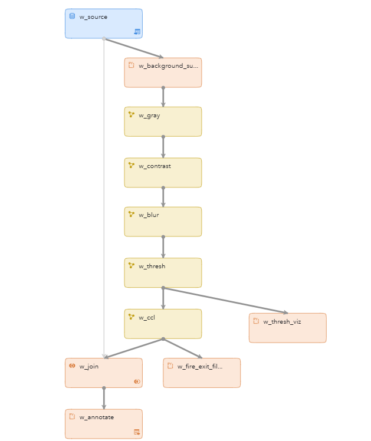
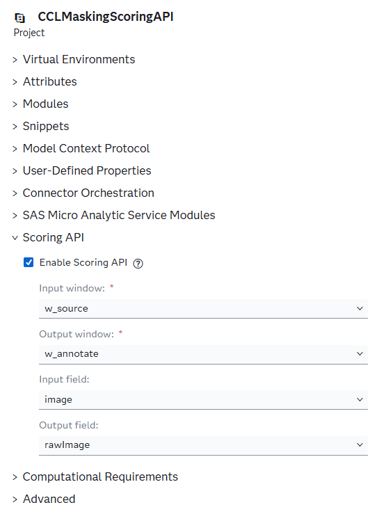
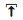
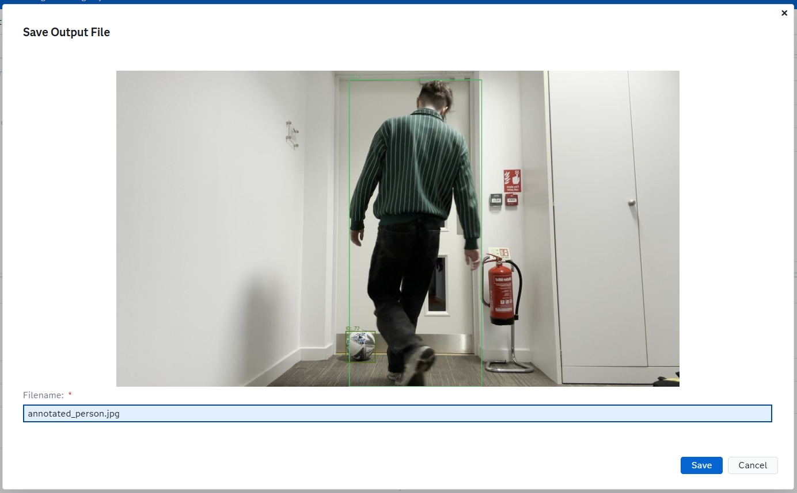
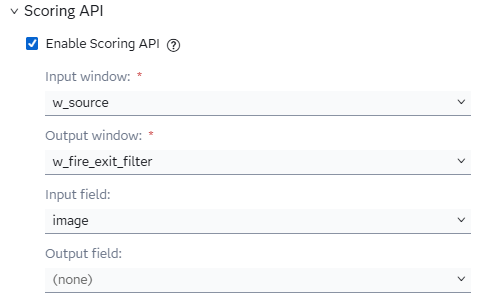
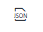
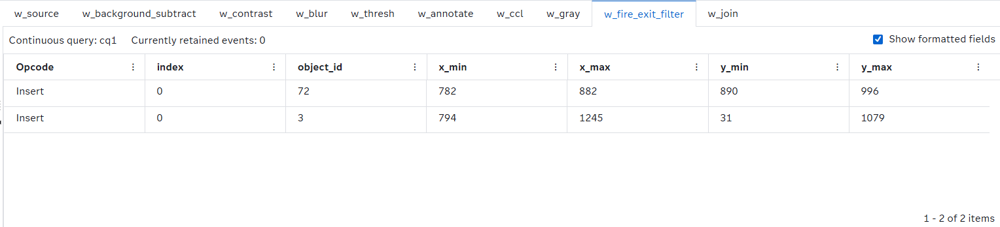
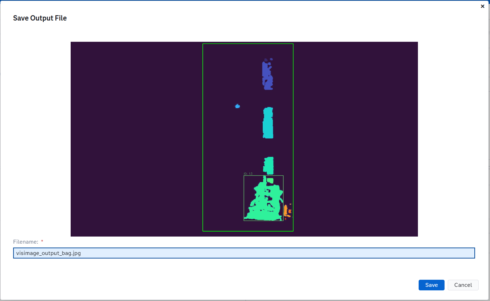

# Fire Exit Obstruction Detection Using Connected Component Labeling
## Overview
This example demonstrates how to use the SAS Event Stream Processing Scoring API with raw binary image data. A JPEG frame is sent in a POST request directly to a running ESP project, which processes it through a multi-stage image processing pipeline and returns a result. The result is either an annotated image or a structured JSON in a single synchronous request-response call.

The pipeline is built entirely from built-in SAS Event Stream Processing algorithms (for example, background subtraction, grayscale conversion, contrast enhancement, Gaussian blurring, adaptive binarization, and Connected Component Labeling) and requires no prior model training. This makes it a practical starting point for detecting unknown or unidentified objects in any fixed-camera scenario such as evacuation routes, ATMs, and restricted areas.

The use case demonstrated in this project relates to worker safety. The project detects objects (for example, bins, bags, and people) that obstruct a fire exit door and produces annotated images and structured bounding-box data that feed downstream alerting or logging systems.

For more information about how to install and use example projects, see [Using the Examples](https://github.com/sassoftware/esp-studio-examples#using-the-examples).

## Use Case
A fixed camera monitors a fire exit corridor. When a person, bag, bin, or any other object enters and remains in front of the exit, safety regulations may be violated. This example processes individual JPEG frames from that camera feed and flags each distinct foreground object that overlaps with a defined region of interest (ROI) around the fire exit door. The output includes a colorized label map as well as the original frame annotated with bounding boxes and object IDs. This makes it straightforward to integrate a downstream alerting or logging step.

## Source Data and Other Files
- `model.xml` is the project associated with this example.
- `test_files/static.jpg` is a reference image of the empty corridor with no obstructions. It is used as the static background for background subtraction.
- `test_files/frame_bin.jpg` is a sample input frame showing a bin placed in front of the fire exit.
- `test_files/frame_bag.jpg` is a sample input frame showing a bag placed in front of the fire exit.
- `test_files/frame_person.jpg` is a sample input frame showing a person standing in front of the fire exit.

**NOTE:** The input data provided in this example should be used only with this project. Using or altering this data beyond the example for any other purpose is prohibited.

## Prerequisites
This example requires SAS Event Stream Processing with Python window support. The `esp_utils` and `opencv-python` (`cv2`) packages must be installed in the Python environment used by the ESP server.

The `test_files/static.jpg` background image must be present in the `test_files` directory of the project package before the project is run in test-mode. The path is resolved at run time via the `ESP_PROJECT_HOME` environment variable.

To use the Scoring API, the project must be running in test mode in SAS Event Stream Processing Studio or deployed to a cluster. For more information, see [Using the Scoring API](#using-the-scoring-api).

## Workflow
The following figure shows the diagram of the project:


- The w_source window is a Source window. Each incoming event contains one JPEG image frame. It is also the configured Score input window. When a request is received via the Scoring API, the image is injected here.
- The w_background_subtract window is a Python window. It converts both the incoming frame and the cached background to the HSV color space and subtracts them to suppress shadows and brightness-only changes while preserving foreground objects with distinct color.
- The w_gray window is a Calculate window that uses the HighDimensionalDSP algorithm. It converts the background-subtracted frame to a single-channel grayscale image.
- The w_contrast window is a Calculate window that uses the HighDimensionalDSP algorithm. It applies gamma-based contrast stretching to enhance the visibility of foreground objects.
- The w_blur window is a Calculate window that uses the TwoDimensionalConvolution algorithm. It applies a Gaussian blur to smooth pixel-level gradients and prevent oversegmentation.
- The w_thresh window is a Calculate window that uses the HighDimensionalDSP algorithm. It converts the blurred grayscale image into a binary mask using the Sauvola adaptive thresholding method. Its output feeds the w_thresh_viz and w_ccl windows.
- The w_thresh_viz window is a Python window. It stretches the binary mask's pixel values to the full 0–255 range so that the mask is clearly visible when previewed as a JPEG. This window exists solely for inspection and does not affect the processing pipeline.
- The w_ccl window is a Calculate window that uses the ConnectedComponentLabeling algorithm. It groups connected foreground pixels into labeled objects and outputs a label-map image together with bounding-box metadata for up to 20 objects.
- The w_fire_exit_filter window is a Python window. It inspects the bounding boxes from w_ccl and retains only the objects that overlap with the defined fire-exit ROI, emitting one event per qualifying object.
- The w_join window is a Join window. It performs a left-outer join between the CCL output (left) and the original source frames (right) on the `index` key, so that the annotation window has access to both the label-map metadata and the raw input image.
- The w_annotate window is a Python window. It colorizes the CCL label map, filters bounding boxes to those with at least 30% overlap with the fire-exit ROI, and draws the filtered boxes onto both the label-map image and the original frame. It is the configured Score output window in the default configuration.

### w_source

Explore the settings for the w_source window:
1. Open the project in SAS Event Stream Processing Studio and select the w_source window.
2. In the right pane, click . The w_source window is a stateless, insert-only Source window that acts as the entry point for the project. Its schema contains two fields:
- `index`: An auto-generated key that uniquely identifies each frame.
- `image`: The raw JPEG image frame.
3. Click , then expand **State and Event Type**. Notice that the window is stateless and the index type is set to **pi_EMPTY**.

### w_background_subtract
Explore the settings for the w_background_subtract window:
1. Open the project in SAS Event Stream Processing Studio and select the w_background_subtract window.
2. In the right pane, click . Notice lines 30 through 31:
    ```
    frame = esp_utils.image_conversion.blob_image_to_opencv_image(data["image"])
    bg    = _load_background()
    ```
   These lines decode the incoming frame blob to an OpenCV image.
3. Notice lines 33 through 34:
    ```
    if frame.shape != bg.shape:
            bg = cv2.resize(bg, (frame.shape[1], frame.shape[0]))
    ```
   The cached background is resized to match the incoming frame dimensions if they differ.
4. Notice lines 36 through 38:
    ```
    frame_hsv = cv2.cvtColor(frame, cv2.COLOR_BGR2HSV).astype(np.float32)
    bg_hsv    = cv2.cvtColor(bg.astype(np.uint8), cv2.COLOR_BGR2HSV).astype(np.float32)
    ```  
   This code converts the frame and background to the HSV color space, computes absolute per-channel differences for hue, saturation, and value, and combines them using weighted coefficients (H×1.5, S×1.2, V×0.3). Lower weighting of the value channel reduces sensitivity to brightness-only changes such as shadows and reflections, while higher hue and saturation weights preserve foreground objects with distinct color contrast.
5. Notice line 47:  
   `diff[diff < 25] = 0`  
   Pixels with a combined difference value below 25 are zeroed out to suppress low-amplitude noise.
6. Notice line 49:  
   `kernel = cv2.getStructuringElement(cv2.MORPH_ELLIPSE, (9, 9))`  
   A morphological opening with a 9×9 elliptical kernel removes isolated noise blobs.
7. Notice lines 54 through 57:
    ```
    event = {}
    event["subtracted_image"] = esp_utils.image_conversion.opencv_image_to_blob_image(diff)

    return event
    ```
   The resulting `subtracted_image` blob is passed to the next window for grayscale conversion.

### w_gray

Explore the settings for the w_gray window:
1. Open the project in SAS Event Stream Processing Studio and select the w_gray window.
2. In the right pane, expand **Settings**. Notice that the algorithm is set to **High-Dimensional Digital Signal Processing**.
3. Expand **Parameters**. Notice that the **transformationType** is set to **COLORSPACE** and the **function** is set to **RGB2GRAY**. This function converts the three-channel background-subtracted image to a single-channel grayscale image. This is a prerequisite for thresholding because it reduces the amount of data that subsequent windows need to process.
3. Expand **Input Map**. The `imageInput` property is mapped to the `subtracted_image` field produced by w_background_subtract.
4. Expand **Output Map**. The `imageOutput` property is mapped to the `gray_image` field.

### w_contrast

Explore the settings for the w_contrast window:
1. Open the project in SAS Event Stream Processing Studio and select the w_contrast window.
2. In the right pane, expand **Settings**. Notice the algorithm is set to **High Dimensional Digital Signal Processing**.
3. Expand **Parameters**. Notice the following key parameter:
- `transformationType`: Set to `CONTRAST` to apply contrast stretching to the grayscale image.
- `lowIn`: The input level below which pixels are clipped to black.
- `highIn`: The input level below which pixels are clipped to white.
- `gamma `: Gamma correction exponent.
4. Expand **Input Map**. The `imageInput` property is mapped to `gray_image`.
5. Expand **Output Map**. The `imageOutput` property is mapped to `contrast_image`.

### w_blur

Explore the settings for the w_blur window:
1. Open the project in SAS Event Stream Processing Studio and select the w_blur window.
2. In the right pane, expand **Settings**. Notice that the algorithm is set to **Two-dimensional convolution**.
3. Expand **Parameters**. Notice the following key parameters:
- `kernel`: The coefficients for the kernel's rows.
- `kernelCol`: The coefficients for the kernel's columns.
- `kernelRowSize`: The height of the kernel in pixels.
- `kernelColumnSize`: The width of the kernel in pixels.

### w_thresh

Explore the settings for the w_thresh window:
1. Open the project in SAS Event Stream Processing Studio and select the w_thresh window.
2. In the right pane, expand **Settings**. Notice that the algorithm is set to **High-Dimensional Digital Signal Processing**.
3. Expand **Parameters**. Notice the following key parameters:
- `windowSize`: Instead of using a global threshold value, the Sauvola method calculates a local threshold for each pixel based on the mean and standard deviation of pixel values within a surrounding window. `windowSize` defines the dimensions of that window.
- `k`: The Sauvola sensitivity parameter - this determines how strict the thresholding algorithm is
  - Values closer to 0 will allow more pixels to be classified as foreground objects but can allow more noise to be mistakenly classified.
  - Values closer to 1 will be more strict and only classify pixels with a strong local contrast as foreground, but may miss actual objects when set too high.
4. Expand **Input Map**. The `imageInput` property is mapped to `blur_image`.
5. Expand **Output Map**. The `imageOutput` property is mapped to `binary_image`.

### w_thresh_viz

Explore the settings for the w_thresh_viz window:
1. Open the project in SAS Event Stream Processing Studio and select the w_thresh_viz window.
2. In the right pane, click . Notice lines 19 through 21:
    ```
    img = esp_utils.image_conversion.blob_image_to_opencv_image(
        data["binary_image"]
    )
    ```
   These lines decode the incoming binary image blob to an OpenCV image.
3. Notice lines 23 through 24:
    ```
    if len(img.shape) == 3:
        img = cv2.cvtColor(img, cv2.COLOR_BGR2GRAY)
    ```
   This ensures the image is converted to a single-channel grayscale if it contains three channels.
4. Notice lines 26 through 27:
    ```
    # Any non-zero pixel becomes 255 for preview
    _, stretched = cv2.threshold(img, 0, 255, cv2.THRESH_BINARY)
    ```  
   This applies a threshold to remap every non-zero pixel to 255 and every zero pixel to 0. Since the incoming mask contains pixel values in the 0–1 range, this stretches them to the full 0–255 range, producing a stark black-and-white image that renders correctly as a JPEG.
5. Notice line 29:  
   `stretched_bgr = cv2.cvtColor(stretched, cv2.COLOR_GRAY2BGR)`  
   This converts the stretched grayscale image back to a three-channel BGR format.
6. Notice lines 31 through 34:
    ```
    event = {}
    event["viz_image"] = esp_utils.image_conversion.opencv_image_to_blob_image(stretched_bgr)

    return event
    ```

The window outputs the `viz_image` field as data blob, which can be previewed using the Scoring API tab (see [Previewing Intermediate Pipeline Stages](#previewing-intermediate-pipeline-stages)). It does not feed any downstream processing window; w_thresh_viz runs in parallel with w_ccl, which receives the original `binary_image` directly from w_thresh.

### w_ccl

Explore the settings for the w_ccl window:
1. Open the project in SAS Event Stream Processing Studio and select the w_ccl window.
2. In the right pane, expand **Settings**. Notice that the algorithm is set to **Connected Component Labeling**.
3. Expand **Parameters**. Notice the following key parameters:
- `method`: Block-based decision tree algorithm for efficient labeling.
- `connectivity`: Eight connected neighbourhood (diagonal pixels are considered connected).
- `sizeThreshold`: Minimum component size in pixels. Any smaller components are discarded.
- `sort`: Objects are sorted by size, going from largest to smallest.
- `coordType`: The format used for the coordinate values of the bounding boxes.
4. Expand **Input Map**. The `imageInput` property is mapped to `binary_image`.
5. Expand **Output Map**. Notice the following roles:
- `objCountOut`: Total number of objects detected.
- `idListOut`: List of object IDs up to 20 IDs.
- `xMinListOut`: List of coordinate value of the left edges of each bounding box.
- `xMaxListOut`: List of coordinate value of the right edges of each bounding box.
- `yMinListOut`: List of coordinate value of the top edges of each bounding box.
- `yMaxListOut`: List of coordinate value of the bottom edges of each bounding box.

### w_fire_exit_filter

Explore the settings for the w_fire_exit_filter window:
1. Open the project in SAS Event Stream Processing Studio and select the w_fire_exit_filter window.
2. In the right pane, click . For each object that intersects the region of interest, the window emits an event that contains the following fields:
- `index`: The index of the event.
- `object_id`: CCL object ID.
- `xMinListOut`: The coordinate value of the left edge of each bounding box.
- `xMaxListOut`: The coordinate value of the right edge of each bounding box.
- `yMinListOut`: The coordinate value of the top edge of each bounding box.
- `yMaxListOut`: The coordinate value of the bottom edge of each bounding box.

### w_join

Explore the settings for the w_join window:
1. Open the project in SAS Event Stream Processing Studio and select the w_join window.
2. In the right pane, expand **Settings**. Notice that the left window is set to w_ccl, and the right window is set to w_source.
3. Expand **Join Criteria**. Notice the join type is set to **Left outer**.
4. Expand **Join Conditions**. Notice that both of the key values are set to `index`, which means the join window combines two streams using a left-outer join on the `index` key.

This window joins the original frame from w_source with the CCL output from w_ccl so that both the label map and the raw frame are available together in w_annotate.

### w_annotate

Explore the settings for the w_annotate window:
1. Open the project in SAS Event Stream Processing Studio and select the w_annotate window.
2. In the right pane, click . Notice the following output schema:
- `outputImage`: CCL label map passed through from w_ccl via w_join.
- `visImage`: Colorized label map with filtered bounding boxes and region of interest boundary overlaid.
- `rawImage`: Original input frame with filtered bounding boxes overlaid. It is the designated Score output field in the default project configuration.
- `overlayImage`: Original input frame with the colorized label map overlaid for foreground objects.
3. Click . The w_annotate window produces the final visualizations. 
Its Python code performs the following operations: 
4. The Region-of-Interest (ROI) (i.e. the fire exit area) and threshold (THRESH) for how much an object must overlap to be considered are defined on line 22-23:
   ```
   ROI = (730, 10, 1230, 1050)
   ```
5. Notice lines 65 through 68:
    ```
    label_map = esp_utils.image_conversion.blob_image_to_opencv_image(data["outputImage"])

    if len(label_map.shape) == 3:
        label_map = cv2.cvtColor(label_map, cv2.COLOR_BGR2GRAY)
    ```
   These lines decode the single-channel CCL label map into an OpenCV image and gracefully handle cases where it might appear as a three-channel image.
4. Notice lines 70 through 71:
    ```
    raw = esp_utils.image_conversion.blob_image_to_opencv_image(data["image"])
    raw = raw.copy()
    ```
   This decodes the original input frame so we have a clean copy to draw on.
5. Notice lines 87 through 91:
    ```
        if _bbox_inside_ratio(x1, y1, x2, y2, ROI) >= THRESH:
            xmins.append(x1)
            xmaxs.append(x2)
            ymins.append(y1)
            ymaxs.append(y2)
    ```  
   The script calculates the overlap ratio of each bounding box against the fire exit's region of interest. Boxes that overlap by at least 30% (`THRESH = 0.3`) are retained.
6. Notice lines 95 through 101:
    ```
    valid_ids = set(ids)
    filtered_label_map = np.zeros_like(label_map)

    for obj_id in valid_ids:
        filtered_label_map[label_map == obj_id] = obj_id

    label_map = filtered_label_map
    ```
   This clears out any pixels from the label map that belong to objects outside of the region of interest.
7. Notice lines 103 through 104:
    ```
    label_map_norm = cv2.normalize(label_map, None, 0, 255, cv2.NORM_MINMAX).astype(np.uint8)
    vis = cv2.applyColorMap(label_map_norm, cv2.COLORMAP_TURBO)
    ```  
   The grayscale CCL label map is normalized and colorized so each object ID has a distinct color.
8. Notice lines 106 through 108:
    ```
    _draw_boxes(vis, xmins, xmaxs, ymins, ymaxs, ids)

    _draw_boxes(raw, xmins, xmaxs, ymins, ymaxs, ids)
    ```
   The filtered bounding boxes and their respective IDs are drawn onto both the colorized label map and the original frame.
9. Notice lines 116 through 118:
    ```
    overlay = raw.copy()
    blended = cv2.addWeighted(raw, 0.6, vis, 0.4, 0)
    overlay[fg_mask_3 == 1] = blended[fg_mask_3 == 1]
    ```
   This creates an alpha-blended overlay image, showing the original frame with the colorized foreground objects superimposed.
10. Notice lines 120 through 125:
    ```
    event["visImage"] = esp_utils.image_conversion.opencv_image_to_blob_image(vis)
    event["rawImage"] = esp_utils.image_conversion.opencv_image_to_blob_image(raw)
    event["overlayImage"] = esp_utils.image_conversion.opencv_image_to_blob_image(overlay)

    return event
    ```
The resulting annotated images are encoded back into blobs and output as `visImage`, `rawImage`, and `overlayImage`.

1. Label-map colorization: The grayscale CCL label map,`outputImage`, is masked to the fire-exit region of interest, normalized, and mapped through OpenCV's `COLORMAP_TURBO` color map. A green rectangle is drawn to mark the region of interest boundaries.
2. Bounding-box filtering: Each bounding box is tested against the fire exit region of interest using an overlap-ratio calculation. Only boxes where at least 30% of the box area lies inside the region of interest are retained.
3. Bounding-box annotation: The filtered boxes are drawn with object-ID labels onto both the colorized label map, `visImage`, and the original raw frame. A fixed random seed (42) ensures consistent box colors across frames.

## Using the Scoring API

The Scoring API enables you to score Input events and return Scored events on demand using a synchronous request-response communication pattern. When you send a scoring request, the system waits for the full pipeline to complete before returning a response. This contrasts from streaming and publish-subscribe patterns, where data flows continuously and asynchronously. This makes scoring API ideal for on-demand inspection and testing without needing live connectors or adapters.

To interact with the Scoring API, without selecting any of the windows, navigate to the Project Properties by selecting  on the right hand side. Notice the following Scoring API-related attributes by expanding the **Scoring API** Section - You will see the following image:



This project is pre-configured for Scoring API use:

| Project attribute     | Value              |
|-----------------------|--------------------|
| `score-input-window`  | `cv_cq/w_source`   |
| `score-input-field`   | `image`            |
| `score-output-window` | `cv_cq/w_annotate` |
| `score-output-field`  | `rawImage`         |

By default, any JPEG you submit is sent to the w_source window, routed through the full image processing pipeline, and then the annotated `rawImage` from w_annotate is returned as the response.

The Scoring API is accessible directly from the **Scoring API** tab when the project is running in test mode. The following subsections describe three different ways to use it.

### Sending an Image and Receiving an Annotated Output

1. Open the project in SAS Event Stream Processing Studio and select **Enter Test Mode**.
2. From the **Run Test** drop down, select **Configure and Run Test**.
3. In the **Load and Start Project in Cluster** window, adjust the deployment settings by clicking **Edit deployment settings...**.
4. Click **OK**.
3. In the bottom pane, click the **Scoring API** tab.
4. In the **Input** table, click . The **Upload Input File** window appears.
5. In the test_files folder of the project package, select one of the test frames (for example, `frame_person.jpg`).
6. Click **Send request**.
7. Because `score-output-field` is set to `rawImage`, the **Save Output File** window appears. SAS Event Stream Processing Studio automatically detects the file type and displays a preview of the original image with the detected bounding boxes of the foreground objects.
8. Enter a file name (for example, `annotated_person.jpg`).
9. Click **Save**. The file is saved to the `/output/scoring_outputs/` folder of the project package.
10. Repeat steps 4 through 9 with `frame_bin.jpg` and `frame_bag.jpg` to view the output of the remaining test frames.
The following figure shows the **Save Output File** window with a preview of the annotated result for `frame_person.jpg`. Each detected object that overlaps the fire-exit ROI is highlighted with a bounding box and an object ID label.



### Previewing Intermediate Pipeline Stages

One of the most powerful uses of the Scoring API is the ability to inspect the output of any window in the pipeline, not just the final result. This is particularly useful during development or parameter tuning. You can send the same image through the pipeline and see exactly what the pipeline produces at each stage without changing any other part of the project.

To preview a different stage, modify the `score-output-window` and `score-output-field` attributes in the **Scoring API** section in the Project Properties before starting the project

| Stage to preview                        | `score-output-window`        | `score-output-field` |
|-----------------------------------------|------------------------------|----------------------|
| After background subtraction            | `cv_cq/w_background_subtract`  | `subtracted_image`   |
| After grayscale conversion              | `cv_cq/w_gray`                 | `gray_image`         |
| After contrast stretching               | `cv_cq/w_contrast`             | `contrast_image`     |
| After Gaussian blur                     | `cv_cq/w_blur`                 | `blur_image`         |
| After binarization (mask)               | `cv_cq/w_thresh`               | `binary_image`       |
| Binary mask (visualised, JPEG-friendly) | `cv_cq/w_thresh_viz`           | `viz_image`          |
| CCL label map (raw)                     | `cv_cq/w_ccl`                  | `outputImage`        |
| Colorizedd label map                    | `cv_cq/w_annotate`             | `visImage`           |
| Annotated raw frame                     | `cv_cq/w_annotate`             | `rawImage`           |
| Overlaid label map onto raw frame       | `cv_cq/w_annotate`             | `overlayImage`       |

For example, to retrieve the human-readable binary mask produced by the w_thresh_viz window, update the scoring windows before starting the project:
To do this, while no window is selected navigate to the Project Properties by selecting  on the right hand side. Select the **Scoring API** section and change the value of `score-output-window` to `cv_cq/w_thresh_viz` and the value of `score-output-field` to `viz_image`.

Select  to open the XML editor and verify that the changes are reflected in `model.xml`:
```xml
<project ... score-output-window="cv_cq/w_thresh_viz" score-output-field="viz_image">
```

Follow the same steps as in [Sending an Image and Receiving an Annotated Output](#sending-an-image-and-receiving-an-annotated-output). Because `viz_image` is an image blob, the **Save Output File** window appears with a preview of the binary mask. The preview shows pure white regions where foreground objects were detected and pure black everywhere else, making it easy to verify that the Sauvola binarization parameters are cleanly segmenting the foreground before Connected Component Labeling runs.

**NOTE:** Inspecting `cv_cq/w_thresh` / `binary_image` directly is also possible, but the raw binary mask has pixel values in the 0–1 range, which renders as a near-black JPEG. Use `cv_cq/w_thresh_viz` / `viz_image` for a clear preview.

The following figure shows the **Save Output File** window with a preview of the visualized binary mask produced by w_thresh_viz when `frame_person.jpg` is used as the input:

")

### Retrieving Structured Obstruction Data

Instead of receiving an image, you can retrieve the structured bounding-box data produced by the w_fire_exit_filter window. This capability enables detection results to be sent to downstream systems, such as writing alert records to a file, triggering notifications, or logging data to a database, without decoding an image.

Since all of the fields in w_fire_exit_filter are structured fields, the value of `score-output-field` should not be set. When no output field is specified, the response events are displayed directly in the **Output** table of the Scoring API tab rather than in the **Save Output File** window.

To configure the project for structured output, update the Scoring API section in the Project Properties and remove the `score-output-field` attribute before starting the project:



1. Open the project in SAS Event Stream Processing Studio and select **Enter Test Mode**.
2. From the **Run Test** drop down, select **Configure and Run Test**.
3. In the **Load and Start Project in Cluster** window, adjust the deployment settings if necessary and click **OK**.
4. In the bottom pane, click the **Scoring API** tab.
5. In the **Input** table, click . The **Upload Input File** window appears.
6. In the test_files folder of the project package, select a test file (for example, `frame_person.jpg`).
7. Click **Send request**.
8. Notice that the response events appear in the **Output** table of the Scoring API tab, with one row per detected object that intersects the fire exit region of interest.
9. Click  to view the events as JSON code:

```json
[
  {
    "index": 1,
    "object_id": 3,
    "x_min": 755,
    "x_max": 1198,
    "y_min": 42,
    "y_max": 1048
  }
]
```

The following table displays the two objects detected in the fire exit's region of interest: a person and a ball.



When the empty corridor (`static.jpg`) is used as input instead of one of the obstruction frames, the w_fire_exit_filter window produces no qualifying events. The **Output** table is empty, confirming that no obstructions were detected.

## Test the Project in SAS Event Stream Processing Studio

Test mode in SAS Event Stream Processing Studio enables you to monitor the events flowing through every window simultaneously. This is useful for observing the full pipeline in motion or for inspecting intermediate window outputs alongside final results.

To test the project, do the following:
1. Select the w_source window.
2. Expand **Input Data (Publisher) Connectors**.
3. Configure a publisher connector to publish one of the test frames.
4. Click **Enter Test Mode**.
5. In the left pane, select the windows whose output you want to examine. It is recommended to select **w_ccl** & **w_fire_exit_filter** as they display the outputs of object detection that can be previewed in the test mode table.
6. From the **Run Test** drop down list, select **Configure and Run Test**.
7. Click **OK**.

The results for each window appear on separate tabs:
- The **w_ccl** tab lists how many objects were detected in the frame. Notice the bounding-box list fields.
- The **w_fire_exit_filter** tab lists objects within the fire exit region of interest. Each row represents one object. If `frame_person.jpg` is used, you should see at least one event that corresponds to the person.
- The **w_annotate** tab lists the `visImage` and `rawImage` blob fields that contain the annotated output images.

The following figure shows an example of the colorized label-map output, `visImage`, for the `frame_bag.jpg` test frame:



## Additional Resources
- For more information about the Scoring API, see [SAS Help Center: Using the Scoring API](https://go.documentation.sas.com/doc/en/espcdc/default/esprestapi/n0gu06h4g3lisgn1y1i56p97o5x6.htm).
- For more information about the Connected Component Labeling algorithm in SAS Event Stream Processing, see [SAS Help Center: ConnectedComponentLabeling Algorithm](https://go.documentation.sas.com/doc/en/espcdc/default/espan/n0tippzgzce4uzn1kin6j79h732v.htm).
- For more information about the HighDimensionalDSP algorithm, see [SAS Help Center: HighDimensionalDSP Algorithm](https://go.documentation.sas.com/doc/en/espcdc/default/espan/n0tippzgzce4uzn1kin6j79h732v.htm).
- For more information about using Python windows in SAS Event Stream Processing, see [SAS Help Center: Using Python Windows](https://go.documentation.sas.com/doc/en/espcdc/default/espcreatewindows/p0jsgd7e0fa40ln16wxod1qpj9d2.htm).