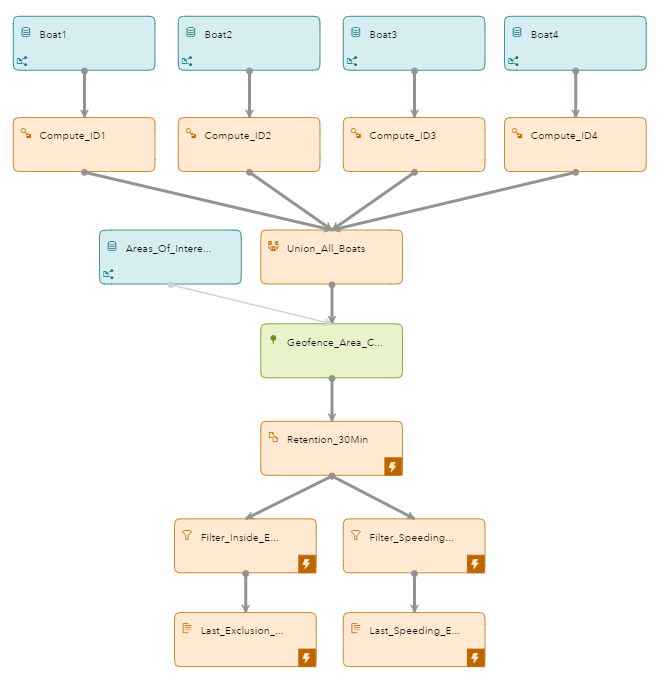
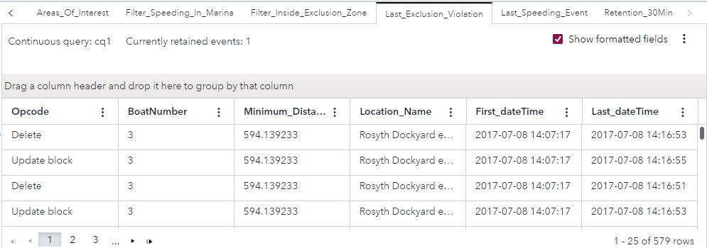
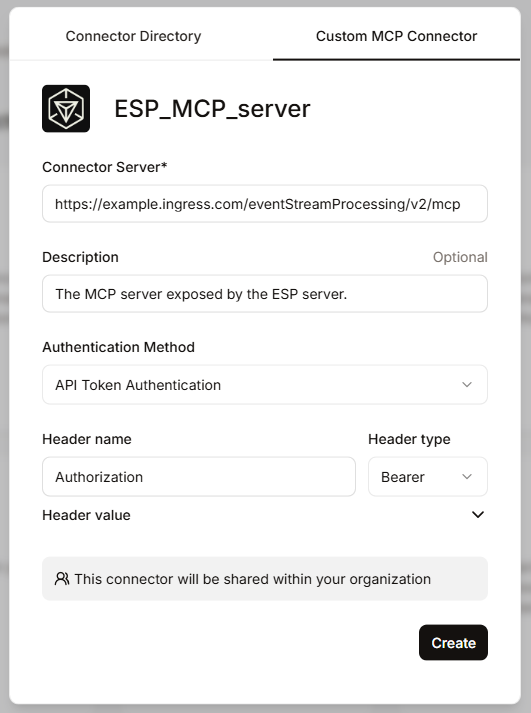
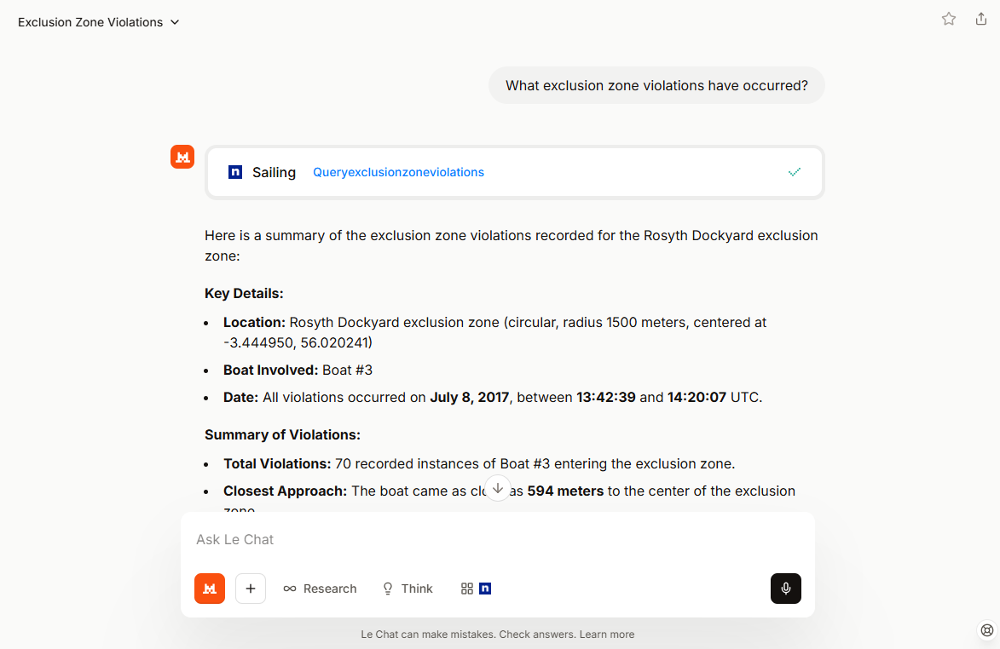
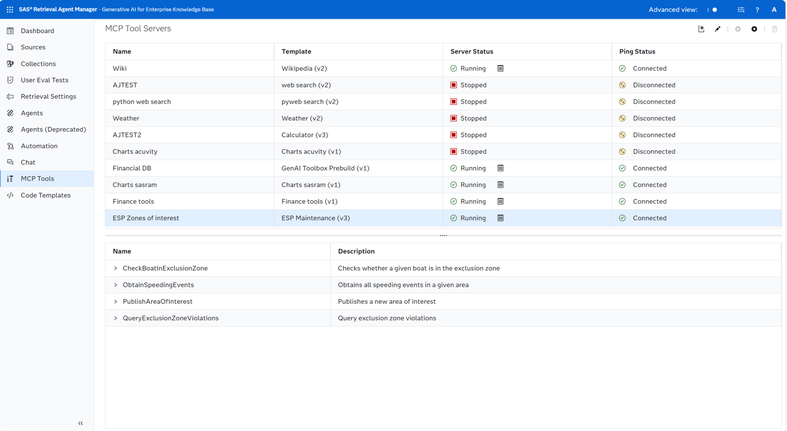
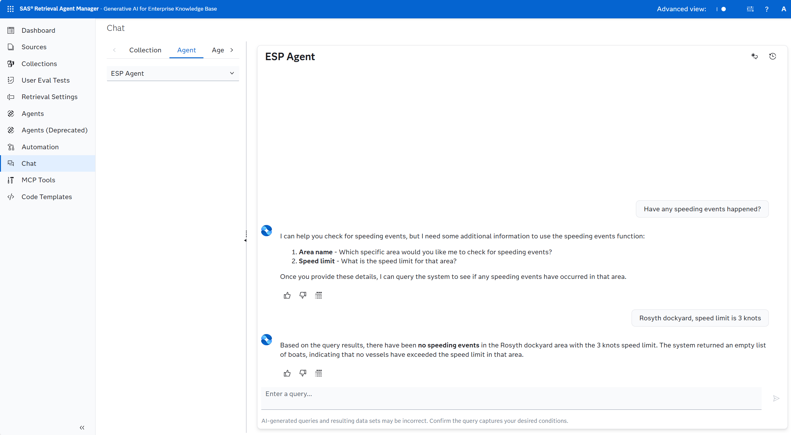
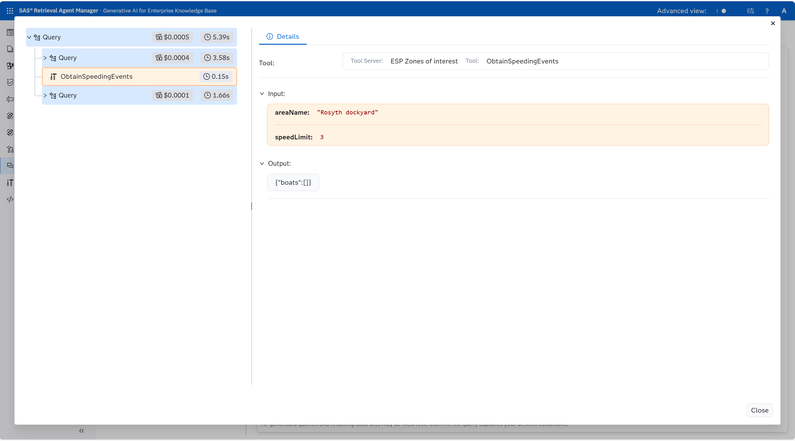

# Processing Data from Sailing Boats
## Overview
This example processes data gathered from sailing boats, and includes configured MCP tools that an LLM can utilise to interact with the project when it runs.

For more information about how to install and use example projects, see [Using the Examples](https://github.com/sassoftware/esp-studio-examples#using-the-examples).

## Use Case

This example identifies two geographical areas of interest. One area is a dockyard exclusion zone that boats are not permitted to enter. The other is a marina where a speed restriction has been applied. In addition, this example includes a variety of pre-configured MCP tools which interact with the project to publish and query data into/from specific windows, process data through an included python snippet, and score data using the Scoring API. These MCP tools can be utilised by an LLM to perform the MCP tool's function.

This example uses CSV files that contain historical data. When a model similar to the one used in this example is deployed in a live environment, real-time data sources might be used instead.

## Source Data

The [geoArea.csv](geoArea.csv) file contains events that relate to the two geographical areas of interest.

The [boat1.csv](boat1.csv), [boat2.csv](boat2.csv), [boat3.csv](boat3.csv), and [boat4.csv](boat4.csv) files contain geographical coordinates of the boats' movements.

## Workflow

The following figure shows the diagram of the project:

- Four Source windows receive event streams from the four boats identified: Boat1, Boat2, Boat3, and Boat4.
- One Source window receives an event stream defining the two areas of interest that the boats are not permitted to enter: Areas_Of_Interest.
- Four Compute windows assign a boat number to each of the four boats identified: Compute_ID1, Compute_ID2, Compute_ID3, and Compute_ID4. This allows SAS Event Stream Processing to differentiate the boats before joining the streams together for processing.
- One Union window unifies the boats’ event streams: Union_All_Boats.
- One Geofence window defines the areas of interest: Geofence_Area_Check.
- One Copy window is used to transition the model from stateless to stateful.
- Two Filter windows identify if any of the boats have entered the exclusion zone and speed restriction zone, and if any of the boats were speeding: Filter_Inside_Exclusion_Zone and Last_Speeding_Event.
- Two Aggregate windows aggregate the last exclusion violation and the last speeding event: Last_Exclusion_Violation and Last_Speeding_Event.

These MCP tools are configured within the project:
- PublishAreaOfInterest
    - Publishes an event into the Areas_Of_Interest window.
- QueryExclusionZoneViolations
    - Queries the data in the Filter_Inside_Exclusion_Zone window.
- ObtainSpeedingEvents
    - Takes two parameters: areaName (the name of an area of interest) speedLimit (a specified speed limit in knots). The provided parameters are passed to the obtainSpeedingEvents function within the MCP_snippets python snippet.
    - The obtainSpeedingEvents function filters retained boat data by the area name and speed limit arguments provided, and returns an array of each boat and the number of speeding violations that the boat incurred within the specified area.
    - Outputs the array returned by the obtainSpeedingEvents function.
- CheckBoatInExclusionZone
    - Takes five parameters: dateTime (timestamp of the boat event), heading, speed, lat (latitude) and long (longitude).
    - The Scoring API is utilised; the provided data is published into the Score_Boat window, and the Filter_Inside_Exclusion_Zone window is used to "score" the data.
    - The processExclusionViolationCheck function is provided with the output of the scoring action, i.e. the event produced by the Filter_Inside_Exclusion_Zone window. The function returns a string indicating if the provided parameters comprise a boat that is within the exclusion zone.
    - Outputs the return of the processExclusionViolationCheck function.

## Test the Project and View the Results

If you do not use the **Install example** button in SAS Event Stream Processing Studio, note that this project includes connector orchestration and as a result, it is recommended that you do not use the **Publish** button in SAS Event Stream Processing Studio's test mode to publish events from CSV files to the Source windows. Instead, edit the file paths in the publisher connectors in the Boat1, Boat2, Boat3, Boat4, and Areas_Of_Interest windows so that they refer to the location in your system where you placed the CSV files. For more information, see [SAS Help Center: Configure a File and Socket Connector](https://go.documentation.sas.com/doc/en/espcdc/default/espstudio/n0esv2n0cbbpgcn1r281krr1iv6q.htm#n0y87cwr7q5vo6n1qlfcey182vt6).

When you test the project, the results for each window appear on separate tabs. The following figure shows the results for the Last_Speeding_Event tab:

The following figure shows the results for the Last_Exclusion_Violation tab. It takes several minutes before events appear in this tab. That is, speeding violations in the marina take place soon after the data stream starts, whereas dockyard exclusion zone violations take place later.

Note: If any table remains empty, check that the publisher connectors for all five Source windows are set correctly to point to the CSV files.

### Invoking MCP tools
When the project is run, the ESP server that is spun up exposes an MCP server, which is available at the **/eventStreamProcessing/v2/mcp** endpoint. This server advertises the MCP tools configured within the project, and an LLM can be configured to connect to this MCP server, discover the project's MCP tools, and invoke them when required.

Major GenAI clients, like ChatGPT, Mistral Le Chat, Claude Desktop, and VS Code, support MCP tools. The process to connect them to the MCP server varies. Note that for web-based GenAI solutions, the ESP project must be run in an environment which is exposed to the internet and protected using a publicly-trusted certificate authority.

The following figures shows the process for connecting Mistral Le Chat to the MCP server, and invoking the QueryExclusionZoneViolations tool:

When a local GenAI client, such as Claude Desktop or VS Code is used, another method is to create a project container. This container can be run locally and the GenAI client connected to the MCP server exposed by the container.

In addition, SAS Retrieval Agent Manager can use MCP tools, including ESP projects with configured MCP functionality. SAS Retrieval Agent Manager allows you to create complex agentic workflows using RAG and MCP tools, including ESP MCP tools.

The following figures show SAS Retrieval Agent Manager discovering the MCP tools advertised by the example project, and invoking the ObtainSpeedingEvents tool:

## Visualizing Objects in Grafana
The sailing boats and areas of interest can be visualized using the [SAS Event Stream Processing Data Source Plug-in for Grafana](https://github.com/sassoftware/grafana-esp-plugin). Import the [grafana.json](grafana.json) dashboard file to Grafana. The `grafana.json` file references the [sailing-areas-of-interest.geojson](sailing-areas-of-interest.geojson) file, which defines the areas of interest.

---
**NOTE:**
This dashboard was created using standalone SAS Event Stream Processing, running in the same namespace as Grafana. If you are using a different environment, such as the SAS Viya platform, you must recreate the queries because the connection URLs will differ.

---

## Additional Resources

- The [Using a Geofence to Find Wanted Vehicles](https://github.com/sassoftware/esp-studio-examples/tree/main/Advanced/geofence) example provides a more detailed discussion of the settings for a Geofence window and for connector orchestration. 
- For more information about the Geofence window, see [SAS Help Center: Using Geofence Windows](https://documentation.sas.com/?cdcId=espcdc&cdcVersion=default&docsetId=espcreatewindows&docsetTarget=p0xru6q01dkxknn1t8gqo2q4zfu6).
- For more information about MCP support in SAS Retrieval Agent Manager, see [SAS Help Center: Working with MCP Tools](https://helpcenter.unx.sas.com/test/doc/en/ragntmgrug/latest/n1l22bifonn2hjn1lquqow5vmxp2.htm).