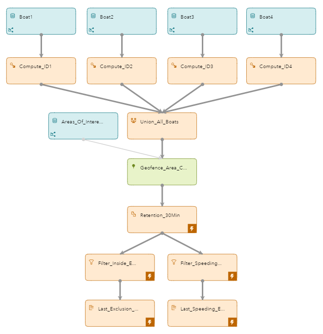
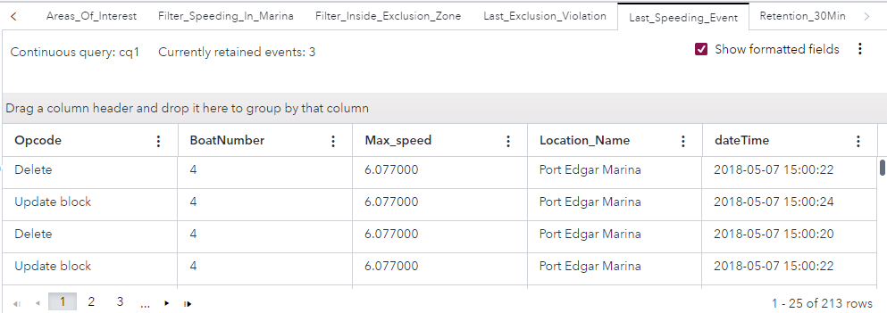
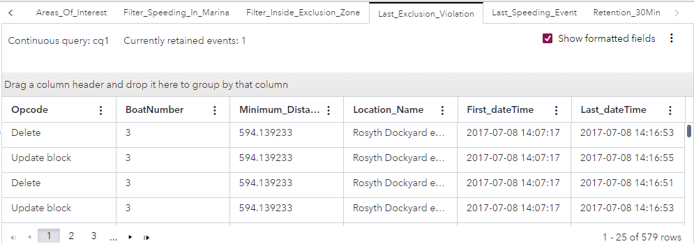
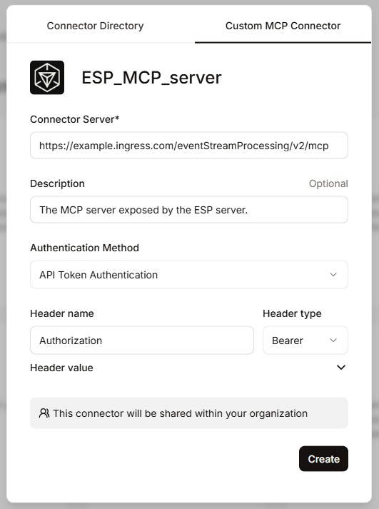
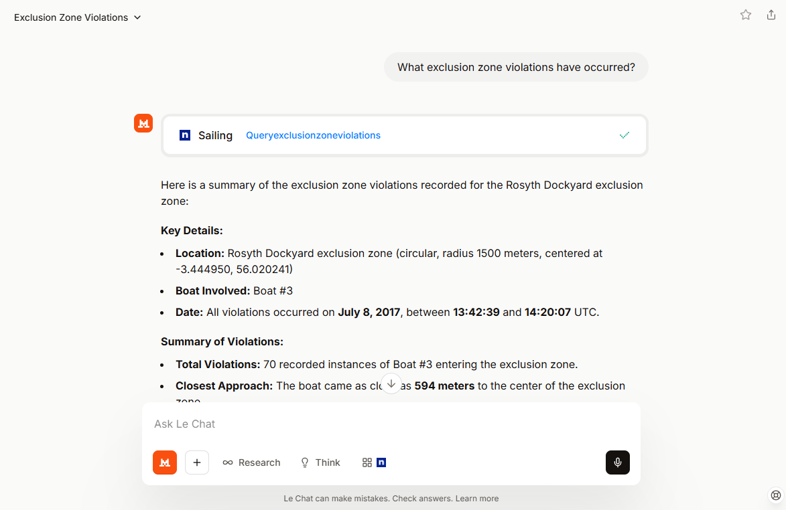
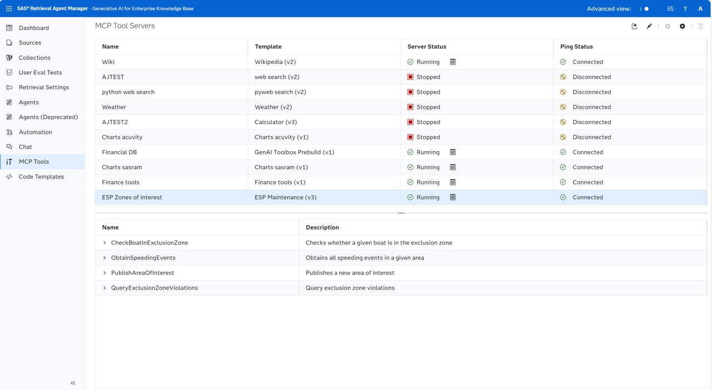
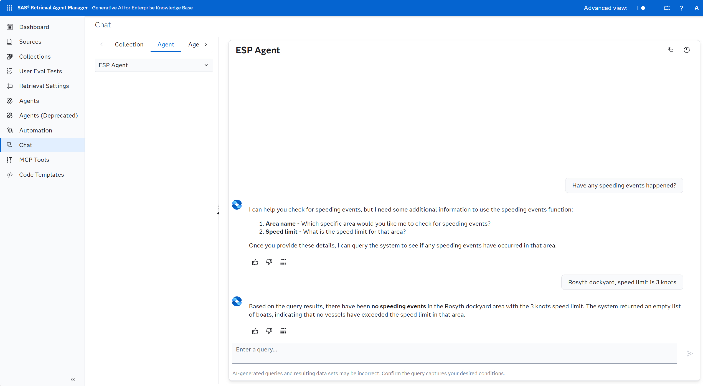
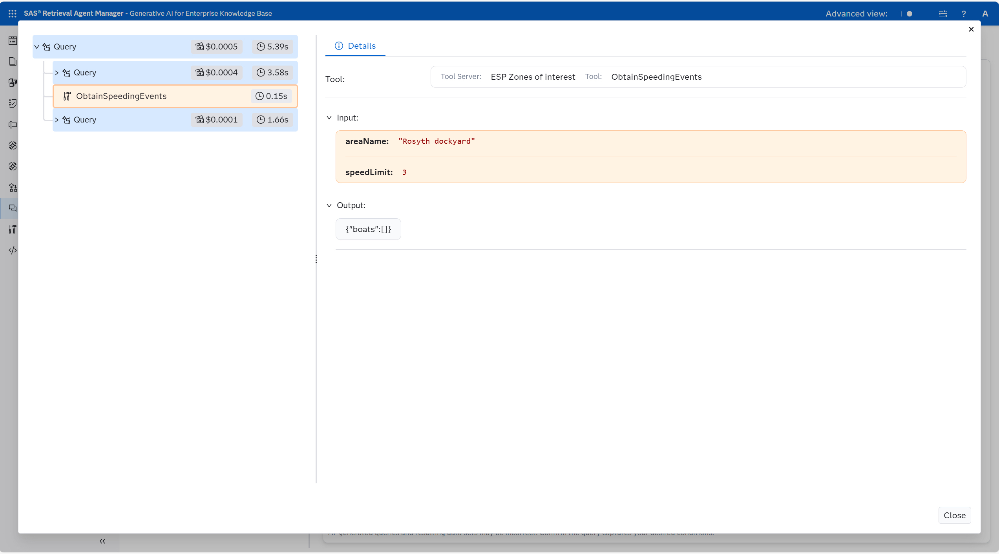
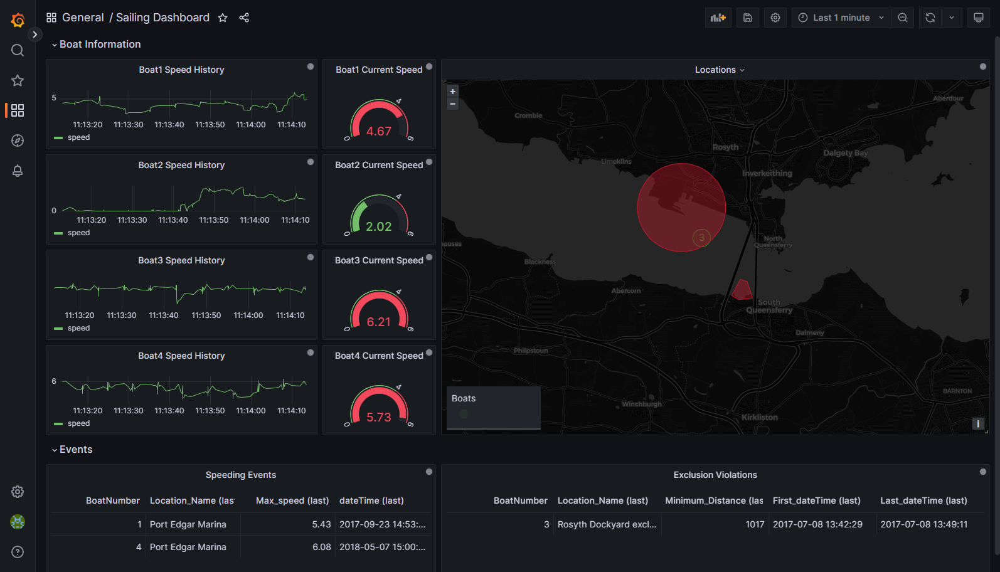

# Using MCP Tools to Process Data from Sailing Boats
## Overview
This example processes data gathered from sailing boats, and includes configured Model Context Protocol (MCP) tools that a Large Language Model (LLM) can use to interact with the project when it runs.

This example is based on the ["Processing Data from Sailing Boats" example](https://github.com/sassoftware/esp-studio-examples/tree/main/EndToEndExamples/sailing).

For more information about how to install and use example projects, see [Using the Examples](https://github.com/sassoftware/esp-studio-examples#using-the-examples).

## Use Case

This example identifies two geographical areas of interest. One area is a dockyard exclusion zone that boats are not permitted to enter. The other area is a marina where a speed restriction is applied.

This example includes several preconfigured MCP tools that interact with the project to publish and query data in specific windows. It also processes data by using an included Python snippet and scores data by using the Scoring API. These MCP tools are used by an LLM to perform the MCP tool's function.

This project uses CSV files that contain historical data. When a similar model is deployed in a live environment, real-time data sources might be used instead.

## Source Data

- The [geoArea.csv](geoArea.csv) file contains events that relate to the two geographical areas of interest.

- The [boat1.csv](boat1.csv), [boat2.csv](boat2.csv), [boat3.csv](boat3.csv), and [boat4.csv](boat4.csv) files contain geographical coordinates of the boats' movements.

## Workflow

The following figure shows the diagram of the project:

- The Boat1, Boat2, Boat3, and Boat 4 windows are Source windows. They receive event streams from the four boats identified.
- The Areas_Of_Interest window is a Source window. It receives an event stream defining the two areas of interest that the boats are not permitted to enter.
- The Compute_ID1, Compute_ID2, Compute_ID3, and Compute_ID4 windows are Source windows. They assign a boat number to each of the four boats. This allows SAS Event Stream Processing to differentiate the boats before joining the streams together for processing.
- The Union_All_Boats window is a Union window. It unifies the boats’ event streams.
- The Geofence_Area_Check window is a Geofence window. It defines the areas of interest, specifically the Rosyth Dockyard and Port Edgar Marina.
- The Retention_30Min window is a Copy window. It is used to transition the model from stateless to stateful.
- The Filter_Inside_Exclusion_Zone and Filter_Speeding_In_Marina windows are Filter windows. They identify whether any of the boats have entered the exclusion zone or speed restriction zone and if any of the boats were speeding.
- The Last_Exclusion_Violation and Last_Speeding_Event windows are Aggregate windows. They aggregate the last exclusion violation and the last speeding event.

The following MCP tools are configured within the project:
- PublishAreaOfInterest: Publishes an event into the Areas_Of_Interest window.
- QueryExclusionZoneViolations: Queries the data in the Filter_Inside_Exclusion_Zone window.
- ObtainSpeedingEvents: Accepts the `areaName` and `speedLimit` parameters and passes them through the obtainSpeedingEvents function within the MCP_snippets python snippet. The obtainSpeedingEvents function filters retained boat data by the area name and speed limit arguments provided to return an array for each boat and the number of speeding violations that the boat incurred within the specified area. It also writes the array returned by the obtainSpeedingEvents function.
- CheckBoatInExclusionZone: Accepts the `dateTime`, `heading`, `speed`, `lat`, and `long` parameters. The Scoring API is used to publish the data provided through the LLM into the Score_Boat window, and the Filter_Inside_Exclusion_Zone window is used to "score" the data. If the Filter_Inside_Exclusion_Zone produces an event as a result of the scoring action, the boat described by the data falls within the exclusion zone, otherwise the boat is outside the exclusion zone.
The processExclusionViolationCheck function accepts the output of the scoring action and returns a string that indicates whether the specified parameters represent a boat within the exclusion zone.

## Test the Project and View the Results

If you do not use the **Install example** button in SAS Event Stream Processing Studio, it is recommended that you do not use the **Publish** button in SAS Event Stream Processing Studio. This is because the project includes connector orchestration. Instead, edit the file paths in the publisher connectors in the Boat1, Boat2, Boat3, Boat4, and Areas_Of_Interest windows so that they refer to the location in your system where you placed the CSV files. For more information, see [SAS Help Center: Configure a File and Socket Connector](https://go.documentation.sas.com/doc/en/espcdc/default/espstudio/n0esv2n0cbbpgcn1r281krr1iv6q.htm#n0y87cwr7q5vo6n1qlfcey182vt6).

When you test the project, the results for each window appear on separate tabs.

The following figure shows the results for the Last_Speeding_Event tab:

The following figure shows the results for the Last_Exclusion_Violation tab. It might take several minutes before events appear in this tab because speeding violations in the marina take place soon after the data stream starts, but dockyard exclusion zone violations take place later:

**NOTE:** If any table remains empty, ensure that the publisher connectors for all five Source windows are set correctly to point to the CSV files.

### Invoking MCP Tools
When the project is run, an MCP server is exposed. It is available at the **/eventStreamProcessing/v2/mcp** endpoint. This server advertises the MCP tools configured within the project. An LLM can be configured to connect to this MCP server, discover the project's MCP tools, and invoke them when required.

Major GenAI clients such as ChatGPT, Mistral Le Chat, Claude Desktop, and VS Code, support MCP tools. The process to connect them to the MCP server varies. Note that for web-based GenAI solutions, the ESP project must be run in an environment that is exposed to the internet and protected using a publicly trusted certificate authority.

The following figures show the process for connecting Mistral Le Chat to the MCP server and invoking the QueryExclusionZoneViolations tool:  

When you use a local GenAI client such as Claude Desktop or VS Code, create a project container instead. Run the container locally and connect the GenAI client to the MCP server that the container exposes.

SAS Retrieval Agent Manager can also use MCP tools, including ESP projects with configured MCP functionality. SAS Retrieval Agent Manager enables you to create complex agentic workflows using Retrieval‑Augmented Generation (RAG) and MCP tools, including ESP MCP tools.

The following figures show SAS Retrieval Agent Manager accessing the MCP tools exposed by the example project and invoking the ObtainSpeedingEvents tool:

## Visualizing Objects in Grafana
The sailing boats and areas of interest can be visualized using [SAS Event Stream Processing Data Source Plug-in for Grafana](https://github.com/sassoftware/grafana-esp-plugin). Import the `grafana.json` dashboard file to Grafana. The `grafana.json` file references the `sailing-areas-of-interest.geojson` file, which defines the areas of interest.

**NOTE:** This dashboard was created using standalone SAS Event Stream Processing running in the same namespace as Grafana. If you are using a different environment, such as the SAS Viya platform, you must re-create the queries because the connection URLs differ.

## Additional Resources

- The [Using a Geofence to Find Wanted Vehicles](https://github.com/sassoftware/esp-studio-examples/tree/main/Advanced/geofence) example provides a more detailed discussion of the settings for a Geofence window and for connector orchestration. 
- For more information about the Geofence window, see [SAS Help Center: Using Geofence Windows](https://documentation.sas.com/?cdcId=espcdc&cdcVersion=default&docsetId=espcreatewindows&docsetTarget=p0xru6q01dkxknn1t8gqo2q4zfu6).
- For more information about MCP support in SAS Retrieval Agent Manager, see [SAS Help Center: Working with MCP Tools](https://go.documentation.sas.com/doc/en/ragntmgrcdc/default/ragntmgrug/n1l22bifonn2hjn1lquqow5vmxp2.htm?fromDefault=).