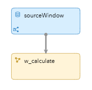
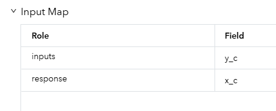
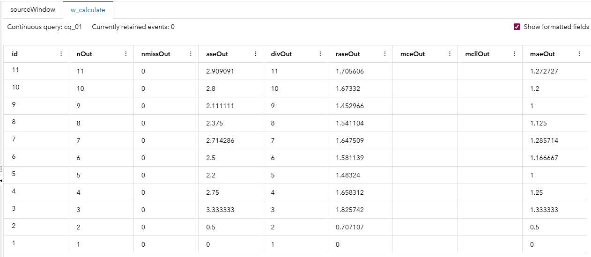

# Computing Fit Statistics

## Overview

The goodness–of–fit (FitStat) capability in SAS Event Stream Processing is not a dedicated window, unlike the Pattern window, the Calculate window, or the Filter window. Instead, FitStat is an algorithm that you can use within the Calculate window. You can use it to compute error metrics on predictions that are flowing through the event stream. Models such as decision trees or neural networks generate predictions when applied to data. These results can then be reviewed to assess their accuracy or usefulness.

## Source

The [input-fitstat.csv](input-fitstat.csv) file contains a list predicted values and ground truth values.

- `inputs="y_c"`: The predicted values from the model (y_hat equivalent).
- `response="x_c"`: The actual observed target values (ground truth).

The FitStat algorithm compares the predictions against the actual values.

## Workflow

The following figure shows the diagram of the project: 

	

- The Source window takes predicted (`y_c`) and actual (`x_c`) values from the event stream.
- The Calculate window receives events from the Source window. It publishes goodness-of-fit statistics according to the FitStat algorithm's properties.

### w_calculate

In the Calculate window used in this model, the FitStat algorithm is defined in the settings as an online algorithm:

	

This window also has input map properties and output map properties. For input variables in regression models, only one input variable is required. This input variable specifies the predicted response. For classification models, the variables must be listed and must contain the predicted probabilities for each class. This project has the following inputs:

	

In this example, the data from the Source window is from a regression model. In addition, the response variable specifies the target variable. The following output map properties are also defined:

| Field    | Description                               |
| -------- | ----------------------------------------- |
| nOut     | Number of observations (N)                |
| nmissOut | Number of missing values                  |
| aseOut   | Average squared error (ASE)               |
| divOut   | Divisor used for ASE                      |
| raseOut  | Root ASE                                  |
| mceOut   | Mean consequential error (classification) |
| mcllOut  | Multiclass log loss (classification)      |
| maeOut   | Mean absolute error                       |
| rmaeOut  | Root mean absolute error                  |
| msleOut  | Mean squared logarithmic error            |
| rmsleOut | Root MSLE                                 |

As the data from the Source window is from a regression model, the variables mceOut and mcllOut appear empty in the resulting output.

## Test the Project and View the Results

When you test the project, the results for each window appear on separate tabs. The **w_calculate** tab shows the results from the FitStat algorithm.

- The **sourceWindow** tab shows the  predicted (`y_c`) and actual (`x_c`) values from the event stream.
- Fit statistics such as nmissOut (number of missing values) and maeOut (mean absolute error) are calculated in real time as data flows through the model.

## Next Steps

You could add downstream windows that pick up the results for use in monitoring, alerts, or dashboards.

## Additional Resources

For more information, see [SAS Help Center: Computing Fit Statistics for Scored Results](https://documentation.sas.com/?cdcId=espcdc&cdcVersion=default&docsetId=espan&docsetTarget=p1wnq007i64zjon0zmxezvkad3m4.htm#p1k5j3rok1x59on15i884xa66ajq).
