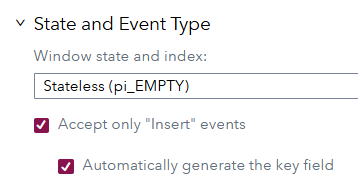
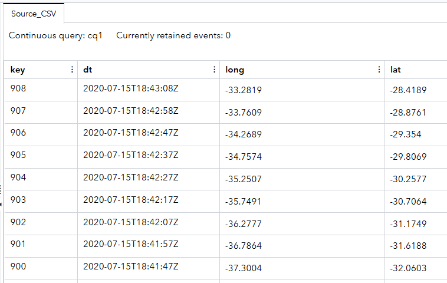
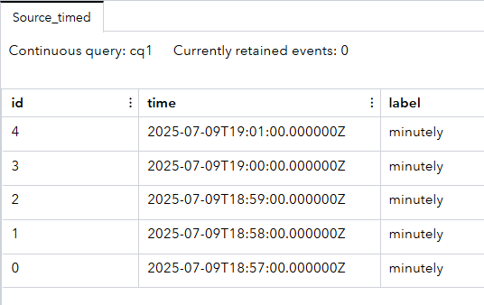
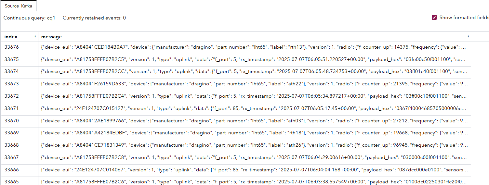
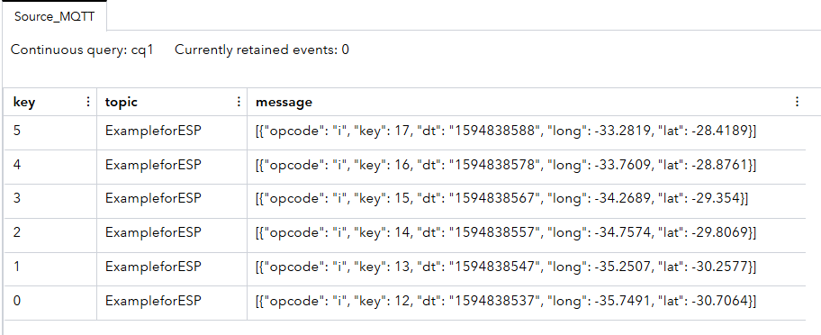
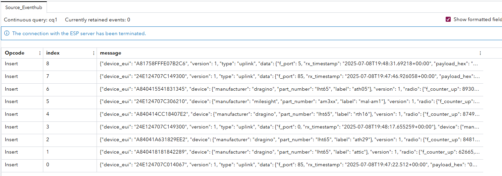
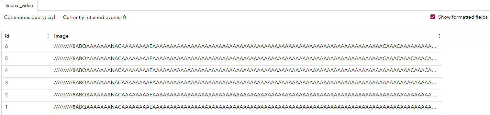

# Exploring Connectors in Source Windows
## Overview

In SAS Event Stream Processing, connectors that run inside ESP servers and adapters that run inside address spaces are vital. They serve as an interface between external data systems and your streaming analytics engine. They enable real-time ingestion of data from a wide variety of sources. These sources might be sensors through MQTT, logs through Kafka, files on disk, or live video streams over real-time streaming protocal or real-time streaming protocol.

Understanding connectors is important for new users of SAS Event Stream Processing. Nearly every real-world application begins with loading data into the system. This example project is designed to help new users visualize and explore how SAS Event Stream Processing handles this through a set of connector configurations. You can load this project into SAS Event Stream Processing Studio or deploy it directly through XML.

For more information about how to install and use example projects, see [Using the Examples](https://github.com/sassoftware/esp-studio-examples#using-the-examples).  

## Workflow

The following figure shows the workflow diagram of the project:

	  

Source windows:
- The Source_MQTT window consumes messages from MQTT. 
- The Source_Eventhub window receives events from Azure Event Hub.
- The Source_Kafka window consumes messages from Kafka.
- The Source_CSV window reads data from a CSV file.
- The Source_video window streams data in from a video file.
- The Source_timed window generates data on a timed interval.  

Counter windows have been added to verify how many events are flowing through the project based on each source window's settings. 

Some connectors are turned off by default in this project and should be turned on as each example is explored. Examples that require configured and active external messaging environments will not execute when activated. These examples are only shown to help with future configurations. 

### Source_CSV

The Source_CSV window shows how to ingest data into SAS Event Steam Processing using the file and socket connector. This is one of the most common and flexible ways to bring in structured data from a flat file. In this example, the input file is a CSV file containing timestamped geographic data points such as longitude and latitude.

Explore the settings for the Source_CSV window by doing the following steps:

1. Open the project in SAS Event Stream Processing Studio and select the Source_CSV window.
2. In the right pane, expand **State and Event Type**. Notice that **Automatically generate the key field** is selected.   
  
**NOTE:** Automatically generated keys simplify data preparation by guaranteeing uniqueness without manual oversight. All key fields must be unique within a SAS Event Stream Processing project. Duplicate key fields can corrupt data and result in unpredictable behavior.

3. Expand **Input Data (Publisher) Connectors**. Notice the different types of connectors:
      - `iss_input`: This connector reads the file from beginning to end once. It is useful for batch-style loading.
      - `iss_input_repeat`: This connector repeats the file input a specified number of times (for example, repeatcount = 100). It is useful for simulations or testing with looped input data.
      - `iss_input_rate`: This connector adds a pacing mechanism to simulate streaming input (for example, rate = 1 record per second). It is useful for defining the rate in which events are injected into the stream.   
      **NOTE:** You can view a connector's configuration by selecting the connector from the table, and then clicking . These connectors are set to inactive by default. You can enable one or more connectors depending on your scenario.
4. Expand **Subscriber Connectors**. Notice that this window includes a different type of connector. The MQTToutput connector is configured as a subscriber connector. Subscriber connectors output data from a project to an external file or system. The MQTToutput connector should only be activated when testing the Source_MQTT example. TCP/IP port 1883 must be open for communication on your system in order to connect to the MQTT broker.
6. Click . Fields include:
      - `key`: A unique identifier for each record
      - `dt`: A date field parsed using a specified format
      - `long`: Longitude
      - `lat`: Latitude

### Use Case

The file and socket connector is used for the following scenarios:

- Loading historical data during development
- Simulating real-time feeds using repeat and rate options
- Testing schemas and downstream logic before deploying with live connectors

### Test the Source_CSV Window and View the Results	
1. Activate the connector(s) that you want to use.
2. Click **Enter Test Mode**.
3. In the left pane, select the Source_CSV and Counter_CSV windows.
4. Click **Run Test**.

The output tab should look similar to the figure below: 

### Source_timed

The Source_timed window shows how to use the timer connector to generate synthetic data at regular intervals. This is useful for testing, monitoring time-based behaviors, or simulating periodic events in a streaming environment without relying on an external data source.

Explore the settings for the Source_timed window by doing the following steps:
1. Open the project in SAS Event Stream Processing Studio and select the Source_timed window.
2. Expand **Input Data (Publisher) Connectors**. Notice the connector named timer_connector. 
3. Select timer_connector from the table, and then click . In the **Connector Configuration** window, notice the following properties:
   - `Connector type`: The type is **Timer Connector**, which indicates that the connector is time-based.
   - `Basetime`: This property is set to **2020-06-08 00:56:00**, which is the starting point for the simulated time field. This is helpful for repeatable tests.
   - `Interval`: The interval is set to **60**, which means that events are generated every 60 seconds.
   - `Unit`: The unit is **second**, which works conjointly with the set interval to specify its units.
4. Click **All properties...**
   - `label`: This is set to **minutely**. This is a fixed string value for the label field in each record.  
6. Click **OK** to exit the **Connector Configuration** window.
7. Click . Fields include:
    - `id`: A unique identifier for each generated record
    - `time`: A timestamp value associated with the generated event
    - `label`: A string label that describes of categorizes the event   

### Use Case

The Source_timed window is used for the following scenarios:

- Testing logic in pattern windows, aggregations, and joins that depend on event timing
- Monitoring latency or throughput using predictable input rates
- Simulating heartbeat events for pipeline activity verification
- Driving scheduled processing in demonstrations or training sessions when no live data is available

### Test the Source_timed Window and View the Results

1. Make sure timer_connector is activated.
2. Click **Enter Test Mode**.
3. In the left pane, select the Source_timed and Counter_timed windows.
4. Click **Run Test**.
   

The output tab should look similar to the figure below:

	

### Source_Kafka

The Source_Kafka window shows how to configure a Source window to receive streaming messages from an external Apache Kafka system. Kafka is a widely used messaging platform designed for high-throughput, fault-tolerant, real-time data streams. This connector is useful for integrating SAS Event Stream Processing with enterprise-grade streaming pipelines where Kafka acts as the central event broker.

Explore the settings for the Source_Kafka window by doing the following steps:

1. Open the project in SAS Event Stream Processing Studio and select the Source_Kafka window.
2. Expand **Input Data (Publisher) Connectors**. Notice there are two connectors that are both inactive by default:
   - `kafkainCurrent`: This connector reads new messages available to the consumer group named lastread. 
   - `kafkainAll`: This connector starts reading all partitions from the beginning of the Kafka topic.  
   **NOTE:** Both of these connectors specify the Kafka host as `saslorahub.servicebus.windows.net:9093` and the topic as `lorahub`. These details are specific to Azure Event Hubs that are used in Kafka compatibility mode.    
3. Click . Fields include:
      - `index`: A unique identifier or offset for each Kafka message.
      - `message`: The content of the Kafka message which is treated as an opaque string. The message is usually formatted in JSON.

### Use Case

The Kafka source connectors are used for the following scenarios:

- Ingesting large-scale event data from operational systems
- Streaming logs, sensor readings, financial transactions, or telemetry data
- Integrating with enterprise pipelines already built on Kafka or Azure Event Hubs
- Supporting real-time analytics on live data as it flows through the Kafka stream

### Test the Source_Kafka Window and View the Results  

This source window is defined in the project, but it will not function until an external Kafka system is configured and running. Ensure that the following criteria are met before attempting to test the Source_Kafka window:
- The Kafka broker must be reachable from the ESP server.
- The authentication settings must match the settings expected by the Kafka system.
- The topic and partition configuration must align with the available Kafka setup.

To run the Source_Kafka window, do the following:
1. Make sure the Kafka Connector is activated.
2. Click **Enter Test Mode**.
3. In the left pane, select the Source_Kafka and Counter_Kafka windows.
4. Click **Run Test**.	

The output tab should look similar to the figure below:

	

### Source_MQTT

The Source_MQTT window demonstrates how to configure SAS Event Stream Processing (ESP) to receive messages over the MQTT protocol. MQTT is a lightweight publish/subscribe messaging protocol commonly used in IoT applications due to its low overhead and ease of use. This source window is useful for streaming data into ESP from MQTT-compatible devices, brokers, or simulated publishers. TCP/IP port 1883 must be open for communication on your system in order to connect to the MQTT broker.

Explore the settings for the Source_MQTT window by doing the following steps:

1. Open the project in SAS Event Stream Processing Studio and select the Source_MQTT window.
2. Expand **Input Data (Publisher) Connectors**. Notice the connector named MQTTinput.
3. Select MQTTinput from the table, and then click . In the **Connector Configuration** window, notice the following properties:
   - `Connector type`: The type is **MQTT Connector**.
   - `Mqtthost`: This is set to **test.mosquitto.org**, which specifies the public MQTT broker that is being used.
   - `Mqtttopic`: This is set to **ExampleforESP**, which is the topic that the connector subscribes to.
   - `Mqttqos`: This is set to **0**, which means the Service level is set to fire and forget.
   - `Mqttmsgtype`: This is set to **opaquestring**, which makes the connector treat incoming messages as a raw string.  
4. Click . Fields include:
      - `key`: A unique identifier for each incoming message.
      - `topic`: The name of the MQTT topic on which the message was received.
      - `message`: The payload of the message that is treated as an opaque string.

### Use Case

MQTT source connectors are used for the following scenarios:  
- Ingesting IoT sensor data from edge devices
- Receiving telemetry from low-power, intermittently connected clients
- Demonstrating event flow in low-bandwidth scenarios
- Learning or testing publish/subscribe patterns using public or local brokers

### Test the Source_MQTT Window and View the Results

This source window alone will not display any data unless a publisher is actively sending messages to the ExampleforESP topic on the public broker at `test.mosquitto.org`. This project includes a built-in MQTT subscriber connector attached to the CSV source window, which acts as a publisher.

To see data flow through the MQTT topic and into this window, do the following:
1. Select the Source_CSV window.
2. Expand **Input Data (Publisher) Connectors**.
3. Activate the iss_input_repeat connector by selecting the check box under the **Active** column. This connector enables you to observe individual messages that flow through the system. The pacing of the connector is helpful for debugging, demonstrations, and learning.
4. Expand **Subscriber Connectors**.
5. Select the check box under the **Active** column.

To run the Source_MQTT window, do the following:
1. Make sure the MQTTinput connector is activated.
2. Click **Enter Test Mode**.
3. In the left pane, select the Source_MQTT and Counter_MQTT windows.
4. Click **Run Test**.	

The output tab should look similar to the figure below: 

### Source_Eventhub

The Source_Eventhub window shows how to receive streaming data from Azure Event Hubs. Azure Event Hubs is a highly scalable, cloud-based data streaming platform. Azure Event Hubs is designed for ingesting millions of events per second from connected devices, services, or applications. Its design makes it an excellent source for real-time analytics pipelines in SAS Event Stream Processing. This window is useful when integrating SAS Event Stream Processing with cloud-hosted event sources, such as IoT telemetry, application logs, or metrics produced by Azure-native services.

Explore the settings for the Source_Eventhub window by doing the following steps:

1. Open the project in SAS Event Stream Processing Studio and select the Source_Eventhub window.
2. Expand **Input Data (Publisher) Connectors**. Notice the connector named EventhubInput.
3. Select EventhubInput from the table, and then click . In the **Connector Configuration** window, notice the following properties:
   - `Connector type`: The type is **Microsoft Azure Event Hubs Connector**.
   - `Eventhubsconnectionstring`: Contains the full connection string needed to authenticate and connect to the Azure Event Hub instance.
   - `Eventhubspath`: This is set to **lorahub**, which specifies the Azure Event Hub namespace or entity path to consume messages from.
   - `Eventhubsconsumergroup`: This is set to **esp** and designates the consumer group to track offset and session state.
   - `Eventhubspartition`: = This is set to **0**, which specifies the partition to read from.
   - `Eventhubsformat`: = This is set to **opaque** so that the connector treats incoming data as unparsed strings.
4. Click **All properties...**
   - `Eventhubsincludeindex`: This is set to **true**, which ensures that the message index is included in the stream.
    **NOTE:** These settings are designed to work with an Azure Event Hub that has been pre-configured to stream data into the `lorahub` namespace, which uses shared access credentials provided in the connection string.  
5. Click **OK** to exit the **Connector Configuration** window.
6. Click . Fields include:
      - `index`: A numeric identifier that corresponds to the event's position in the Event Hub stream 
      - `message`: The raw message content from the event that is treated as a plain string

### Use Case

Event Hub connectors are used for the following scenarios:

- Connecting to high-volume telemetry or log data pipelines hosted in Azure.
- Integrating ESP with cloud-first applications or IoT deployments using Azure IoT Hub (which can route data into Event Hubs).
- Performing real-time monitoring and alerting on event data from applications, services, or devices.

### Test the Source_Eventhub Window and View the Results

The Source_Eventhb window will not function unless a valid, externally configured Azure Event Hub is available and properly set up. Ensure that the following criteria are met before attempting to test the Source_Eventhub window:

- The connection string must point to a real Event Hub instance in Azure.
- The Event Hub must be actively receiving and holding event data for SAS Event Stream Processing to consume.
- The ESP server must have internet access and proper networking permissions to reach the Azure endpoint.
- The connector is set to inactive by default to avoid connection errors during deployment in environments without access to Azure.

To run the Source_Eventhub window, do the following:
1. Make sure the Eventhubinput connector is activated.
2. Click **Enter Test Mode**.
3. In the left pane, select the Source_Eventhub and Counter_Eventhub windows.
4. Click **Run Test**.	

The output tab should look similar to the figure below: 
	

### Source_video

The Source_video window is designed to demonstrate how to ingest video frames into an ESP project using the videocap connector. This window is typically used for computer vision and image processing tasks where video data must be analyzed in real time or near real time. While the connector supports both camera and file-based input, this example uses a local video file for simplicity and repeatability.

Explore the settings for the Source_Eventhub window by doing the following steps:
1. Open the project in SAS Event Stream Processing Studio and select the Source_video window.
2. Expand **Input Data (Pubisher) Connectors**.
3. Select video_publisher from the table, and then click . In the **Connector Configuration** window, notice the following properties:
      - `Connector type`: The type is **Video Capture Connector**.
      - `Filename`: This is set to **@ESP_PROJECT_HOME@/test_files/intersection.mp4**, which is the path to the input video file.
      - `Publishformat`: This is set to **wide**, which formats each frame as a single record with the entire image in the blob field.
4. Click **All properties...**
      - `inputrate`: This is set to **10** and specifies the desired frame rate in units of frames per second.
      - `repeatcount`: This is set to **999**, which makes the video file repeat multiple times to simulate a continuous feed.
      - `resize_x` and `resize_y`: Resizes each frame to a resolution of `resize_x` by `resize_y` pixels before it is published.
      - `blocksize`: This is set to **1**, which means that one frame is published per batch.
5. Click **OK** to exit the **Connector Configuration** window. 
6. Click . Fields include:
      - `id`: A unique identifier for each frame
      - `image`: A large, binary object containing the raw video frame data

### Use Case

Video capture connectors are used for the following scenarios:

- Real-time video analytics such as object detection, motion tracking, or license plate recognition.
- Streaming camera feeds from RTSP-compatible devices like IP cameras.
- Simulating video input using repeatable file-based sources for development and testing.
- Demonstrating computer vision models and their deployment in an event stream processing pipeline.

### Test the Source_video Window and View the Results

The video connector is declared but set to inactive by default. This allows users to enable it manually when they are ready to run the window. The connector expects that the specified video file exists at the given path and is accessible to the ESP server.

To run the Source_video window, do the following:
1. Make sure the video_publisher connector is activated.
2. Click **Enter Test Mode**.
3. In the left pane, select the Source_MQTT and Counter_MQTT windows.
4. Click **Run Test**.	

The output tab should look similar to the figure below: 
	

### Video Credits and Copyright

| File Name          | Copyright                                      | Notes                                        |
| ------------------ | ---------------------------------------------- | -------------------------------------------- |
| `intersection.mp4` | © 2024 SAS Institute Inc. All Rights Reserved. | To be used only in the context of this demo. |

### Video and Image Restrictions

The videos and images provided in this example are to be used only with the project provided. Using or altering these videos and images beyond the example for any other purpose is prohibited.

## Additional Resources
For more information, see [SAS Help Center: Using Remove State Windows](https://documentation.sas.com/?cdcId=espcdc&cdcVersion=default&docsetId=espcreatewindows&docsetTarget=p0usk3uf3bcnebn1m99g1jbvvhxu).
