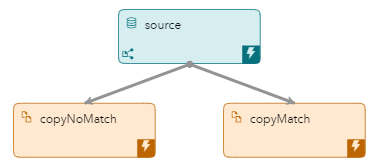
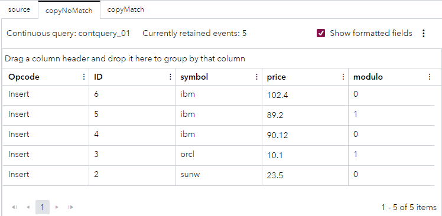

# Using a Splitter
## Overview

You can use expressions to define window-output splitter-slot calculations. For example, you can use an expression to evaluate where to send a generated event. In this project, a splitter evaluates stock market events. The splitter works with user-defined functions to calculate the slot number, to decide which window each event goes to.

For more information about how to install and use example projects, see [Using the Examples](https://github.com/sassoftware/esp-studio-examples#using-the-examples).

## Source Data

The [input-splitter.csv](input-splitter.csv) file contains information about stock trades.

## Workflow
The following figure shows the diagram of the project:

- The source window is a Source window. This is where the stock trades from the `input-splitter.csv` file enter the model and where the splitter is defined. 
- The copyNoMatch window is a Copy window. This window retains events that do not match the splitter expression.
- The copyMatch window is a Copy window. This window retains events that match the splitter expression.

### source

Explore the settings for the Source window:
1. Open the project in SAS Event Stream Processing Studio and select the source window. 
3. Expand **Input Data (Publisher) Connectors**. Observe that there is a publisher connector, connected to `input-splitter.csv`.
4. Expand **Advanced**. Observe the following settings:
   - An Expression Engine Language (EEL) expression is used to split the output: `udf1() and (match_string(udf2(), "IBM")) and (udf3() > 100.0)`. 
   - The user-defined functions in the splitter expression are defined as follows:
     -  `udf1` is defined as `return ID%2`. This function uses the modulo operator to determines whether an event's ID is an odd number or an even number. If the result of `ID%2` is 0, it means that the ID is an even number. If the result of `ID%2` is 1, it means that the ID is an odd number.
     -  `udf2` is defined as `return upper(symbol)`. This function returns the company's stock market symbol.
     -  `udf3` is defined as `return price`. This function returns the share price.
  
   That is, an event matches the expression if the ID number is odd, the event concerns IBM stock, and the price exceeds 100. For more information about EEL, see [SAS Help Center: Overview of the Expression Engine Language](https://go.documentation.sas.com/doc/en/espcdc/default/engelref/n1w06w1wjvul9en1xuyuuh5bn3u7.htm).
5. To examine the window's output schema, on the right toolbar, click . Observe the following fields: 
   - `ID`: This field is the stock trade's ID, which is also selected as the key field.
   - `symbol`: This field is the stock symbol.
   - `price`: This field is the stock price.
   - `modulo`: This field stores the result of the modulo calculation.

### copyNoMatch and copyMatch

Explore the settings for the edges that connect the source window to the copyNoMatch and copyMatch windows.
1. Select the edge that connects the source window to the copyNoMatch window. In the right pane, observe that the slot has the value 0 (even). 
2. Select the edge that connects the source window to the copyMatch window. In the right pane, observe that the slot has the value 1 (odd).

## Test the Project and View the Results

When you test the project in SAS Event Stream Processing Studio, the results for each window appear in separate tabs. The following figure shows the results for the **copyNoMatch** tab:

Note the following details:
- The event whose ID is 6 is not a match because the ID is even
- The event whose ID is 5 is not a match because the price is lower than 100
- The event whose ID is 4 is not a match because the ID is even and the price is lower than 100
- The event whose ID is 3 is not a match because the stock symbol is not IBM and the price is lower than 100
- The event whose ID is 2 is not a match because the ID is even, the stock symbol is not IBM, and the price is lower than 100

The following figure shows the results for the **copyMatch** tab:

Both events match all three conditions: the ID is odd, the stock symbol is IBM, and the price exceeds 100.

## Additional Resources
For more information, see [SAS Help Center: Overview of the Expression Engine Language](https://go.documentation.sas.com/doc/en/espcdc/default/engelref/n1w06w1wjvul9en1xuyuuh5bn3u7.htm).
