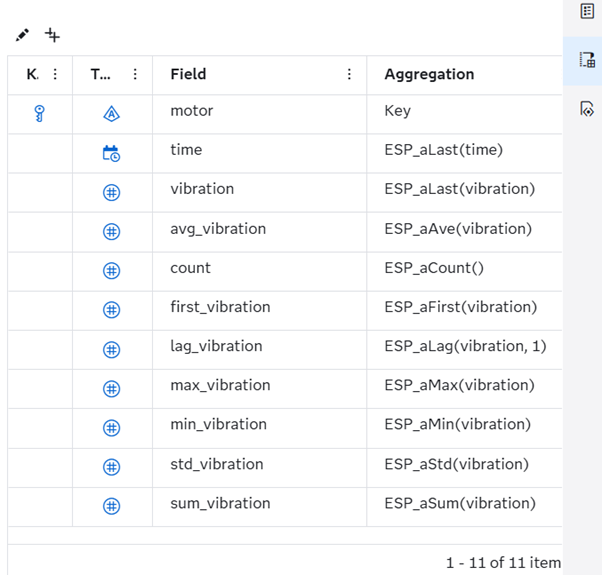
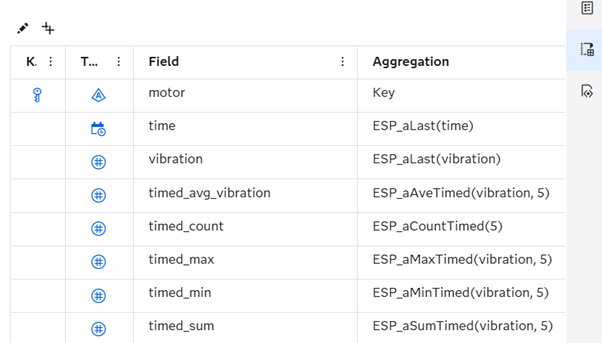
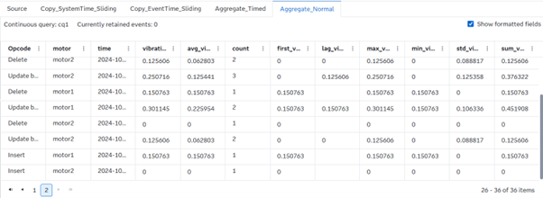

# Introduction to Aggregate Window and Aggregate Functions
## Overview

This SAS Event Stream Processing (ESP) project demonstrates how to use the Aggregate window and the different types of aggregation functions it supports. Aggregate windows allow you to add simple statistics such as sum, mean, and standard deviation to streaming data. Since these calculations are provided out of the box and implemented on streaming data, they are fast and match the rate of the incoming data. 

Aggregate windows are always Stateful, which means they need to retain the events. Aggregate windows can be paired with Copy windows that have retention to manage the size of the state.

For more information about how to install and use example projects, see [Using the Examples](https://github.com/sassoftware/esp-studio-examples#using-the-examples).

## Use Case

Aggregate windows are useful for the following scenarios:
- Adding basic statistics to streaming data. These statistics are used in the model as filtering criteria. They are also used for further calculations.
- Capturing the first occurrence in a group, which is known as an Insert event.

## Source Data

The `input.csv` file contains dummy motor vibration data where the fields `motor` and `time` (in microseconds) together identify a unique event. The motors are emitting events at a rate of one event per second.

## Workflow
This example shows the different aggregation functions that you can use with the Aggregate window. The following figure shows the workflow diagram of the project:

	

There are two Aggregate windows that are connected to two Copy windows.
- Aggregate_Normal is an Aggregate window that has various normal aggregate functions.
- Aggregate_Timed is in Aggregate window that has various time-based aggregate functions. 
- Copy_SystemTime_Sliding is a Copy window that has a retention type of **By time, sliding** with a time limit of five seconds.
- Copy_EventTime_Sliding is a Copy window that has a retention type of **By time, sliding** with a time limit of ten seconds.
- Source is a Source window that reads the input.csv file using a Python connector and publishes the events at a rate of one event per second.

### Aggregate_Normal

Explore the settings for the Aggregate_Normal window:
1. Open the project in SAS Event Stream Processing Studio. 
2. Select the Aggregate_Normal window.
3. Click . The following figure shows the fields and their corresponding aggregate functions:

In this window, the `motor` field acts as the key. This means that the aggregation will happen for unique values of `motor`. When events arrive in the Aggregate window, they are placed into aggregate groups based on the value `motor`.

The descriptions of the aggregate functions are listed below:
- **ESP_aLast(time)**: Copies the `time` of the latest event in the aggregate group.
- **ESP_aLast(vibration)**: Copies the `vibration` of the latest event in the aggregate group.
- **ESP_aAve(vibration)**: Calculates the average of the `vibration` field of all events in the aggregate group.
- **ESP_aCount()**: Returns the count of all events in the aggregate group.
- **ESP_aFirst(vibration)**: Returns the `vibration` for the first event added to the aggregate group.
- **ESP_aLag(vibration, 1)**: Returns the `vibration` for the previous event that got added to the aggregate group.
- **ESP_aMax(vibration)**: Returns the maximum value of the `vibration` field among the events in the aggregate group.
- **ESP_aMin(vibration)**: Returns the minimum value of `vibration` field among the events in the aggregate group.
- **ESP_aStd(vibration)**: Calculates the standard deviation of the `vibration` field for all events in the aggregate group.
- **ESP_aSum(vibration)**: Calculates the sum of the `vibration` field for all events in the aggregate group.

### Aggregate_Timed

Explore the settings for the Aggregate_Timed window:
1. Open the project in SAS Event Stream Processing Studio. 
2. Select the Aggregate_Timed window.
3. Click . The following figure shows the fields and their corresponding aggregate functions:

The descriptions of the aggregate functions are listed below:
- **ESP_aAveTimed(vibration, 5)**: Calculates the average of the `vibration` field for all events in the aggregate group. The average calculation is cleared when a new event arrives after five seconds.
- **ESP_aCountTimed(5)**: Returns the count of all events in the aggregate group. The count is cleared whenever a new event arrives after five seconds.
- **ESP_aMaxTimed(vibration, 5)**: Returns the maximum value of the `vibration` field among the events in the aggregate group. The maximum is cleared whenever a new event arrives after five seconds.
- **ESP_aMinTimed(vibration, 5)**: Returns the minimum value of the `vibration` field among the events in the aggregate group. The minimum is cleared whenever a new event arrives after five seconds.
- **ESP_aSumTimed(vibration, 5)**: Calculates the sum of the `vibration` field for all events in the aggregate group. The sum is cleared whenever a new event arrives after five seconds.

## Test the Project and View the Results

When you test the project, the results for each window appear on separate tabs:
- **Source**: Lists raw events published into the project
- **Copy_SystemTime_Sliding**: Lists Insert and Delete events generated because of system time-based sliding retention
- **Copy_EventTime_Sliding**: Lists Insert and Delete events generated because of event time-based sliding retention
- **Aggregate_Normal**: Lists Insert, Delete, and Update events generated because of the aggregate group being updated with each incoming event
- **Aggregate_Times**: Lists Insert, Delete, and Update events generated because of the aggregate group being updated with each incoming event along with calculated values clearing out due to timed function

The following figure shows the results of the Aggregate_Normal window:

Notice that the first events for `motor1` and `motor2` are Insert events. These events trigger the creation of aggregate groups that are based on `motor`. For each subsequent event in a group, a Delete event is generated to delete the last aggregated event in that group. Then, an Update block event is generated with a new aggregated event.

The following figure shows the results of the Aggregate_Timed window:

This window displays timed calculations. These values are cleared without having to introduce event retention based on the time interval provided as the function argument. When a new event arrives, the previous calculated value is cleared. Notice the highlighted events. The Delete event is for the previous state of the group. The aggregate values for the Update Block event have been reset based on the time. As a result, the values for `vibration`, `timed_average`, `timed_max`, `timed_min`, and `timed_sum` are all the same for the Update block event. 

## Additional Resources
For more information, see [SAS Help Center: Using Aggregate Windows](https://documentation.sas.com/?cdcId=espcdc&cdcVersion=default&docsetId=espcreatewindows&docsetTarget=p1i6d35raag9lbn1512750fhhd1x).
