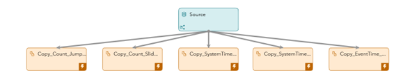
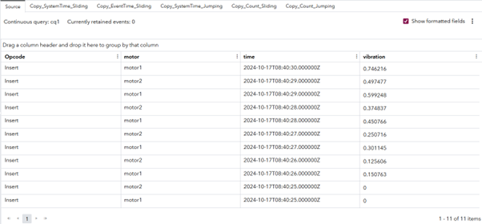
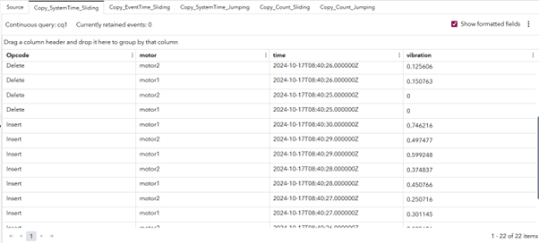
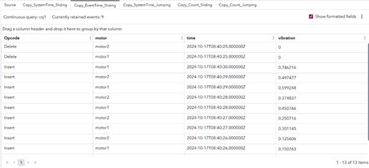
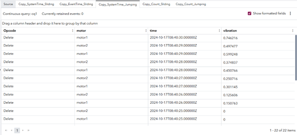
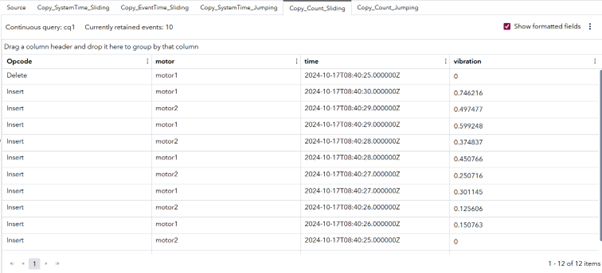
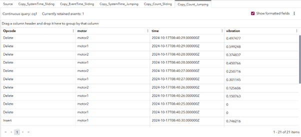

# Introduction to the Copy Window and Types of Retention

## Overview
This example demonstrates how to use the Copy window and the retention types that it supports. The Copy window replicates the schema and output of its connected parent window without modifying event data. Its primary purpose is to introduce retention policies that control how long events are stored in memory. These policies enable you to add state to an otherwise stateless portion of the model, which supports operations such as time-based aggregation. Retention settings also help control the size of the maintained state, which is essential for managing performance and resource usage in streaming applications.

Understanding the Copy window requires an understanding of state in SAS Event Stream Processing. By default, streaming data is ephemeral: each event passes through the system and is discarded unless it is explicitly retained. The Copy window introduces state into the data flow by maintaining a memory of past events. This capability is required for operations that depend on historical context, such as time-based aggregation. Retention settings control how much historical data is preserved, which helps balance memory usage and performance.

For more information about how to install and use example projects, see [Using the Examples](https://github.com/sassoftware/esp-studio-examples#using-the-examples).

## Use Case 
- The Copy window is commonly used with the Aggregate window. When a model is stateless until an Aggregate window is introduced, a Copy window is required because the Aggregate window is inherently stateful. The Copy window provides a controlled way to introduce and manage state for the Aggregate window and downstream model components.
- This example uses multiple parallel Copy windows to apply different time-based retention policies in support of distinct use cases. For example, separate Copy windows can be used to maintain event state for computing averages over 5-second and 10-second time intervals.

## Source Data
The `input.csv` file contains dummy motor vibration data where the fields `motor` and `time` (in microseconds) together identify a unique event. The motors are emitting events at a rate of 1 event per second. 

## Workflow
The example shows the different retention options that you can use with the Copy window. The following figure shows the diagram of the project:

	

- The Source window is the entry point of the data. It reads the events at a rate of 1 event per second.
- The Copy_Count_Jumping window uses jumping retention based on the number of events stored in memory.
- The Copy_Count_Sliding window uses sliding retention based on the number of events stored in memory.
- The Copy_SystemTime_Jumping window uses jumping retention based on the system time.
- The Copy_SystemTime_Sliding window uses sliding retention based on the system time.
- The Copy_EventTime_Sliding window uses sliding retention based on the timestamp field in the event.

### Copy_Count_Jumping

Explore the settings for the Copy_Count_Jumping window:
1. Select the Copy_Count_Jumping window.
2. Expand **State**. Notice that the index is set to **pi_HASH**, which means that the window is stateful. 
3. Expand **Retention**. The retention is set to **By row count, jumping** with a row limit of 10. This means that the window keeps track of 10 events at maximum, and as soon as the 11th event comes, a Delete event is generated for the 10 events before it.

This behavior is useful when you want to reset the whole state of the model based on the number of events being published.

### Copy_Count_Sliding

Explore the settings for the Copy_Count_Sliding window:
1. Select the Copy_Count_Sliding window.
2. Expand **State**. Notice that the index is set to **pi_HASH**, which means that the window is stateful.
3. Expand **Retention**. The retention is set as **By row count, sliding** with a row limit of 10. This means that the window keeps track of 10 events at maximum, and as soon as the 11th event comes, a Delete event is generated for the first event. When the 12th event comes, a Delete event is generated for the second event and so on.

This behavior is useful when you want to maintain a fixed state of the model based on the number of events being published.

### Copy_SystemTime_Jumping

Explore the settings for the Copy_SystemTime_Jumping window:
1. Select the Copy_SystemTime_Jumping window.
2. Expand **State**. Notice that the index is set to **pi_HASH**, which means that the window is stateful.
3. Expand **Retention**. The retention is set to **By time, jumping** with a time limit of 5 seconds, and the time field is set to **(use system clock)**, which tells SAS Event Stream Processing which clock to follow. There is an internal timer that starts with the project. When the timer completes the specified time limit, in this case 5 seconds, the Copy window generates Delete events for all the events in its state. The timer is internal to SAS Event Stream Processing and is independent of the events being pushed. 

This behavior is useful when you want to clear the whole state at fixed intervals regardless of the events that came in.

### Copy_SystemTime_Sliding

Explore the settings for the Copy_SystemTime_Sliding window:
1. Select the Copy_SystemTime_Sliding window.
2. Expand **State**. Notice that the index is set to **pi_HASH**, which means that the window is stateful.
3. Expand **Retention**. The retention is set to **By time, sliding** with a time limit of 5 seconds, and the time field is set to **(use system clock)**, which tells SAS Event Stream Processing which clock to follow. An internal timer starts when the project runs. At each 1‑second heartbeat, the Copy window generates Delete events for all retained events that are older than the specified time limit, which in this example is 5 seconds. This check occurs continuously and is independent of event arrival. The timer is internal to SAS Event Stream Processing and does not rely on incoming events.

This behavior is useful when you want to consistently manage the state of the window through time. The internal timer does not depend on the incoming events and keeps running even when there are no events or an influx of events.

### Copy_EventTime_Sliding

Explore the settings for the Copy_EventTime_Sliding window:
1. Select the Copy_EventTime_Sliding window.
2. Expand **State**. Notice that the index is set to **pi_HASH**, which means that the window is stateful.
3. Expand **Retention**. The retention is set to **By time, sliding** with a time limit of 5 seconds, and the time field is set to **time**, which tells SAS Event Stream Processing to use the `time` schema field to determine the time. The **Time field** drop-down list shows only fields whose data type is stamp or date.

The Copy window monitors time based on a specified field. The window reaches the configured time limit when the difference between the time-field value of the most recent event and that of the first retained event is greater than or equal to the specified limit. When this condition is met, the window generates Delete events for all events that meet the time-based retention criteria.
This type of retention is useful when event timestamps do not align precisely with system time, such as during rapid testing or when variable network latency affects event arrival in production.

## Test the Project and View the Results

When you test the project, the results for each window appear on separate tabs:
- The **Source** tab lists raw events published into the project.
- The **Copy_SystemTime_Sliding** tab lists Insert and Delete events generated because of sliding retention based on system time.
- The **Copy_EventTime_Sliding** tab lists Insert and Delete events generated because of sliding retention based on event time.
- The **Copy_SystemTime_Jumping** tab lists Insert and Delete events generated because of jumping retention based on system time.
- The **Copy_Count_Sliding** tab lists Insert and Delete events generated because of count-based sliding retention.
- The **Copy_Count_Jumping** tab lists Insert and Delete events generated because of count-based jumping retention.

The following figure shows the results for the Source tab:

The following figure shows the results for the Copy_SystemTime_Sliding tab. Notice that for all events, Delete events are generated. You can also confirm this with the **Current retained events** value, which is **0**:

The following figure shows the results for the Copy_EventTime_Sliding tab. Notice that there are two Delete events generated whose time field values are exactly 5 seconds less than the last event published. Because other events have time values less than 5 seconds from the last event, their Delete events are not generated:

The following figure shows the results for the Copy_SystemTime_Jumping tab. Notice that all Delete events are generated. The difference between these results and the results of Copy_SystemTime_Sliding window is that Copy_SystemTime_Sliding generates all Delete events at the same time:

The following figure shows the results for the Copy_Count_Sliding tab. Notice that the output has 12 events. There are 11 Input events and 1 Delete event for the first Input event. The 11th Insert event crosses the retention limit of 10 events. This leads to the deletion of the first event in the state. The number of retained events remains at 10:

The following figure shows the results of the Copy_Count_Jumping tab. Notice that the output has 21 events. There are 11 Input events and 10 Delete events. Only 1 event is shown as **Currently retained events**. This happened because as soon as the 11th event arrived, the retention limit of 10 events was crossed. This leads to the deletion of all previous events:

## Additional Resources
For more information, see [SAS Help Center: Using Copy Windows](https://documentation.sas.com/?cdcId=espcdc&cdcVersion=default&docsetId=espcreatewindows&docsetTarget=n03rea4fhvohcgn15o9970mq9jea).
