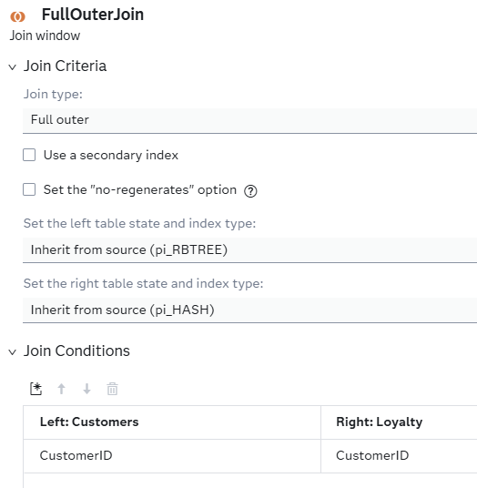
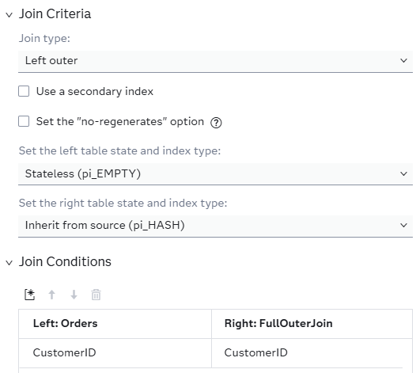
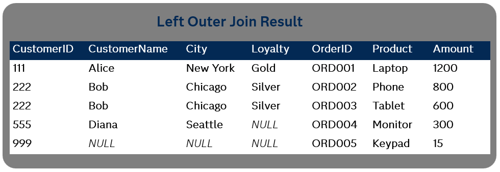
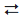
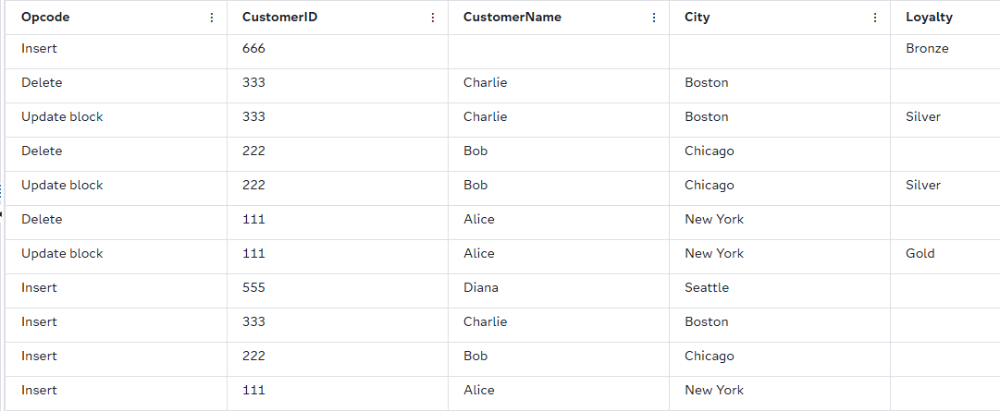
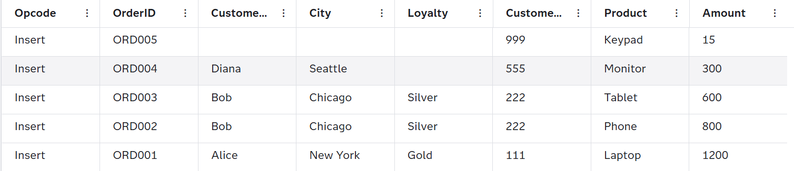

# SAS Event Stream Processing Join Window 

## Overview
This example demonstrates the various ways to use SAS Event Stream Processing Join windows. Join windows in SAS Event Stream Processing enable you to combine streaming data from multiple sources based on specific join conditions. By combining fast-moving fact data and dimension data, you can make decisions and detect patterns as events happen. This example explains how to pre-join dimension tables, choose the correct join type for your outcome, and configure state. These practices help lower latency, avoid unbounded memory growth, and make streaming pipelines easier to maintain and scale.

For more information about how to install and use example projects, see [Using the Examples](https://github.com/sassoftware/esp-studio-examples#using-the-examples).

## Source Data

The example contains three source files: `orders.csv`, `loyalty.csv`, and `customers.csv`. The **CustomerID** column is the common key. The `customers.csv` and `loyalty.csv` files provide additional information to enrich the data, and the `orders.csv` file represents the continuous stream of events that enhance the information.

## Prerequisites

In SAS Event Stream Processing streaming analytics, it is important to understand the distinction between fact tables and dimension tables in order to design effective join operations.

Join windows consist of the following:

- The Join window has a left input, which is called a fact table. It also has a right input, which is called a dimension table. 
- The left input is the stream of events that you want to enrich (for example, sensor readings, transactions, and clickstreams).
- The right input is a lookup or reference stream with the fields that you use to create a join (for example, customer master data or machine configuration).

## Workflow

The following figure shows the diagram of the project:

	

- The Customers window is a Source window that contains a dimension table with information about customers (for example, ID, name, and city).
- The Loyalty window is a Source window that contains a dimension table with information about loyalty status (for example, Silver, Gold, or Bronze).
- The Orders window is a Source window that contains a fact table that receives a continuous stream of events (for example, new customer orders).
- The FullOuterJoin window is a Join window that combines the tables in Customers and Loyalty. This helps create a unified view of all the information. This is used as a pre-join step to simplify your pipeline. Note that full outer joins can be used only with two dimension tables. It is not possible to full outer join a fact table.
- The InnerJoin window is a Join window that performs an inner join of the tables.
- The LeftOuterJoin window is a Join window that performs a left outer join of the tables.
- The RightOuterJoin window is a Join window that performs a right outer join of the tables.
<!-- So aren't they techinically Source windows that contain dimension and fact tables? -->

### Full Outer Join

A full outer join brings together all rows from both tables, matching them where keys align. Otherwise, it fills in **NULL** where keys do not align. In this example, you want to include all customers whether they are part of the loyalty program or not.  

Explore the settings for the FullOuterJoin window:
1. Open the project in SAS Event Stream Processing Studio. 
2. Select the FullOuterJoin window. The window should look like the figure below:

	

3. Click . Fields include:
   - `CustomerID`
   - `CustomerName`
   - `City`
   - `Loyalty`

Notice that **Loyalty** is coming from the right side of the join and **CustomerName** and **City** come from the left. 

		

Results:
- 111, 222, and 333: The first three rows are matched records, which means both tables contained these `CustomerIDs`.
- 555: This record exists only in `customers.csv`, so `Loyalty` is **NULL**.
- 666: This record exists only in `loyalty.csv`, so `CustomerName` and `Amount` are **NULL**.

### Inner Join

An inner join shows only records where `CustomerID` exists in both tables. Records are matched based on the `CustomerID` key. 

Explore the settings for the InnerJoin window:
1. Open the project in SAS Event Stream Processing Studio. 
2. Select the InnerJoin window. The window should look like the figure below:

	

3. Click . Fields include:
   - `OrderID`
   - `CustomerID`
   - `Product`
   - `Amount`
   - `CustomerName`
   - `City`
   - `Loyalty`

`Orders.csv` acts as the fact table and the table created from the full outer join is the dimension table. A record is generated for each order received where the `CustomerID` matches. 

	

### Left Outer Join

A left outer join returns all the records that match from the fact table with records from the dimension table.	

Explore the settings for the LeftOuterJoin window:
1. Open the project in SAS Event Stream Processing Studio. 
2. Select the LeftOuterJoin window. The window should look like the figure below:

Notice that the Join window enables you to set the state for the left and right inputs separately. The left table state is set to **Stateless (pi_EMPTY)**, which means no events are stored except for the current record. This removes any unbounded memory growth issues from the project. When a dimension table is large or is updated frequently, you can select the **Use a secondary index** check box to improve lookup performance.

3. Click . Fields include:
   - `OrderID`
   - `CustomerID`
   - `Product`
   - `Amount`
   - `CustomerName`
   - `City`
   - `Loyalty`

The left outer join creates a record for every event that enters the data steam from the fact table. Therefore, **ORD005** creates a joined event even though all the dimension fields are **NULL**:

		

### Right Outer Join

A right outer join returns all the records that match from the dimension table with records from the fact table. This join type is not compatible with the project because `orders.csv` streams in from the left side. To fix this issue, the project was rearranged so that the fact table streams in from the right side. The schema entries were rebuilt. The project is already fixed for you, but if you encounter this error in another project, you can use the following steps to fix it:

1. Open the project in SAS Event Stream Processing Studio. 
2. Select the RightOuterJoin window. The window looks like the figure below:

	

This clearly states that the left window is **Orders**, and the right window is **FullOuterJoin**. You need to change this by clicking . This generates the following message: 

	

3. Click **Yes**. Now the left and right windows are reversed:

	

4. Click . The schema has been rebuilt and the fact table expressions are now prefixed with **r_**.

	

## Test the Project and View the Results

When you test the project, the results for each window appear on separate tabs:
- The FullOuterJoin tab lists the combination of the `customers.csv` and `loyalty.csv` tables.
- The InnerJoin tab lists the results of an inner join performed on `orders.csv` and the full outer join tables.
- The LeftOuterJoin tab lists the results of a left outer join performed on the `orders.csv` and the full outer join tables.
- The RightOuterJoin tab lists the results of a right outer join performed on the `orders.csv` and the full outer join tables.

The following figure shows the results for the FullOuterJoin tab:

	

The following figure shows the results for the InnerJoin tab:

The following figure shows the results for the LeftOuterJoin tab:

The following figure shows the results for the RightOuterJoin tab:

## Additional Resources

For more information, see [SAS Help Center: Using Join Windows](https://go.documentation.sas.com/doc/en/espcdc/v_063/espcreatewindows/n0suhocslptadgn10oh2htqnynr5.htm).
