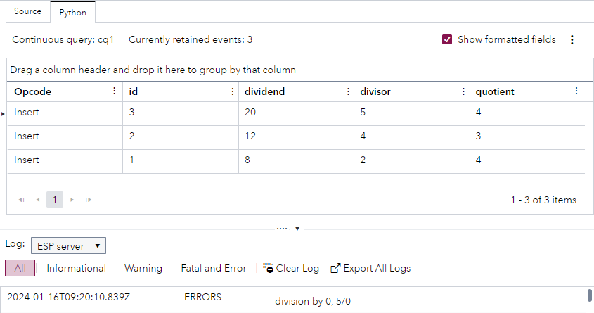

# Using a Python Module to Define Logging Functionality
## Overview
This example demonstrates how you can define useful functions in a Python module at project level and reference those functions from other Python code in the project.

---
**NOTE:**
Use this example with SAS Event Stream Processing 2024.02 and later. 

---

For more information about how to install and use example projects, see [Using the Examples](https://github.com/sassoftware/esp-studio-examples#using-the-examples). 

## Use Case

The Python window in this project performs division calculations and logs an error message when there is an attempt to divide a number by zero. To log the error, the Python window references a Python module that defines the logging functionality. 

## Source Data
The [python_module.csv](python_module.csv) file contains information about calculations.

## Workflow
The following figure shows the diagram of the project:


### logger Module
1. Open the project in SAS Event Stream Processing Studio and click  on the toolbar. Project-level properties are displayed in the right pane.
2. Expand **Modules**.
3. In the **Python Modules** section, double-click the **logger** row.
4. In the Edit Python Code Module window, explore the Python code.

    <table>
    <tr>
    <th>Step</th> <th>Python Code Section</th>
    </tr>
    <tr>
    <td>Import the esp module, which facilitates the use of SAS Event Stream Processing functions with Python.</td>
    <td>

      
    ```
    import esp

    ```

      
    </td>
    </tr>
    <tr>
    <td>Declare the Logger class and initialize the _context attribute.</td>
    <td>

      
    ```
    class Logger:

            def __init__(self,context):
                self._context = context if context != None else "mylogger"
      
    ```

      
    </td>
    </tr>
    <tr>
    <td> Define the logging functions that are used to create log messages at different severity levels. These functions use a SAS Event Stream Processing function called esp.logMessage.</td>
    <td>


    ```
            def error(self,msg,line = None):
                esp.logMessage(logcontext=self._context,message=msg,level="error",line=line)

            def warn(self,msg,line = None):
                esp.logMessage(logcontext=self._context,message=msg,level="warn",line=line)

            def fatal(self,msg,line = None):
                esp.logMessage(logcontext=self._context,message=msg,level="fatal",line=line)

            def info(self,msg,line = None):
                esp.logMessage(logcontext=self._context,message=msg,level="info",line=line)

            def debug(self,msg,line = None):
                esp.logMessage(logcontext=self._context,message=msg,level="debug",line=line)

            def trace(self,msg,line = None):
                esp.logMessage(logcontext=self._context,message=msg,level="trace",line=line)

    ```


    </td>
    </tr>
    </table>

### Source

The Source window streams information from the [python_module.csv](python_module.csv) file to the Python window.

Explore the settings for this window:
1. Select the Source window on the workspace. 
2. To examine the window's output schema, on the right toolbar, click . Observe the following fields: 
   - `id`: This is the ID that is assigned to each calculation. It is also selected as the Key.
   - `dividend`: This is a number that is to be divided by the number in the `divisor` field.
   - `divisor`: This is a number that is used as the divisor in the calculation.
   - `quotient`: This is the result of the division.
3. Click . 

### Python

The Python window performs division calculations.

Explore the settings for this window:
1. Select the Python window in the workspace.
2. In the right pane, expand **Python Settings**.
   - To increase the efficiency of the Python code processing, you can specify which fields to copy from the source file and which fields to use in the Python code. 
     - The **Fields to copy** field shows that the fields `id` and `dividend`, and `divisor` are copied from the source file.
     - The **Fields to use in Python code** field shows that the fields `dividend` and `divisor` are used in the Python code.
   - The **Events function** field shows the Python function that is used (in this case, the `create` function).
3. Scroll down in the right pane, to view the Python code that performs the calculations for this example:
   
    <table>
    <tr>
    <th>Step</th> <th>Python Code Section</th>
    </tr>
    <tr>
    <td>Import the Logger module.</td>
    <td>

      
    ```
   from logger import Logger
    ```

      
    </td>
    </tr>
    <tr>
    <td>Define a function called create and set three variables to represent an event and information about the dividend and the divisor.</td>
    <td>

      
    ```
   def create(data,context):

        e = {}
        dividend = data["dividend"]
        divisor = data["divisor"]
    ```

      
    </td>
    </tr>
    <tr>
    <td> Check whether the divisor is zero. If so, use the Logger class (defined in the Python module) to log an error message.</td>
    <td>


    ```
        if (divisor == 0):
            logger = Logger("modules.example")
            logger.error("division by 0, " + str(dividend) + "/" + str(divisor))
            return None
    ```


    </td>
    </tr>
    <tr>
    <td> If the divisor is not zero, perform the calculation and return a SAS Event Stream Processing event.</td>
    <td>


    ```
        e["quotient"] = dividend / divisor

        return(e)
    ```


    </td>
    </tr>
    </table>


## Test the Project and View the Results

When you test the project in SAS Event Stream Processing Studio, the results for each window appear in separate tabs. The following figure shows the **Python** tab. The [python_module.csv](python_module.csv) file contains four events, but only three events appear in the Python tab. The fourth event, where the number five was to be divided by zero, has caused the following error to be logged in the **Log** pane: `division by 0, 5/0`



## Next Steps

In this simple example, the Python module is referenced from one location. In a real-life scenario, creating a Python module is most useful when you want to reference common Python code from multiple locations.

## Additional Resources
For more information, see [SAS Help Center: Using Python Modules](https://documentation.sas.com/?cdcId=espcdc&cdcVersion=default&docsetId=espcreatewindows&docsetTarget=p0vztmx09ct57mn1dr6h3hwxw38k.htm) and [SAS Help Center: ESP Server Log Debugging](https://documentation.sas.com/?cdcId=espcdc&cdcVersion=default&docsetId=espcreatewindows&docsetTarget=p0es0j4alwxukqn1fmpi24ndl12n.htm#n0oo3y1qdfl79bn1e2k0po0rmpvz).
