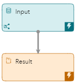

# Using a Python Snippet
## Overview
This example provides a simple demonstration of how to define a Python snippet and reference it. Python snippets are self-contained blocks of Python code that exist at the project level, which can then be referenced by any other Python entity in the project. 

---
**NOTE:**
Use this example with SAS Event Stream Processing 2024.02 and later.

---

For more information about how to install and use example projects, see [Using the Examples](https://github.com/sassoftware/esp-studio-examples#using-the-examples).

## Use Case

A Python window called Result performs division calculations by referencing a Python snippet that exists at the project level.

The code that performs the calculations could have been placed in the Result window instead of using a snippet. The purpose of this example is to show the syntax for referencing a snippet. In a real-life scenario, creating a Python snippet is most useful when you want to reference the snippet from multiple locations.

## Source Data
The [numbers.csv](numbers.csv) file contains information about calculations.

## Workflow
The following figure shows the diagram of the project:



### math Snippet
1. Open the project in SAS Event Stream Processing Studio and click  on the toolbar. Project-level properties are displayed in the right pane.
2. Expand **Snippets**.
3. In the **Python Snippets** section, double-click the **math** row.
4. In the Edit Python Code Snippet window, explore the Python code.

    ```
    def divide(dividend,divisor):
        value = dividend / divisor
        return value
    ```
    The snippet defines a function called `divide`. The function takes two parameters, `dividend` and `divisor`. The result of dividing `dividend` by `divisor` is stored in the variable `value`.

5. Click **Cancel**.


### Input

The Input window is a Source window that streams information from the [numbers.csv](numbers.csv) file to the Result window.

Explore the settings for this window:
1. Select the Source window on the workspace. 
2. To examine the window's output schema, on the right toolbar, click . Observe the following fields: 
   - `id`: This is the ID that is assigned to each calculation. It is also selected as the Key.
   - `dividend`: This is a number that is to be divided by the number in the `divisor` field.
   - `divisor`: This is a number that is used as the divisor in the calculation.
3. Click . 

### Result

The Result window is a Python window that references the `math`` snippet.

Explore the settings for this window:
1. Select the Result window in the workspace.
2. In the right pane, expand **Python Settings**.
   - The **Fields to copy** field indicates that all fields are copied from the source file. 
   - The **Fields to use in Python code** field indicates that all fields are used in the Python code.
   - The **Events function** field shows the Python function that is used (in this case, the `create` function).
3. Scroll down in the right pane, to view the Python code that performs the calculations for this example:
   
    <table>
    <tr>
    <th>Step</th> <th>Python Code Section</th>
    </tr>
    <tr>
    <td>Import the esp module, which facilitates the use of SAS Event Stream Processing functions with Python.</td>
    <td>

      
    ```
   import esp
    ```

      
    </td>
    </tr>
    <tr>
    <td>Define a function called create and set three variables to represent an event and information about the dividend and the divisor.</td>
    <td>

      
    ```
   def create(data,context):

        event = {}
        event['dividend'] = data.get('dividend')
        event['divisor'] = data.get('divisor')
    ```

      
    </td>
    </tr>
    <tr>
    <td> The esp.call function enables you to call functions that are defined in Python snippets. The _pyname_ parameter identifies the snippet, which in this example is called math. The _pyfunc_ parameter identifies the divide function within that snippet. The return value is a Python object that contains the following fields:
    <ul><li>code - a Boolean value that indicates whether the function was executed successfully.</li><li>results - an array of the return values from the function if the call executed successfully.</li><li>error - an error description if the call failed.</li></ul></td>
    <td>


    ```
        response = esp.call(event['dividend'],event['divisor'],_pyname_="math",_pyfunc_="divide")
    ```


    </td>
    </tr>
    <tr>
    <td> If there is a division by 0, the code field of the response is false and the error field of the response indicates the error. Otherwise, the code field is true and the results field contains a single entry that provides the result of the calculation.</td>
    <td>


    ```
        if (response['code'] is True):
            event['quotient'] = response['results'][0]
        else:
            event['error'] = response['error']
    ```


    </td>
    </tr>
    <tr>
    <td> Return a SAS Event Stream Processing event.</td>
    <td>


    ```
        return event
    ```


    </td>
    </tr>
    </table>


## Test the Project and View the Results

When you test the project in SAS Event Stream Processing Studio, the results for each window appear in separate tabs. The following figure shows the **Result** tab.  The fourth event, where the number five was to be divided by zero, has caused an error message to be recorded in the **error** column.


## Next Steps

In this simple example, the Python snippet is referenced from one location. In a real-life scenario, creating a Python snippet is most useful when you want to reference the snippet from multiple locations.

## Additional Resources
For more information, see [SAS Help Center: Using Python Snippets](https://documentation.sas.com/?cdcId=espcdc&cdcVersion=default&docsetId=espcreatewindows&docsetTarget=n0chyslei2xg23n1a48aht2tmmdj.htm) and [SAS Help Center: ESP Server Log Debugging](https://documentation.sas.com/?cdcId=espcdc&cdcVersion=default&docsetId=espcreatewindows&docsetTarget=p0es0j4alwxukqn1fmpi24ndl12n.htm#n0oo3y1qdfl79bn1e2k0po0rmpvz).
