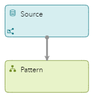
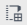
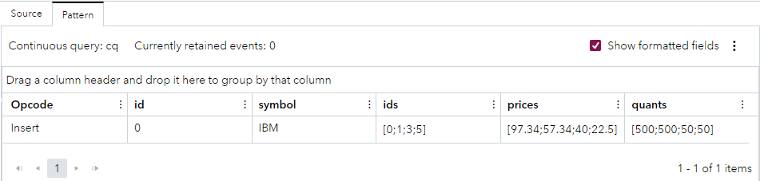

# Using Python to Identify Trading Patterns in a Stock Market
## Overview
This example demonstrates how to use a Python-based Pattern window. The model identifies decreases in a stock's price. When the pattern detects four trades with successively lower prices (that is, without an intervening higher price), an event is generated.

---
**NOTE:**
Use this example with SAS Event Stream Processing 2024.03 and later. 

---

For more information about how to install and use example projects, see [Using the Examples](https://github.com/sassoftware/esp-studio-examples#using-the-examples).

## Source Data
The file [input.csv](input.csv) contains stock trade data.

## Workflow
The following figure shows the diagram of the project:



The model is stateless, that is, the index on the Source window has the type pi_EMPTY. Events are not retained in any window, and are transformed or passed through. This prevents the Pattern window from growing infinitely.

### Source

Stock trades from the `input.csv` file enter the model in this Source window.

Explore the settings for this window:
1. Open the project in SAS Event Stream Processing Studio and select the Source window. 
2. In the right pane, expand **State and Event Type**. Observe the following settings:
   - The **Window state and index** field is set to **Stateless (pi_EMPTY)**. This index does not store events.
   - The **Accept only “Insert” events** check box is selected. If a Source window precedes a Pattern window, the Source window must be specified as insert-only. This causes the Source window to reject any events with an opcode other than Insert, and permits an index type of pi_EMPTY to be used.
   - The **Automatically generate the key field** check box is selected, which means that the Source window automatically generates identification keys for incoming events. To automatically generate key values, the Source window must be insert-only and have only one key with type INT64 or STRING.
3. To examine the window's output schema, on the right toolbar, click . Observe the following fields: 
   - `id`: This field is the stock trade's ID, which is also selected as the key field.
   - `broker`: This field is the stock broker.
   - `symbol`: This field is the stock symbol. A stock symbol is a series of letters that are assigned to a security for trading purposes.
   - `price`: This field is the stock price.
   - `quant`: This field is the quantity of stock that is traded.

4. Click . 

### Pattern

Stock trade patterns are matched in this Pattern window. 

Pattern windows are insert-only with respect to both their input windows and the output that they produce. As the input and output of a Pattern window are unbounded and insert-only, they are typically stateless windows (that is, windows with index type pi_EMPTY).

The Pattern window uses Python code to define the events of interest (EOI) to be matched. The pattern consists of the following events of interest:
- Event 1: Occurrence of a trade event
- Event 2: A further occurrence of a trade event with the same stock symbol where the price has decreased

In order for the pattern to be matched, the price must decrease three times after the initial trade.

Explore the settings for this window:
1. Select the Pattern window.
2. In the right pane, expand **Patterns**.
3. In the table in the **Patterns** section, select the `pattern1` row and click . <br>The Edit Pattern window is displayed, which enables you to view the pattern’s properties. The Edit Pattern window is a wizard with four pages.
4. On the **Initiliaze** page, observe that in the **Index fields** field, the `symbol` field is selected. This field is part of the Source window and forms an index generation function. All incoming events are grouped by the specified index. Specifying the `symbol` field as the index field means that the code on the **Python Code** page does not need to specify this field in each Python function.
5. Click **Next**.
6. On the **Python Code** page, view the code that specifies the EOI functions and an output function that are required for the pattern:
   
    <table>
    <tr>
    <th>Step</th> <th>Python Code Section</th>
    </tr>
    <tr>
    <td>Import the esp module, which facilitates the use of SAS Event Stream Processing functions with Python.</td>
    <td>


    ```
   import esp

    ```


    </td>
    <tr>
    <td>The first EOI function, start, is triggered when a trade event occurs. It extracts the price from the event.</td>
    <td>


    ```
    def start(event,context):
        return True, {"price":event["price"]}
    ```


    </td>
    </tr>
    <tr>
    <td>The second EOI function, decreasing_events, identifies further occurrences of trade events where the price has decreased. It compares the price in the current event with the price stored in the context.</td>
    <td>

      
    ```
    def decreasing_trades(event,context):
        print(str(context))
        if (event["price"] < context["data"]["price"]):
            return True, {"price":event["price"]}
        
        return False
    ```

      
    </td>
    </tr>
    <tr>
    <td> The output function defines three lists: ids, prices, and quants. The function then appends the ID, price, and quantity of the starting event to those lists. The function then extracts the same information from further events and appends it to the respective lists.</td>
    <td>


    ```
    def output(context):
        
        ids = []
        prices = []
        quants = []
        
        ids.append(context["events"]["start"]["id"])
        prices.append(context["events"]["start"]["price"])
        quants.append(context["events"]["start"]["quantity"])

        for value in context["events"]["decrease"]:
          ids.append(value["id"])
          prices.append(value["price"])
          quants.append(value["quantity"])
    ```


    </td>
    </tr>
    <tr>
    <td>The output function then creates an event that contains the IDs, prices, and quantities collected earlier.</td>
    <td>


    ```
        event = {}
        
        event["symbol"] = context["events"]["start"]["symbol"]
        event["ids"] = ids
        event["prices"] = prices
        event["quants"] = quants
        
        return(event)
    ```


    </td>
    </tr>
    </table>

7. Click **Next**.
8. On the **Output and Events** page, observe the following settings:
     - The **Output function** field is set to `output`. This output function is defined on the **Python Code** page.
     - The pattern contains two EOIs. The event `start` is associated with the EOI function `start`. The event `decrease` is associated with the EOI function `decreasing _trades`. The EOI functions are defined on the **Python Code** page.
     - In this example, the Included Fields and Send Events columns are empty.
       - When the Included Fields column is empty, all Python fields are passed to the event. When you select Python fields in the Included Fields column, only those fields are passed to the event.
       - Selecting a check box in the Send Events column sends all previously matched events into the Python function. It can be more efficient to not send all events into the function. The code that is specified in the **Python Code** section window can put data into the pattern context. In that case, access to previous events is not needed when you define events.
9. Click **Next**.
10. On the **Logic Expression** page, observe that the pattern contains the following logic expression: `fby(start,is:3(decrease))`<br>This logic expression specifies that for there to be a match for the pattern, a `start` event must be followed by three `decrease` events (that is, events where the share price decreases). You could adjust this example to look for fewer decreases in price by adjusting the number in the logic expression, without having to modify the Python code. <br>The logic expression does not use the Python language.

## Test the Project and View the Results

When you test the project, the results for each window appear on separate tabs.
- The **Source** tab lists the stock trades that are received from the input file.
- The **Pattern** tab shows one matched pattern.

The following figure shows the results for the Pattern tab:



## Additional Resources
For more information, see [SAS Help Center: Using Python in a Pattern Window](https://documentation.sas.com/?cdcId=espcdc&cdcVersion=default&docsetId=espcreatewindows&docsetTarget=n1rj6nmwuzuxisn12tjeu0o336tt.htm#p1jnlh8axicxzzn1rowpnua01fs0).
